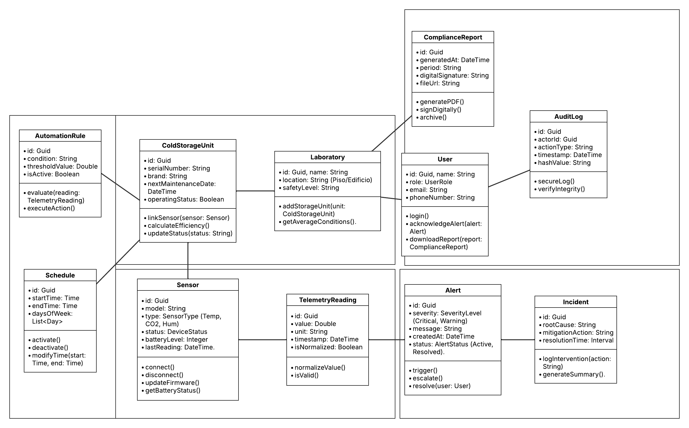

        
    <h1>Informe de Trabajo Final</h1>
    
<strong>Universidad:</strong> Universidad Peruana de Ciencias Aplicadas

    
<strong>Carrera:</strong> Ingeniería de Software

    
<strong>Ciclo:</strong> 2026-10

    
<strong>Código del Curso:</strong> 1ASI0729

    
<strong>Nombre del Curso:</strong> Desarrollo de Aplicaciones Open Source

    
<strong>Sección:</strong> 2610

    
<strong>Profesor:</strong> Alberto Wilmer Sánchez Seña

    
<strong>Startup:</strong> Safelab

    
<strong>Nombre del Producto:</strong> Safelab

<h3 align="center">Relación de Integrantes:</h3>

    <table>
        <tr>
            <th><strong>Código</strong></th>
            <th><strong>Apellidos y Nombres</strong></th>
        </tr>
        <tr>
            <td>U201817507</td>
            <td>Manuel Angel Sanchez Arenas</td>
        </tr>
        <tr>
            <td>U201919096</td>
            <td>Jean Niels Arizabal Condori</td>
        </tr>
        <tr>
            <td>U20241B761</td>
            <td>Esteban Eduardo Chavez Bardales</td>
        </tr>
        <tr>
            <td>U202520310</td>
            <td>Jhon Jordy Jaramillo Mayta</td>
        </tr>
    </table>

<strong>Mes y Año:</strong> Abril 2025

## Registro de Versiones del Informe

<table border="1" cellpadding="6" cellspacing="0">
    <thead>
        <tr>
            <th>Versión</th>
            <th>Fecha</th>
            <th>Autor(es)</th>
            <th>Descripción de Modificación</th>
        </tr>
    </thead>
    <tbody>
        <tr>
            <td><strong>1.0</strong></td>
            <td>2026-04-25</td>
            <td>
                - Sanchez Arenas, Manuel Angel 
                - Arizabal Condori, Jean Niels 
                - Chavez Bardales, Esteban Eduardo 
                - Jaramillo Mayta, Jhon Jordy
            </td>
        </td>
        <td>
            <strong>Se incluye:</strong> 
            -Carátula, Registro de versiones, Student Outcome y Contenido de Informe 
            -Capitulo I: Introducción 
            -Capitulo II: Requirements Elicitation & Analysis 
            -Capitulo III: Especificación de Requerimientos 
            -Capitulo IV: Diseño del Producto 
            -Capitulo V: Implementación, Validación y Despliegue del Producto 
        </td>
        </tr>
    </tbody>
</table>

## Project Report Collaboration Insights

**URL del Repositorio:**  
[Repositorio de GitHub](https://github.com/upc-pre-1ASI0729-11834-Especialistas/report)

Este informe ha sido desarrollado de forma colaborativa mediante GitHub, empleando GitFlow y Conventional Commits. Cada miembro del equipo ha contribuido con commits y ramas individuales durante el desarrollo del proyecto.

**Participación del equipo:**

<table border="1" cellpadding="6" cellspacing="0">
  <thead>
    <tr>
      <th>Integrante</th>
      <th>Usuario GitHub</th>
      <th>Aportaciones destacadas</th>
    </tr>
  </thead>
  <tbody>
    <tr>
      <td>Manuel Sanchez</td>
      <td>@manuels7a</td>
      <td>Desarrollo de secciones del capítulo IV relacionadas a la web app. Elboración de User Stories e Impact Mapping</td>
    </tr>
    <tr>
      <td>Jean Niels Arizabal Condori</td>
      <td>@JeanArizabal</td>
      <td>Evaluación de la competencia. Desarrollo del LeanUX Canvas. Diseño y elaboración de las entrevistas</td>
    </tr>
    <tr>
      <td>Esteban Eduardo Chavez Bardales</td>
      <td>@ECEB0704</td>
      <td>Avance de los Event Storming y priorización de segmentación de aportes en ramas</td>
    </tr>
    <tr>
      <td>Jhon Jordy Jaramillo Mayta</td>
      <td>@Marklnz1</td>
      <td>Documentación de secciones en relación al desarrollo y despliegue de la Landing Page</td>
    </tr>
  </tbody>
</table>

## Contenido

- [Carátula](#carátula)
- [Registro de Versiones del Informe](#registro-de-versiones-del-informe)
- [Project Report Collaboration Insights](#project-report-collaboration-insights)
- [Contenido](#contenido)
- [Student Outcome](#student-outcome)
- [Capítulo I: Introducción](#capítulo-i-introducción)
  - [1.1 Startup Profile](#11-startup-profile)
    - [1.1.1 Descripción de la Startup](#111-descripción-de-la-startup)
    - [1.1.2 Perfiles de integrantes del equipo](#112-perfiles-de-integrantes-del-equipo)
  - [1.2 Solution Profile](#12-solution-profile)
    - [1.2.1 Antecedentes y problemática](#121-antecedentes-y-problemática)
    - [1.2.2 Lean UX Process](#122-lean-ux-process)
      - [1.2.2.1 Lean UX Problem Statements](#1221-lean-ux-problem-statements)
      - [1.2.2.2 Lean UX Assumptions](#1222-lean-ux-assumptions)
      - [1.2.2.3 Lean UX Hypothesis Statements](#1223-lean-ux-hypothesis-statements)
      - [1.2.2.4 Lean UX Canvas](#1224-lean-ux-canvas)
  - [1.3 Segmentos objetivo](#13-segmentos-objetivo)
- [Capítulo II: Requirements Elicitation & Analysis](#capítulo-ii-requirements-elicitation--analysis)
  - [2.1 Competidores](#21-competidores)
    - [2.1.1 Análisis competitivo](#211-análisis-competitivo)
    - [2.1.2 Estrategias y tácticas frente a competidores](#212-estrategias-y-tácticas-frente-a-competidores)
  - [2.2 Entrevistas](#22-entrevistas)
    - [2.2.1 Diseño de entrevistas](#221-diseño-de-entrevistas)
    - [2.2.2 Registro de entrevistas](#222-registro-de-entrevistas)
    - [2.2.3 Análisis de entrevistas](#223-análisis-de-entrevistas)
  - [2.3 Needfinding](#23-needfinding)
    - [2.3.1 User Personas](#231-user-personas)
    - [2.3.2 User Task Matrix](#232-user-task-matrix)
    - [2.3.3 User Journey Mapping](#233-user-journey-mapping)
    - [2.3.4 Empathy Mapping](#234-empathy-mapping)
  - [2.4 Big Picture Event Storming](#24-big-picture-event-storming)
  - [2.5 Ubiquitous Language](#25-ubiquitous-language)
- [Capítulo III: Requirements Specification](#capítulo-iii-requirements-specification)
  - [3.1 User Stories](#31-user-stories)
  - [3.2 Impact Mapping](#32-impact-mapping)
  - [3.3 Product Backlog](#33-product-backlog)
- [Capítulo IV: Product Design](#capítulo-iv-product-design)
  - [4.1 Style Guidelines](#41-style-guidelines)
    - [4.1.1 General Style Guidelines](#411-general-style-guidelines)
    - [4.1.2 Web Style Guidelines](#412-web-style-guidelines)
  - [4.2 Information Architecture](#43-information-architecture)
    - [4.2.1 Organization Systems](#421-organization-systems)
    - [4.2.2 Labeling System](#422-labeling-system)
    - [4.2.3 SEO Tags and Meta Tags](#423-seo-tags-and-meta-tags)
    - [4.2.4 Searching Systems](#424-searching-systems)
    - [4.2.5 Navigation System](#425-navigation-system)
  - [4.3 Landing Page UI Design](#43-landing-page-ui-design)
    - [4.3.1 Landing Page Wireframe](#431-landing-page-wireframe)
    - [4.3.2 Landing Page Mock-up](#432-landing-page-mock-up)
  - [4.4 Web Applications UX/UI Design](#44-web-applications-uxui-design)
    - [4.4.1 Web Applications Wireframes](#441-web-applications-wireframes)
    - [4.4.2 Web Applications Wireflow Diagrams](#442-web-applications-wireflow-diagrams)
    - [4.4.3 Web Applications Mock-ups](#443-web-applications-mock-ups)
    - [4.4.4 Web Applications User Flow Diagrams](#444-web-applications-user-flow-diagrams)
  - [4.5 Web Applications Prototyping](#45-web-applications-prototyping)
  - [4.6 Domain-Driven Software Architecture](#46-domain-driven-software-architecture)
    - [4.6.1 Software Architecture Context Diagram](#461-software-architecture-context-diagram)
    - [4.6.2 Software Architecture Container Diagrams](#462-software-architecture-container-diagrams)
    - [4.6.3 Software Architecture Components Diagrams](#463-software-architecture-components-diagrams)
  - [4.7 Software Object-Oriented Design](#47-software-object-oriented-design)
    - [4.7.1 Class Diagrams](#471-class-diagrams)
  - [4.8 Database Design](#48-database-design)
    - [4.8.1 Database Diagrams](#481-database-diagrams)
- [Capítulo V: Product Implementation, Validation & Deployment](#capítulo-v-product-implementation-validation--deployment)
  - [5.1 Software Configuration Management](#51-software-configuration-management)
    - [5.1.1 Software Development Environment Configuration](#511-software-development-environment-configuration)
    - [5.1.2 Source Code Management](#512-source-code-management)
    - [5.1.3 Source Code Style Guide & Conventions](#513-source-code-style-guide--conventions)
    - [5.1.4 Software Deployment Configuration](#514-software-deployment-configuration)
  - [5.2 Landing Page, Services & Applications Implementation](#52-landing-page-services--applications-implementation)
    - [5.2.1 Sprint 1](#521-sprint-1)
      - [5.2.1.1 Sprint Planning](#5211-sprint-planning-1)
      - [5.2.1.2 Aspect Leaders and Collaborators](#5212-aspect-leaders-and-collaborators)
      - [5.2.1.3 Sprint Backlog 1](#5213-sprint-backlog-1)
      - [5.2.1.4 Development Evidence for Sprint Review](#5214-development-evidence-for-sprint-review)
      - [5.2.1.5 Execution Evidence for Sprint Review](#5215-execution-evidence-for-sprint-review)
      - [5.2.1.6 Services Documentation Evidence for Sprint Review](#5216-services-documentation-evidence-for-sprint-review)
      - [5.2.1.7 Software Deployment Evidence for Sprint Review](#5217-software-deployment-evidence-for-sprint-review)
      - [5.2.1.8 Team Collaboration Insights during Sprint](#5218-team-collaboration-insights-during-sprint)
- [Conclusiones](#conclusiones)
- [Bibliografia](#bibliografia)
- [Anexos](#anexos)

## Student Outcome

> Criterio: El estudiante comunica resultados y proceso de ingeniería aplicado para el ciclo de desarrollo y despliegue de una solución web distribuida bajo una arquitectura orientada a servicios, que satisface requisitos para empresas o público en general, con un enfoque innovador e inclusivo, desplegada sobre plataformas Server Side o Cloud, haciendo uso de tecnologías open-source basadas en el lenguaje de programación Java para la lógica de lado servidor y tecnologías open-source para los componentes de la aplicación.

<table border="1" cellpadding="6" cellspacing="0">
  <thead>
    <tr>
      <th>Criterio Específico</th>
      <th>Acciones Realizadas</th>
      <th>Conclusiones</th>
    </tr>
  </thead>
  <tbody>
    <tr>
      <td><strong>Comunica oralmente con efectividad a diferentes rangos de audiencia</strong></td>
      <td>
        <strong>Manuel Sanchez</strong> 
        AV1: Expongo con efectividad la propuestas del diseño de la aplicación.  
        <strong>Jean Arizabal</strong> 
        AV1: Presento la propuesta de solución de forma detallada considerando los antecedentes, el perfil de la solución, el análisis competitivo y el needfinding.  
        <strong>Esteban Chavez</strong> 
        AV2: Explico detalladamente el event storming, desde el inicio hasta el final, los diagramas, tanto de clase como de base de datos y el diseño de la landing page..  
        <strong>Jhon Jaramillo</strong> 
        AV1: Expongo y sustento las decisiones arquitectónicas del proyecto utilizando los diagramas C4, además de presentar el diseño, flujo y propósito de la landing page al equipo.. 
      </td>
      <td>
        <strong>AV1:</strong> Para poder comunicar efectivamente nuestras ideas fue necesario trabajar en nuestra capacidad de expresión y en la claridad de nuestra comunicación. 
      </td>
    </tr>
    <tr>
      <td><strong>Comunica por escrito con efectividad a diferentes rangos de audiencia</strong></td>
      <td>
        <strong>Manuel Sanchez</strong> 
        AV1: Redacto documentos claros y objetivos sobre las historias de usuario de Safelab.  
        <strong>Jean Arizabal</strong> 
        AV1: Redacto con detenimiento detalles sobre la startup, el perfil de la solución, el análisis competitivo y el needfinding.  
        <strong>Esteban Chavez</strong> 
        AV1: Escribo claramente la informacion necesaria que cada diagrama, e imagen necesita, de forma sencilla y tecnica, demostrando conocimientos especificos para las diferentes secciones.  
        <strong>Jhon Jaramillo</strong> 
        AV1: Redacto historias de usuario claras y detalladas para estructurar la landing page, y documento la arquitectura del sistema elaborando diagramas de contexto y contenedores bajo el modelo C4. 
      </td>
      <td>
        <strong>AV1: </strong>Para poder comunicar efectivamente nuestras ideas en el reporte fue necesario tener un bien planteada nuestra propuesta. 
      </td>
    </tr>
  </tbody>
</table>

---

# **Capítulo I: Introducción**

## **1.1. Startup Profile**

### **1.1.1. Descripción de la Startup**

SafeLab es una startup tecnológica dedicada a la transformación digital y la seguridad operativa del sector bioclínico y farmacéutico. Nuestra organización nace de la necesidad de resolver una vulnerabilidad crítica en la industria de la salud: la incertidumbre y las ineficiencias asociadas al almacenamiento de materiales biológicos altamente sensibles. Como empresa emergente, canalizamos todos nuestros esfuerzos técnicos y estratégicos en nuestro primer gran despliegue en el mercado: el desarrollo de un ecosistema digital innovador que garantice la preservación absoluta de la cadena de frío clínica. En SafeLab, no solo desarrollamos software; construimos infraestructuras de confianza que blindan la calidad del diagnóstico y la sostenibilidad de los recursos médicos.

El núcleo de nuestra propuesta de valor es una plataforma integral de monitoreo ambiental automatizado, diseñada específicamente para las rigurosas exigencias de laboratorios, hospitales y redes de farmacias. A través de la integración de dispositivos de hardware con un dashboard centralizado, el producto de SafeLab sustituye la vulnerable supervisión humana intermitente por una vigilancia continua y predictiva. Nuestra solución permite a los profesionales de la salud configurar reglas precisas de alerta y mitigación automática, previniendo activamente la degradación química de reactivos y vacunas. Nuestra misión es empoderar al personal clínico, eliminando el desgaste asociado a las tareas mecánicas de documentación y permitiéndoles enfocar su tiempo y experiencia exclusivamente en la gestión analítica y el cuidado del paciente.

Desde una perspectiva operativa y comercial, SafeLab estructura sus servicios bajo un modelo B2B (Business-to-Business) sustentado en una arquitectura SaaS (Software as a Service). Este enfoque nos permite dotar a las instituciones de salud de una solución altamente escalable y de rápida implementación, donde una suscripción corporativa garantiza el acceso ininterrumpido a herramientas de auditoría en tiempo real, reportes automatizados para el cumplimiento normativo y una inmutabilidad total en la retención de datos históricos. La visión a largo plazo de SafeLab es convertirse en el estándar regional para la gestión inteligente de inventarios biológicos, impulsando a las instituciones de salud hacia un modelo operativo guiado por la innovación pragmática y un compromiso innegociable con la cultura del "Desperdicio Cero".

### **1.1.2. Perfiles de los Integrantes del Equipo**

<table border="1" cellpadding="6" cellspacing="0">
  <thead>
    <tr>
      <th>Foto</th>
      <th>Nombre completo</th>
      <th>Código</th>
      <th>Carrera</th>
      <th>Habilidades técnicas y rol</th>
    </tr>
  </thead>
  <tbody>
    <tr>
      <td></td>
      <td>Manuel Sanchez</td>
      <td>u201817507</td>
      <td>Ingeniería de Software</td>
      <td>Desarrollo Fullstack: ASP.NetCORE MVC con Razor. Java básico. React.js</td>
    </tr>
    <tr>
      <td></td>
      <td>Jean Arizabal</td>
      <td>U201919096</td>
      <td>Ingeniería de Software</td>
      <td>Desarrollo backend: node.js ASP.net</td>
    </tr>
    <tr>
      <td></td>
      <td>Esteban Chavez</td>
      <td>U20241B761</td>
      <td>Ingeniería de Software</td>
      <td>Conocimientos y habilidades: C++, html, css, java. Responsable, creativa, y con diferentes conocimientos para el curso. Me destaco por mi creatividad e innovación.</td>
    </tr>
    <tr>
      <td></td>
      <td>Jhon Jaramillo</td>
      <td>U202520310</td>
      <td>Ingeniería de Software</td>
      <td>Habilidades técnicas y rol: Desarrollo FullStack</td>
    </tr>
  </tbody>
</table>

## **1.2. Solution Profile**

### **1.2.1 Antecedentes y Problemática**

La gestión de la cadena de frío en entornos bioclínicos no es únicamente un desafío logístico, sino un pilar crítico para la seguridad del paciente. Cuando los reactivos de diagnóstico, muestras biológicas y vacunas se exponen a excursiones térmicas (fluctuaciones fuera de los rangos normativos de 2 °C a 8 °C), sufren alteraciones moleculares que comprometen drásticamente su eficacia y estabilidad (Kumru et al., 2014). Un reactivo degradado térmicamente que sea utilizado en pruebas de laboratorio puede generar falsos negativos o alterar métricas diagnósticas, representando un riesgo clínico inminente que afecta directamente las decisiones médicas y la salud de los pacientes.

En segundo plano, esta vulnerabilidad operativa se traduce en un impacto financiero severo para las instituciones de salud. La Organización Mundial de la Salud (OMS, 2020) señala que las deficiencias en el control de temperatura obligan al descarte preventivo de lotes enteros de productos biológicos de alto costo. Esta pérdida económica (desperdicio de stock) se agrava por el desgaste humano: el personal invierte un volumen considerable de horas laborales documentando parámetros en bitácoras físicas. Este esfuerzo administrativo resulta ineficiente, ya que no previene el daño del material, sino que apenas lo registra de forma forense y tardía.

La raíz de este problema es bidimensional. Por un lado, existe un factor de infraestructura: las instalaciones de salud a menudo enfrentan cortes de suministro eléctrico o dependen de equipos de refrigeración que carecen de sistemas de respaldo térmico. Por otro lado, y de forma más crítica, los métodos convencionales de monitoreo manual generan "puntos ciegos" en la supervisión. Un análisis sistemático sobre la cadena de frío demuestra que las revisiones esporádicas durante los turnos diurnos dejan al inventario completamente vulnerable durante la madrugada, los fines de semana y los días festivos (Matthias et al., 2007). Es precisamente en estos intervalos de nula vigilancia donde ocurren la mayoría de las fallas irreversibles, obligando al descarte de los insumos ante la incertidumbre del tiempo de exposición.

Para delimitar el problema de manera estructurada, aplicamos la técnica The 5 'W's y 2 'H's:

- **Who (Quién)**: Coordinadores de laboratorio, técnicos de farmacia y personal administrativo responsable de la viabilidad clínica y la gestión presupuestal del inventario biológico.

- **What (Qué)**: Riesgo clínico elevado por la potencial utilización de insumos degradados, sumado a pérdidas económicas significativas debido al descarte obligatorio de reactivos y vacunas tras excursiones térmicas.

- **Where (Dónde)**: Cuartos fríos, refrigeradores de laboratorio y áreas de almacenamiento en farmacias clínicas y hospitalarias.

- **When (Cuándo)**: El riesgo es permanente, pero los incidentes críticos ocurren durante fallas de infraestructura eléctrica y, especialmente, durante los "puntos ciegos" de la supervisión manual (madrugadas, fines de semana y feriados).

- **Why (Por qué)**: Excesiva dependencia de la supervisión humana intermitente mediante bitácoras físicas, combinada con la falta de mecanismos que notifiquen proactivamente el mal funcionamiento del hardware de refrigeración.

- **How (Cómo)**: El personal constata la temperatura visualmente en intervalos de varias horas. Si ocurre un apagón o una falla técnica entre dos lecturas, es imposible determinar con exactitud el tiempo que el reactivo estuvo fuera de rango, lo que invalida su uso clínico.

- **How Much (Cuánto)**: Compromiso incalculable en la fiabilidad diagnóstica de los pacientes, sumado a la pérdida de miles de dólares por lote descartado y cientos de horas-hombre desperdiciadas anualmente en tareas mecánicas de documentación (Kumru et al., 2014; OMS, 2020).

### **1.2.2 Lean UX Process**

#### **1.2.2.1. Lean UX Problem Statements**

- **Contexto**: Las instituciones de salud, como laboratorios clínicos y farmacias hospitalarias, dependen de la integridad de inventarios biológicos (reactivos, vacunas y muestras) que requieren un control térmico estricto, generalmente entre 2 °C y 8 °C. La precisión de los diagnósticos médicos y la rentabilidad institucional están directamente ligadas a la estabilidad de estos insumos.

- **Observación del problema**: Se ha identificado que el proceso actual de control de la cadena de frío es mayoritariamente manual y reactivo. Profesionales altamente especializados, como biólogos y químicos, dedican hasta un 25% de su jornada a registrar temperaturas en bitácoras físicas. Este método genera "puntos ciegos" críticos durante las madrugadas y fines de semana, periodos en los que no existe supervisión activa ni capacidad de respuesta ante fallas de infraestructura o cortes eléctricos.

- **Impacto**: Esta deficiencia operativa provoca un elevado riesgo clínico por el uso potencial de insumos degradados y genera pérdidas económicas que pueden alcanzar miles de dólares por cada incidente térmico. Asimismo, la falta de una trazabilidad digital inmutable expone a las instituciones a sanciones legales y regulatorias por parte de entidades como DIGEMID o la FDA, además de comprometer certificaciones de calidad como la ISO 15189 (Kumru et al., 2014; Organización Mundial de la Salud, 2020).

#### **1.2.2.2. Lean UX Assumptions**

- **User Assumptions**:
    - Creemos que nuestros usuarios son biólogos y coordinadores de laboratorio con una carga laboral excesiva y altos niveles de estrés.
    - Creemos que estos profesionales poseen un criterio científico riguroso que les hace valorar la precisión de los datos sobre la facilidad administrativa.
    - Creemos que el personal siente una profunda desconfianza hacia las bitácoras manuales debido a su inherente margen de error.
    - Creemos que los usuarios tienen la competencia técnica necesaria para operar interfaces web modernas sin requerir capacitaciones extensas.
    - Creemos que las auditorías externas y el cumplimiento normativo representan la principal fuente de fricción y preocupación laboral para el personal.

- **User Outcome Assumptions**:
    - Creemos que el usuario obtendrá tranquilidad mental al disponer de visibilidad remota de sus equipos de frío las 24 horas del día.
    - Creemos que el éxito del sistema para el usuario implica la eliminación absoluta de las bitácoras de papel y los errores de transcripción.
    - Creemos que el personal podrá actuar preventivamente antes de que un reactivo sufra una degradación irreversible gracias a las alertas tempranas.
    - Creemos que el usuario logrará una curva de adopción técnica inmediata sin depender de manuales complejos o del departamento de sistemas.
    - Creemos que la automatización liberará tiempo valioso para que el personal se enfoque en tareas analíticas de alto valor clínico.

- **Business Assumptions**:
    - Creemos que las pérdidas económicas por desperdicio de reactivos son significativamente mayores al costo de suscripción de nuestro software.
    - Creemos que los laboratorios medianos optarán por un modelo B2B SaaS si el Retorno de Inversión (ROI) es demostrable en el corto plazo.
    - Creemos que la facilidad de uso del software es vital para evitar la resistencia operativa en entornos clínicos tradicionales.
    - Creemos que la creciente rigurosidad de los entes reguladores sanitarios actuará como el principal motor de ventas para nuestra solución.
    - Creemos que la reputación de SafeLab se consolidará mediante la reducción comprobada de mermas en los primeros clientes adoptantes.

- **Business Outcome Assumptions**:
    - Creemos que la plataforma logrará reducir el desperdicio de material biológico en un 95% durante el primer año de implementación.
    - Creemos que alcanzaremos una tasa de retención de clientes superior al 90% anual debido al valor crítico que aporta el sistema.
    - Creemos que los costos operativos de gestión de calidad en las clínicas disminuirán en un 60% al automatizar la recolección de datos.
    - Creemos que la usabilidad de la plataforma permitirá que el tiempo de capacitación y adopción del personal clínico se reduzca a menos de 2 horas por laboratorio.
    - Creemos que la acumulación de datos históricos permitirá ofrecer servicios de analítica predictiva como una fuente de ingresos adicional.

- **Feature Assumptions**:
    - Creemos que un Dashboard SPA (Single Page Application) es la interfaz más eficiente para centralizar el monitoreo de múltiples equipos.
    - Creemos que un motor de alertas configurable por umbrales permitirá adaptar el sistema a la sensibilidad térmica específica de cada reactivo.
    - Creemos que un módulo de exportación de reportes PDF automatizados garantizará el cumplimiento de los estándares de auditoría.
    - Creemos que un flujo de configuración guiada (onboarding nativo) en la plataforma facilitará la adopción autónoma del sistema.
    - Creemos que una base de datos inmutable es esencial para asegurar la veracidad de la trazabilidad ante inspecciones legales.

#### **1.2.2.3. Lean UX Hypothesis Statements**

- **Creemos que** reduciremos el desperdicio de material biológico en un 95% 
    **Si** los biólogos y coordinadores de laboratorio 
    **Obtienen** la capacidad de anticiparse a fallas térmicas críticas antes de que ocurra el daño 
    **Con** el motor de alertas preventivas en tiempo real configurables por umbrales. 
- **Creemos que** disminuiremos los costos operativos administrativos en un 60% 
    **Si** los coordinadores de operaciones clínicas 
    **Obtienen** la eliminación total del registro manual y la transcripción de datos físicos 
    **Con** el módulo automatizado de generación de reportes normativos en PDF. 
- **Creemos que** lograremos reducir el tiempo de capacitación y adopción a menos de 2 horas por laboratorio 
    **Si** el personal de salud 
    **Obtiene** una curva de aprendizaje inmediata sin depender del departamento de sistemas 
    **Con** el flujo de configuración guiada (onboarding nativo) integrado en la plataforma. 
- **Creemos que** lograremos una retención de clientes superior al 90% anual 
    **Si** los responsables de laboratorio y biólogos 
    **Obtienen** tranquilidad operativa y visibilidad absoluta de su infraestructura 24/7 
    **Con** el Dashboard SPA que centraliza toda la telemetría en una interfaz minimalista. 
- **Creemos que** el éxito en auditorías de trazabilidad será del 100% para nuestros clientes 
    **Si** los gerentes de calidad y entes reguladores 
    **Obtienen** acceso a registros históricos de temperatura inalterables y detallados 
    **Con** la implementación de una base de datos persistente e inmutable. 

#### **1.2.2.4. Lean UX Canvas**

Nota: Elaboración propia.

## **1.3. Segmentos Objetivo**

**El Coordinador de Operaciones Bioclínicas**

El mercado objetivo de SafeLab se concentra en el sector de la salud descentralizado, específicamente enfocado en laboratorios clínicos y farmacias hospitalarias ubicados en ciudades emergentes o provincias con poblaciones menores a 250,000 habitantes. Desde una perspectiva firmográfica y geográfica, estas instituciones representan un nicho altamente desatendido; mientras que los grandes complejos hospitalarios en metrópolis ya cuentan con ecosistemas de automatización de grado corporativo, los laboratorios en ciudades medianas y pequeñas operan con presupuestos más restringidos y dependen de infraestructura tecnológica rezagada. Al carecer de acceso a soluciones automatizadas accesibles, estas instituciones sufren de manera desproporcionada los impactos económicos de las excursiones térmicas, convirtiéndose en el ecosistema ideal para la adopción de un modelo B2B SaaS de rápida implementación.

A nivel demográfico, este segmento está compuesto por hombres y mujeres en un rango de edad amplio, situado entre los 24 y 60 años. Esta amplitud etaria abarca desde profesionales de la salud recién egresados que asumen roles de supervisión técnica, hasta directores de laboratorio con décadas de trayectoria. Todos comparten un nivel educativo superior (grados universitarios en biología, farmacia, biotecnología o tecnología médica). En el contexto institucional, estos profesionales poseen un poder de decisión híbrido: actúan como usuarios finales (End Users) que sufren directamente las ineficiencias del proceso diario, pero al mismo tiempo ejercen el rol de influenciadores críticos (Decision Influencers) frente a la gerencia médica. Si bien no siempre son quienes firman los presupuestos de la clínica, su aval técnico es el requisito indispensable para la adquisición de cualquier herramienta o equipamiento de laboratorio.

Desde un enfoque psicográfico y de comportamiento, el coordinador bioclínico se caracteriza por un rigor científico inquebrantable, moldeado por años de formación académica. Son individuos meticulosos y altamente analíticos, cuyo mayor temor profesional es la validación de un falso negativo derivado del uso de un reactivo degradado. Comportamentalmente, viven en un estado de alerta constante, experimentando altos niveles de estrés laboral al tener que equilibrar el procesamiento de muestras con tareas mecánicas de transcripción en bitácoras físicas. La presión por cumplir con normativas de calidad y superar auditorías sorpresa de entes reguladores rige su rutina diaria, generándoles una profunda frustración al saber que sus métodos de control manual son reactivos, propensos al error humano y consumen tiempo que debería ser destinado al análisis clínico.

Finalmente, el perfil tecnográfico de este segmento revela una dualidad interesante. En su entorno de trabajo, suelen interactuar con computadoras compartidas (generalmente PCs de escritorio con sistemas operativos heredados) y carecen de un departamento de soporte técnico (TI) dedicado exclusivamente a ellos. Sin embargo, en su vida personal, son usuarios asiduos de dispositivos móviles inteligentes (smartphones Android o iOS) y consumen información ágilmente. Esta realidad exige que las soluciones tecnológicas dirigidas a ellos no requieran instalaciones complejas ni mantenimientos locales; necesitan plataformas como aplicaciones web (SPA) que sean intuitivas, accesibles desde cualquier navegador o dispositivo móvil, y que ofrezcan una experiencia de usuario fluida que contrarreste la obsolescencia técnica de su entorno laboral.

# **Capítulo II: Requirements Elicitation & Analysis**

## **2.1. Competidores**

### **2.1.1. Análisis competitivo**

**¿Por qué llevar a cabo este análisis?**
Identificar las barreras de entrada (tecnológicas y económicas) que imponen los líderes globales del monitoreo IoT, con el fin de validar que existe un nicho desatendido en instituciones de salud medianas y pequeñas. Este análisis nos permitirá posicionar a SafeLab como una alternativa ágil, específica para el flujo clínico y económicamente accesible.

<table border="1" cellpadding="6" cellspacing="0">
  <thead>
    <tr>
      <th>Atributo</th>
      <th>SafeLab</th>
      <th>SmartSense</th>
      <th>SenseAnywhere</th>
      <th>Monnit</th>
    </tr>
  </thead>
  <tbody>
    <tr>
      <td><strong>Overview</strong></td>
      <td>Startup B2B SaaS enfocada en erradicar mermas biológicas mediante automatización ágil y accesible.</td>
      <td>Plataforma corporativa IoT de alto nivel para trazabilidad y cumplimiento en redes hospitalarias y farmacéuticas.</td>
      <td>Sistema europeo de monitoreo en la nube, enfocado en hardware ultra duradero y logística de cadena de frío.</td>
      <td>Proveedor global de soluciones de monitoreo remoto con sensores inalámbricos para múltiples industrias.</td>
    </tr>
    <tr>
      <td><strong>Ventaja Competitiva</strong></td>
      <td>Plataforma agnóstica de hardware, altamente contextualizada al flujo de trabajo de biólogos.</td>
      <td>Capacidad masiva de escala e integración con sistemas ERP y cumplimiento estricto normativo (FDA).</td>
      <td>Confiabilidad extrema del hardware y registro ininterrumpido en la nube sin mantenimiento local.</td>
      <td>Accesibilidad económica inicial y personalización extrema para monitorear casi cualquier variable.</td>
    </tr>
    <tr>
      <td><strong>Mercado Objetivo</strong></td>
      <td>Laboratorios clínicos y farmacias hospitalarias en ciudades emergentes o periféricas.</td>
      <td>Grandes hospitales, cadenas de farmacias nacionales y logística farmacéutica global.</td>
      <td>Almacenes de alta tecnología, laboratorios farmacéuticos y empresas de transporte logístico.</td>
      <td>Pequeñas y medianas empresas (PyMEs) de cualquier sector (agricultura, IT, alimentos, clínicas).</td>
    </tr>
    <tr>
      <td><strong>Estrategias de Marketing</strong></td>
      <td>Inbound marketing enfocado en la "Cultura de Desperdicio Cero" y la simplificación de auditorías de calidad locales.</td>
      <td>Ventas corporativas B2B, enfocadas en el retorno de inversión (ROI) por mitigación de riesgos legales.</td>
      <td>Presencia en ferias farmacéuticas globales.</td>
      <td>Marketing digital masivo, e-commerce directo y posicionamiento en buscadores por bajo costo.</td>
    </tr>
    <tr>
      <td><strong>Productos y Servicios</strong></td>
      <td>Web Application SPA + Integración API con hardware genérico y económico de terceros.</td>
      <td>Software empresarial + Gateways + Sensores IoT propietarios.</td>
      <td>SenseAnywhere Cloud + AiroSensors (Hardware propietario cerrado).</td>
      <td>Plataforma iMonnit + Sensores ALTA inalámbricos.</td>
    </tr>
    <tr>
      <td><strong>Precios y Costos</strong></td>
      <td>Bajo. Modelo puramente SaaS con pagos mensuales/anuales, permitiendo reutilizar equipos genéricos.</td>
      <td>Muy alto. Contratos empresariales anuales que incluyen hardware costoso e instalación.</td>
      <td>Medio-Alto. Depende de la importación de sus sensores europeos especializados.</td>
      <td>Bajo-Medio. Hardware asequible y suscripciones mensuales o anuales escalonadas.</td>
    </tr>
    <tr>
      <td><strong>Canales de distribución</strong></td>
      <td>Venta directa B2B y self-onboarding.</td>
      <td>Venta directa corporativa. Plataforma Web y App Móvil.</td>
      <td>Red de distribuidores oficiales. Plataforma Web SaaS.</td>
      <td>Tienda online propia y distribuidores. Plataforma Web y Móvil.</td>
    </tr>
    <tr>
      <td><strong>Fortalezas</strong></td>
      <td>Alta agilidad para pivotar, bajo costo estructural e interfaz diseñada puramente para el usuario clínico</td>
      <td>Reputación de marca inquebrantable y certificaciones internacionales.</td>
      <td>Hardware líder en el mercado (10 años sin carga) y software muy estable.</td>
      <td>Amplísimo catálogo de sensores e interfaz altamente personalizable.</td>
    </tr>
    <tr>
      <td><strong>Oportunidades</strong></td>
      <td>Existencia de un inmenso mercado de laboratorios medianos que utilizan procesos de papel por no poder pagar a los grandes competidores.</td>
      <td>Absorción de competidores menores y contratos gubernamentales.</td>
      <td>Expansión en mercados emergentes y mejora de su integración API.</td>
      <td>Crecimiento constante en la digitalización post-pandemia en clínicas medianas.</td>
    </tr>
    <tr>
      <td><strong>Debilidades</strong></td>
      <td>Ausencia de hardware propietario y falta de reconocimiento de marca en la etapa inicial.</td>
      <td>Inaccesible para clínicas pequeñas. Requiere procesos lentos de implementación corporativa.</td>
      <td>Modelo de hardware cerrado; si se daña un sensor, hay que importar otro del fabricante.</td>
      <td>Plataforma demasiado genérica; no está diseñada específicamente para flujos de trabajo específicos.</td>
    </tr>
    <tr>
      <td><strong>Amenazas</strong></td>
      <td>Desconfianza inicial del sector salud hacia plataformas nuevas o ingreso de un gigante tecnológico al mercado de bajo costo.</td>
      <td>Surgimiento de startups ágiles y económicas en mercados locales.</td>
      <td>Problemas en cadenas de suministro global de microchips que encarecen su hardware.</td>
      <td>Soluciones de nicho que roben a sus clientes del sector salud por tener interfaces más especializadas.</td>
    </tr>
  </tbody>
</table>

### **2.1.2. Estrategias y tácticas frente a competidores**

**Estrategias Ofensivas** 
*Penetración por Hiper-especialización y Bajo Costo* 
Al cruzar nuestra fortaleza de tener una arquitectura de software agnóstica (sin hardware propietario) con el inmenso mercado desatendido en ciudades de menos de 250,000 habitantes, nuestra táctica principal será ofrecer un modelo SaaS puramente enfocado en el flujo clínico. Mientras los competidores obligan a comprar costosos paquetes de sensores cerrados, SafeLab permitirá a los laboratorios medianos digitalizar sus procesos utilizando sensores genéricos locales, democratizando el acceso a la tecnología de calidad y capturando rápidamente este nicho en expansión.
  
**Estrategias Adaptativas** 
*Alianzas Estratégicas de Distribución B2B* 
Para contrarrestar nuestra principal debilidad (la ausencia de hardware propio y el bajo reconocimiento de marca inicial), aprovecharemos la creciente necesidad de digitalización post-pandemia mediante alianzas. La táctica será asociarnos con distribuidores locales de refrigeradoras médicas y proveedores de sensores IoT genéricos, ofreciendo SafeLab como un "valor agregado" o software nativo en sus ventas. Esto nos permite llegar al cliente final a través de un canal que ya goza de confianza, mitigando el costo de adquisición.
  
**Estrategias Defensivas** 
*Diferenciación por Usabilidad Clínica (Self-Onboarding)* 
Ante la amenaza de la desconfianza del sector salud hacia nuevas tecnologías o el posible ingreso de gigantes tecnológicos con soluciones de bajo costo, utilizaremos nuestra agilidad y diseño centrado en el usuario clínico como escudo. La táctica es construir un flujo de onboarding "Plug & Play" y una interfaz (dashboard/reportes PDF) tan milimétricamente adaptada al estrés de las auditorías locales (ej. ISO 15189), que cualquier otra plataforma genérica se perciba como torpe e inadecuada para un biólogo.
  
**Estrategias de Supervivencia** 
*Validación Temprana y Cumplimiento Normativo Estricto* 
La combinación de ser una marca nueva (debilidad) en un sector altamente desconfiado y regulado (amenaza) es el mayor riesgo para la startup. Para sobrevivir a esta barrera, la táctica desde el "Día 1" será la estandarización estricta. El software se diseñará exclusivamente bajo los formatos exigidos por los entes reguladores de salud. Además, se implementarán programas piloto (pruebas Beta gratuitas) en laboratorios clave de ciudades secundarias para generar casos de éxito comprobables y métricas de ROI reales, sustituyendo la falta de reputación inicial por evidencia empírica irrefutable.
 

## **2.2. Entrevistas**

### **2.2.1. Diseño de entrevistas**

**Segmento: Coordinador**

1. ¿Podrías indicarnos tu nombre, edad, estado civil y en qué distrito resides?
2. Cuéntanos un poco sobre tí y qué sueles hacer en tu tiempo libre. ¿Cómo te describirías en tres palabras?
3. ¿Cuál es tu cargo actualmente y cuántos años de experiencia tienes? ¿Tienes un objetivo profesional a corto plazo?
4. En tu día a día, ¿qué dispositivos tecnológicos utilizas más (smartphone, tablet, laptop), qué sistema operativo y navegador prefieres?
5. ¿Cómo es actualmente el proceso de monitoreo en tu laboratorio/farmacia en el día a día?
6. ¿Cuánto tiempo estimas que le dedicas a registrar estas bitácoras y elaborar los reportes?
7. Háblame de la última vez que tuvieron un evento crítico, como una alta desviación de temperatura o una pérdida de reactivos/vacunas.
8. ¿Qué es lo que más te frustra o te estresa de tu trabajo actualmente?
9. Si existiera un sistema ideal para resolver tus problemas, ¿cómo sería?
10. Si un sistema te enviará una alerta a tu celular de que el refrigerador esté fallando, ¿preferirías solo recibir la notificación o que el sistema intente ejecutar una acción de contingencia?
11. Para que confíes al 100% en este sistema, ¿qué información o garantías tendría que mostrarte?
12. ¿Hay algo más sobre tu trabajo que creas que es importante discutir?

### **2.2.2. Registro de entrevistas**

Enlace de las entrevistas: https://upcedupe-my.sharepoint.com/:v:/g/personal/u201919096_upc_edu_pe/IQBdqMlL_u9rToY2ZTeE2nSjAQadDXLFwRLG9-oDESdV8MU?e=vSyiF7&nav=eyJyZWZlcnJhbEluZm8iOnsicmVmZXJyYWxBcHAiOiJTdHJlYW1XZWJBcHAiLCJyZWZlcnJhbFZpZXciOiJTaGFyZURpYWxvZy1MaW5rIiwicmVmZXJyYWxBcHBQbGF0Zm9ybSI6IldlYiIsInJlZmVycmFsTW9kZSI6InZpZXcifX0%3D

**Segmento: Coordinador**

* **Entrevista 1**: Abdul Muchica
    * **Inicio**: 00:00
    * **Duración**: 09:56
    * **Captura**:  
    * **Resumen**: Abdul Muchica es un biólogo de 29 años con experiencia en las áreas de microbiología y laboratorio clínico en los hospitales Honorio Delgado y Manuel Nuñez Butron. Se describe a sí mismo como una persona atlética y empática.
Su trabajo empieza monitoreando refrigeradoras en un banco de sangre, toma la temperatura manualmente usando un termómetro digital independiente de la refrigeradora y registra la hora, la persona responsable y la temperatura en una hoja de papel. Este procedimiento lo realiza tres veces por turno y le toma aproximadamente cinco minutos cada uno. Nos cuenta que a veces los termómetros pueden no ser manipulados correctamente y terminan siendo descalibrados. Lo que lo frustra es que no dispone de mucho espacio dentro del laboratorio, le es difícil manipular sus herramientas, y más aún cuando está en un apuro.
Le gustaría que los datos con los que trabaja no los tenga que medir y que estén disponibles para él por medio de su celular para más comodidad. Prefiere que, en caso suceda un problema, el sistema se encargue de arreglarlo por sí mismo, aunque expresa escepticismo en el caso de laboratorios con menor presupuesto. Considera de alta importancia, además de tener información sobre las temperaturas de las refrigeradoras, saber el estado de los equipos para prevenir que estos dejen de operar en momentos críticos.

 

* **Entrevista 2**: Fabrizio Palomino
    * **Inicio**: 09:57
    * **Duración**: 09:20
    * **Captura**:  
    * **Resumen**: Fabrizio Palomino es un biólogo de 24 años con dos años de experiencia en microbiología. Se describe a sí mismo como una persona entusiasta y cooperativa.
Su trabajo empieza con un control de calidad, revisa refrigeradoras donde guarda reactivos, algunos cuentan con termómetros, otros no. El control es manual, la temperatura y humedad son anotados en un cuaderno y a fin de mes debe generar un reporte con las variaciones de temperatura y averías que los equipos hayan sufrido. Le toma aproximadamente unos 5 minutos cada inspección. Algunos de los equipos no pueden ser examinados correctamente e inevitablemente fallan. Cuando esto sucede, le estresa el proceso de licitación para adquirir uno nuevo, él solo quiere tener un nuevo equipo funcionando lo más antes posible.
Lo principal que busca en una nueva aplicación es que demuestre confiabilidad, que la aplicación lo informe y esté disponible en todo momento. Prefiere que se envíen alertas siempre que suceda un imprevisto, priorizando al personal que se encuentre de turno en el momento de la falla. Espera que la aplicación muestre variación de temperatura entre periodos, preferiblemente entre semanas y meses.

 

* **Entrevista 3**: Efrain Palomino
    * **Inicio**: 09:57
    * **Duración**: 09:20
    * **Captura**:  
    * **Resumen**: Efrain Palomino es un biólogo de 65 años que trabaja en el servicio de laboratorio de EsSalud, tiene 26 años de experiencia en el área de microbiología. Se describe a sí mismo como una persona solidaria y trabajadora.
Al ingresar a trabajar, lo primero que hace es registrar las temperaturas de sus equipos, lo hace de forma manual, tres veces al día y tarda 35 minutos aproximadamente a lo largo de una semana. Estos registros se archivan diariamente en un “registro de incidencias”. Indica que no ha sufrido ninguna experiencia crítica hasta el momento, lo atribuye a un buen trabajo en equipo. Lo que lo estresa son las fallas administrativas al enfrentar ausencia de insumos y fallos de equipos.
Lo que más le importa es la constante comunicación entre el personal, aunque actualmente usa WhatsApp, le gustaría que esto se integre formalmente a su trabajo; menciona la necesidad de personalizar alertas para filtrar información y actuar inmediatamente. Requiere que esta app le muestre información de incidentes, estado de insumos y de equipos. Para finalizar, recalca la necesidad de las alarmas para que todo el personal esté informado sobre el estado de su servicio.

 

### **2.2.3. Análisis de entrevistas**

**Segmento: Coordinador**

**Características**
* **Sexo:** Masculino
* **Edad:** 24 - 65 años
* **Dispositivos:** Celular, Laptop
* **Sistemas Operativos:** Android, Windows
* **Navegadores:** Chrome
* **Influencia de Marcas:** Equipo de refrigeración (BioRack, BioBase, Helmer Inc), Insumos (Wiener), Comunicación (WhatsApp)

**Objetivos Comunes**
* Dejar de depender de procesos manuales al examinar sus equipos e insumos.
* Tener información detallada de sus equipos.
* Estandarizar sus controles y protocolos.
* Obtener rápida respuesta desde el nivel administrativo.

**Motivaciones Comunes**
* Contar con la seguridad de que sus equipos operan de forma correcta.
* Tener información que prevenga averías antes de que el equipo deje de funcionar.
* Contar con nuevos equipos totalmente operativos a la brevedad cuando uno deje de funcionar.

**Frustraciones Comunes**
* Procesos manuales sujetos a errores.
* Alcance a información superficial insuficiente.
* Largos tiempos de espera por procesos burocráticos debido a la falta de estandarización.

## **2.3. Needfinding**

### **2.3.1. User Personas**

**Segmento: Coordinador**

Nota: Elaboración propia.

### **2.3.2. User Task Matrix**

<table border="1" cellpadding="6" cellspacing="0">
  <thead>
    <tr>
      <th>#</th>
      <th>Tarea</th>
      <th>Frecuencia</th>
      <th>Importancia</th>
    </tr>
  </thead>
  <tbody>
    <tr>
      <td>1</td>
      <td>Monitoreo rutinario de temperatura</td>
      <td>Alta</td>
      <td>Alta</td>
    </tr>
    <tr>
      <td>2</td>
      <td>Respuesta ante incidentes de equipo</td>
      <td>Baja</td>
      <td>Crítica</td>
    </tr>
    <tr>
      <td>3</td>
      <td>Elaboración de reportes de calidad</td>
      <td>Media</td>
      <td>Alta</td>
    </tr>
    <tr>
      <td>4</td>
      <td>Traspaso de información entre turnos</td>
      <td>Alta</td>
      <td>Media</td>
    </tr>
    <tr>
      <td>5</td>
      <td>Gestión administrativa de reposición</td>
      <td>Muy Baja</td>
      <td>Media</td>
    </tr>
  </tbody>
</table>

### **2.3.3. User Journey Mapping**

**Segmento: Coordinador**

Nota: Elaboración propia.

### **2.3.4. Empathy Mapping**

**Segmento: Coordinador**

Nota: Elaboración propia.

## **2.4. Big Picture Event Storming**

El equipo llevó a cabo una sesión de **Big Picture Event Storming** con el objetivo de obtener una visión holística y compartida del dominio de **SafeLab**. A diferencia de un análisis técnico detallado, este proceso se centró en mapear el "landscape" del negocio, identificando los eventos de dominio más significativos desde que un sensor captura una lectura hasta que se genera un reporte de cumplimiento legal.

Durante esta fase, se priorizó la exploración del flujo de trabajo clínico y los puntos críticos de contacto entre el personal de laboratorio y la infraestructura tecnológica. El proceso se dividió en las siguientes etapas:

* **Identificación de Eventos de Dominio (Naranja):** Se plasmaron de forma cronológica todos los cambios de estado relevantes en el sistema (por ejemplo, el inicio de una excursión térmica o el reconocimiento de una alerta), utilizando un lenguaje común libre de tecnicismos excesivos.

* **Detección de Puntos de Fricción o Pain Points (Rosa):** De manera simultánea, el equipo identificó cuellos de botella, riesgos operativos y vacíos en la supervisión manual, como la fatiga por alarmas o la desconfianza en la integridad de los datos manuales durante los turnos nocturnos.

Esta primera aproximación visual permitió al equipo exponer oportunidades de mejora, como la automatización de acciones correctivas, y sentó las bases para delimitar los contextos de la solución, asegurando que la arquitectura de software propuesta responda fielmente a las necesidades críticas de seguridad bioclínica identificadas.

Nota: Elaboración propia en Miro.

## **2.5. Ubiquitous Language**

<table border="1" cellpadding="6" cellspacing="0">
  <thead>
    <tr>
      <th>Ubiquitous Term</th>
      <th>Definition</th>
    </tr>
  </thead>
  <tbody>
    <tr>
      <td><strong>Cold Chain</strong></td>
      <td>El proceso continuo e ininterrumpido de almacenamiento a temperatura controlada que garantiza la estabilidad y viabilidad de los insumos en el laboratorio.</td>
    </tr>
    <tr>
      <td><strong>Biological Reagent</strong></td>
      <td>Cualquier sustancia, reactivo clínico, vacuna o muestra de pacientes que requiera refrigeración estricta y sea altamente sensible a las variaciones térmicas.</td>
    </tr>
    <tr>
      <td><strong>Cold Storage Unit</strong></td>
      <td>El contenedor físico (refrigeradora médica, congeladora o cuarto frío) utilizado por el laboratorio para salvaguardar los insumos biológicos.</td>
    </tr>
    <tr>
      <td><strong>IoT Sensor</strong></td>
      <td>El dispositivo de hardware colocado en el interior del equipo de frío encargado de capturar la temperatura en tiempo real y transmitirla de forma inalámbrica a la plataforma.</td>
    </tr>
    <tr>
      <td><strong>Temperature Reading</strong></td>
      <td>El valor métrico exacto de temperatura o humedad capturado por un sensor en una marca de tiempo (timestamp) específica.</td>
    </tr>
    <tr>
      <td><strong>Safe Temperature Threshold</strong></td>
      <td>El rango numérico de temperatura permitido (usualmente entre 2 °C y 8 °C) dentro del cual un insumo biológico mantiene su integridad sin riesgo de daño.</td>
    </tr>
    <tr>
      <td><strong>Thermal Excursion</strong></td>
      <td>Evento crítico que ocurre cuando la temperatura de un equipo se desvía por fuera de su Safe Temperature Threshold, poniendo en riesgo la utilidad del reactivo.</td>
    </tr>
    <tr>
      <td><strong>Spoilage</strong></td>
      <td>La pérdida económica e irreversible (merma o desperdicio) de un lote de insumos biológicos debido a una exposición prolongada a una falla térmica.</td>
    </tr>
    <tr>
      <td><strong>Preventive Alert</strong></td>
      <td>Notificación automática generada por el sistema y enviada al personal de turno cuando la temperatura se acerca peligrosamente a los límites del umbral, antes de que ocurra la merma.</td>
    </tr>
    <tr>
      <td><strong>Incident Log</strong></td>
      <td>El registro inmutable y centralizado de todas las anomalías detectadas, incluyendo los comentarios sobre qué miembro del personal respondió a una alerta y qué acción correctiva tomó.</td>
    </tr>
    <tr>
      <td><strong>Compliance Report</strong></td>
      <td>Documento oficial generado automáticamente que consolida el historial de lecturas y el registro de incidencias en un formato normativo válido para superar auditorías de calidad (ej. ISO 15189, DIGEMID).</td>
    </tr>
  </tbody>
</table>

# Capítulo III: Requirements Specification

## Epics

<table border="1" cellpadding="6" cellspacing="0">
  <thead>
    <tr>
      <th>Epic ID</th>
      <th>Título</th>
      <th>Descripción</th>
    </tr>
  </thead>
  <tbody>
    <tr>
      <td>EP01</td>
      <td>Landing Page</td>
      <td>Landing page para la presentación y promoción del sistema SafeLab.</td>
    </tr>
    <tr>
      <td>EP02</td>
      <td>Gestión de Laboratorios</td>
      <td>Permitir a los usuarios crear, visualizar, administrar y monitorear sus laboratorios junto con sus sensores y sistemas ambientales en tiempo real.</td>
    </tr>
    <tr>
      <td>EP03</td>
      <td>Gestión de Alertas e Historial</td>
      <td>Permitir la detección, gestión, seguimiento y análisis de incidentes y alertas generadas por los laboratorios.</td>
    </tr>
    <tr>
      <td>EP04</td>
      <td>Cuenta, Seguridad y Experiencia del Usuario</td>
      <td>Gestionar la autenticación, la sesión, las preferencias del usuario y las notificaciones del sistema.</td>
    </tr>
  </tbody>
</table>

## 3.1 User Stories

<table border="1" cellspacing="0" cellpadding="8">
  <thead>
    <tr>
      <th>Epic / Story ID</th>
      <th>Título</th>
      <th>Descripción</th>
      <th>Criterios de Aceptación</th>
      <th>Relacionado con (Epic ID)</th>
    </tr>
  </thead>
  <tbody>
    <tr>
      <td>US01</td>
      <td>Navegación a secciones principales</td>
      <td>Como visitante, quiero acceder a las distintas secciones informativas desde un menú principal para encontrar la información deseada rápidamente.</td>
      <td>
        <b>Escenario 1: Navegación por anclas</b> 
        Dado que el visitante se encuentra en la página inicial, 
        Cuando selecciona la opción de una sección específica en el menú, 
        Entonces el sistema lo dirige suavemente hacia la información correspondiente.  
        <b>Escenario 2: Retorno al inicio</b> 
        Dado que el visitante navega en cualquier sección de la página, 
        Cuando selecciona el logo, 
        Entonces el sistema presenta nuevamente la vista superior de la página.
      </td>
      <td>EP01</td>
    </tr>
    <tr>
      <td>US02</td>
      <td>Navegación en dispositivos móviles</td>
      <td>Como visitante desde móvil, quiero disponer de un menú adaptable para acceder a las secciones sin saturar la pantalla.</td>
      <td>
        <b>Escenario 1:</b> Despliegue de menú 
        <b>Escenario 2:</b> Ocultamiento automático tras seleccionar sección.
      </td>
      <td>EP01</td>
    </tr>
    <tr>
      <td>US03</td>
      <td>Acceso a demo y características</td>
      <td>Como gerente de laboratorio, quiero solicitar una demo o ver características desde el primer vistazo.</td>
      <td>
        <b>Escenario 1:</b> Botón solicitar demo redirige a formulario. 
        <b>Escenario 2:</b> Botón ver características dirige a sección de features.
      </td>
      <td>EP01</td>
    </tr>
    <tr>
      <td>US04</td>
      <td>Visualización de interfaz del sistema</td>
      <td>Como prospecto, quiero ver imágenes de la plataforma para conocer su apariencia.</td>
      <td>
        <b>Escenario 1:</b> Carrusel automático. 
        <b>Escenario 2:</b> Indicadores manuales para cambiar vista.
      </td>
      <td>EP01</td>
    </tr>
    <tr>
      <td>US05</td>
      <td>Consulta de herramientas</td>
      <td>Como investigador, quiero consultar funciones principales estructuradas.</td>
      <td>
        <b>Escenario 1:</b> Mostrar título, descripción e icono de cada feature. 
        <b>Escenario 2:</b> Carga correcta de gráficos.
      </td>
      <td>EP01</td>
    </tr>
    <tr>
      <td>US06</td>
      <td>Comparativa de solución</td>
      <td>Como jefe de calidad, quiero comparar método tradicional vs plataforma.</td>
      <td>
        <b>Escenario 1:</b> Mostrar problemas del método tradicional. 
        <b>Escenario 2:</b> Mostrar beneficios de SafeLab.
      </td>
      <td>EP01</td>
    </tr>
    <tr>
      <td>US07</td>
      <td>Revisión de testimonios</td>
      <td>Como responsable de compras, quiero leer testimonios para ganar confianza.</td>
      <td>
        <b>Escenario 1:</b> Mostrar reseña, calificación y datos del autor. 
        <b>Escenario 2:</b> Adaptabilidad responsive.
      </td>
      <td>EP01</td>
    </tr>
    <tr>
      <td>US08</td>
      <td>Consulta de planes y precios</td>
      <td>Como administrador, quiero comparar planes y funcionalidades.</td>
      <td>
        <b>Escenario 1:</b> Mostrar costos y alcance. 
        <b>Escenario 2:</b> Destacar plan recomendado.
      </td>
      <td>EP01</td>
    </tr>
    <tr>
      <td>US09</td>
      <td>Información legal y soporte</td>
      <td>Como visitante, quiero encontrar políticas y soporte en el footer.</td>
      <td>
        <b>Escenario 1:</b> Mostrar enlaces organizados. 
        <b>Escenario 2:</b> Mostrar copyright actualizado.
      </td>
      <td>EP01</td>
    </tr>
    <tr>
      <td>US10</td>
      <td>Acceso a portal de usuarios</td>
      <td>Como visitante, quiero acceder a login y registro.</td>
      <td>
        <b>Escenario 1:</b> Botón login redirige a autenticación. 
        <b>Escenario 2:</b> Botón registro redirige a creación de cuenta.
      </td>
      <td>EP01</td>
    </tr>
    <tr>
      <td>US11</td>
      <td>Visualización del Dashboard</td>
      <td>Como usuario autenticado, quiero ver un resumen general del estado de mis laboratorios para conocer rápidamente si todo está bajo control.</td>
      <td>
        <b>Escenario 1:</b> Dado que el usuario ingresa al sistema, cuando accede al dashboard, entonces visualiza métricas clave  
        <b>Escenario 2:</b> Dado que existen alertas críticas activas, cuando el dashboard carga, entonces se muestran destacadas visualmente.
      </td>
      <td>EP02</td>
    </tr>
    <tr>
      <td>US12</td>
      <td>Listar laboratorios</td>
      <td>Como usuario, quiero visualizar todos mis laboratorios en una grilla para acceder rápidamente a su información.</td>
      <td>
        <b>Escenario 1:</b> Dado que el usuario accede a la sección Laboratories, entonces el sistema muestra tarjetas de cada laboratorio.  
        <b>Escenario 2:</b> Dado que no hay laboratorios registrados, cuando el usuario accede a la sección, entonces el sistema muestra un estado vacío con opción de crear uno nuevo.
      </td>
      <td>EP02</td>
    </tr>
    <tr>
      <td>US13</td>
      <td>Acceder al detalle de laboratorio</td>
      <td>Como usuario, quiero ingresar al detalle de un laboratorio para revisar sus sensores y estado.</td>
      <td>
        <b>Escenario 1:</b> Dado que el usuario selecciona un laboratorio, entonces el sistema abre la pantalla Laboratory Details.  
        <b>Escenario 2:</b> Dado que el laboratorio tiene sensores activos, entonces se muuestran métricas en tiempo real.
      </td>
      <td>EP02</td>
    </tr>
    <tr>
      <td>US14</td>
      <td>Visualización de métricas de ambiente</td>
      <td>Como usuario, quiero ver temperatura, vibraciones y calidad del aire para garantizar condiciones seguras.</td>
      <td>
        <b>Escenario 1:</b> Dado que existen sensores activos, cuando el usuario accede al laboratorio, entonces se muestran gráficos y valores actuales.  
        <b>Escenario 2:</b> Dado que un sensor está desactivado, cuando se muestra el panel, entonces se señala el estado offline.
      </td>
      <td>EP02</td>
    </tr>
    <tr>
      <td>US15</td>
      <td>Activación de sistemas automatizados</td>
      <td>Como usuario, quiero activar o desactivar sistemas como ventilación para reaccionar ante cambios en el laboratorio.</td>
      <td>
        <b>Escenario 1:</b> Dado que el usuario accede al laboratorio, cuando usa el interruptor de ventilación, entonces el sistema cambia el estado correctamente.  
        <b>Escenario 2:</b> Dado que el sistema cambia de estado, cuando la acción se completa, entonces se muestra un pop-up de confirmación.
      </td>
      <td>EP02</td>
    </tr>
    <tr>
      <td>US16</td>
      <td>Eliminación de laboratorio</td>
      <td>Como administrador, quiero eliminar laboratorios para mantener la información organizada.</td>
      <td>
        <b>Escenario 1:</b> Dado que el usuario selecciona eliminar laboratorio, entonces el sistema elimina el registro.  
        <b>Escenario 2:</b> Dado que el usuario cancela la acción, cuando cierra el modal, entonces el laboratorio permanece intacto.
      </td>
      <td>EP02</td>
    </tr>
    <tr>
      <td>US17</td>
      <td>Visualización de alertas activas</td>
      <td>Como usuario, quiero revisar alertas activas para actuar rápidamente ante riesgos.</td>
      <td>
        <b>Escenario 1:</b> Dado que existen alertas, cuando el usuario accede a Alerts, entonces se muestran en tarjetas destacadas.  
        <b>Escenario 2:</b> Dado que no existen alertas, cuando accede a la vista, entonces se muestra mensaje de sistema estable.
      </td>
      <td>EP03</td>
    </tr>
    <tr>
      <td>US18</td>
      <td>Gestión del estado de alertas</td>
      <td>Como usuario, quiero marcar alertas como atendidas para mantener control del incidente.</td>
      <td>
        <b>Escenario 1:</b> Dado que una alerta está activa, cuando el usuario la marca como resuelta, entonces cambia su estado.  
        <b>Escenario 2:</b> Dado que cambia el estado, cuando la acción se completa, entonces el cambio de estado se registra en el historial.
      </td>
      <td>EP03</td>
    </tr>
    <tr>
      <td>US19</td>
      <td>Consulta de historial de eventos</td>
      <td>Como usuario, quiero revisar el historial para analizar eventos pasados.</td>
      <td>
        <b>Escenario 1:</b> Dado que el usuario accede a History, entonces se muestran eventos ordenados por fecha.
      </td>
      <td>EP03</td>
    </tr>
    <tr>
      <td>US20</td>
      <td>Creación de nuevo laboratorio</td>
      <td>Como usuario, quiero registrar nuevos laboratorios para comenzar a monitorearlos.</td>
      <td>
        <b>Escenario 1:</b> Dado que el usuario completa el formulario correctamente, cuando envía la información, entonces el laboratorio se crea.  
        <b>Escenario 2:</b> Dado que faltan campos obligatorios, cuando se intenta enviar, entonces el sistema muestra validaciones.
      </td>
      <td>EP02</td>
    </tr>
    <tr>
      <td>US21</td>
      <td>Edición de laboratorio</td>
      <td>Como usuario, quiero editar la información de un laboratorio para mantener los datos actualizados.</td>
      <td>
        <b>Escenario 1:</b> Dado que el usuario accede al detalle del laboratorio, cuando selecciona editar, entonces puede activar o desactivar los sistemas o sensores disponibles.  
        <b>Escenario 2:</b> Dado que el usuario accede al detalle del laboratorio, cuando accede al  panel de recordatorios, entonces puede programar recordatorios.  
      </td>
      <td>EP02</td>
    </tr>
    <tr>
      <td>US22</td>
      <td>Búsqueda de laboratorios</td>
      <td>Como usuario, quiero buscar laboratorios por nombre para encontrarlos rápidamente.</td>
      <td>
        <b>Escenario 1:</b> Dado que el usuario escribe en la barra de búsqueda, cuando ingresa texto, entonces el sistema filtra los resultados en tiempo real.  
        <b>Escenario 2:</b> Dado que no hay coincidencias, cuando finaliza la búsqueda, entonces se muestra un mensaje de resultados vacíos.
      </td>
      <td>EP02</td>
    </tr>
    <tr>
      <td>US23</td>
      <td>Filtrado de alertas</td>
      <td>Como usuario, quiero filtrar alertas por diferentes criterios para priorizar mis necesidades.</td>
      <td>
        <b>Escenario 1:</b> Dado que el usuario selecciona un filtro de severidad o fecha, cuando aplica el filtro, entonces solo se muestran alertas correspondientes.  
        <b>Escenario 2:</b> Dado que elimina el filtro, cuando lo desactiva, entonces se muestran todas las alertas nuevamente.
      </td>
      <td>EP03</td>
    </tr>
    <tr>
      <td>US24</td>
      <td>Detalle completo de alerta</td>
      <td>Como usuario, quiero ver el detalle completo de una alerta para comprender el incidente.</td>
      <td>
        <b>Escenario 1:</b> Dado que el usuario selecciona una alerta, cuando abre el detalle, entonces visualiza fecha, sensor, laboratorio y descripción.  
        <b>Escenario 2:</b> Dado que la alerta tiene acciones registradas, cuando revisa el detalle, entonces ve el historial de acciones.
      </td>
      <td>EP03</td>
    </tr>
    <tr>
      <td>US25</td>
      <td>Gestión de notificaciones por correo</td>
      <td>Como usuario, quiero activar o desactivar las notificaciones por correo para controlar cómo recibo las alertas de los laboratorios.</td>
      <td>
        <b>Escenario 1:</b> Dado que el usuario accede a la configuración de notificaciones, cuando activa o desactiva el envío por correo, entonces el sistema guarda la preferencia.  
        <b>Escenario 2:</b> Dado que ocurre una alerta crítica, cuando el envío por correo está activado, entonces el sistema envía la notificación al email registrado.  
        <b>Escenario 3:</b> Dado que el envío por correo está desactivado, cuando ocurre una alerta, entonces el sistema no envía correos.
      </td>
      <td>EP04</td>
    </tr>
    <tr>
      <td>US26</td>
      <td>Visualización de tendencias históricas</td>
      <td>Como usuario, quiero visualizar tendencias de eventos para analizar patrones.</td>
      <td>
        <b>Escenario 1:</b> Dado que el usuario accede a History, cuando selecciona rango de fechas, entonces el sistema filtra los eventos.  
        <b>Escenario 2:</b> Dado que existen datos suficientes, cuando revisa la vista, entonces se muestran gráficos de tendencias.
      </td>
      <td>EP03</td>
    </tr>
    <tr>
      <td>US27</td>
      <td>Edición de perfil de usuario</td>
      <td>Como usuario, quiero editar mi información personal para mantener mis datos actualizados.</td>
      <td>
        <b>Escenario 1:</b> Dado que el usuario accede a su perfil, cuando modifica nombre, foto o correo, entonces el sistema permite guardar los cambios.  
        <b>Escenario 2:</b> Dado que el usuario cambia su correo electrónico, cuando confirma la actualización, entonces el sistema solicita verificación del nuevo correo.  
        <b>Escenario 3:</b> Dado que los cambios se guardan correctamente, cuando vuelve a acceder al perfil, entonces visualiza la información actualizada.
      </td>
      <td>EP04</td>
    </tr>
    <tr>
      <td>US28</td>
      <td>Notificaciones del sistema en tiempo real</td>
      <td>Como usuario, quiero recibir notificaciones visuales tras acciones importantes.</td>
      <td>
        <b>Escenario 1:</b> Dado que el usuario realiza una acción exitosa, cuando el proceso termina, entonces se muestra mensaje de confirmación.  
        <b>Escenario 2:</b> Dado que ocurre un error, cuando el sistema falla, entonces se muestra notificación de error.
      </td>
      <td>EP04</td>
    </tr>
    <tr>
      <td>US29</td>
      <td>Cierre de sesión</td>
      <td>Como usuario, quiero cerrar sesión para proteger el acceso a la plataforma.</td>
      <td>
        <b>Escenario 1:</b> Dado que el usuario selecciona cerrar sesión, cuando confirma, entonces el sistema finaliza la sesión activa.  
        <b>Escenario 2:</b> Dado que la sesión finaliza, cuando intenta acceder a rutas privadas, entonces es redirigido al login.
      </td>
      <td>EP04</td>
    </tr>
    <tr>
      <td>US30</td>
      <td>Persistencia de sesión</td>
      <td>Como usuario, quiero mantener mi sesión activa para no iniciar sesión constantemente.</td>
      <td>
        <b>Escenario 1:</b> Dado que el usuario vuelve al sistema, cuando su sesión es válida, entonces accede directamente al dashboard.  
        <b>Escenario 2:</b> Dado que la sesión expira, cuando intenta acceder, entonces el sistema solicita autenticación nuevamente.
      </td>
      <td>EP04</td>
    </tr>
  </tbody>
</table>

## 3.2 Impact Mapping

## 3.3 Product Backlog

<table border="1" cellpadding="6" cellspacing="0">
  <thead>
    <tr>
      <th>#Orden</th>
      <th>ID</th>
      <th>Título</th>
      <th>Descripción</th>
      <th>Story Points</th>
    </tr>
  </thead>
  <tbody>
    <tr>
      <td>01</td>
      <td>US-01</td>
      <td>Navegación a secciones principales</td>
      <td>Como visitante, quiero acceder a las distintas secciones informativas desde un menú principal para encontrar la información deseada rápidamente.</td>
      <td>3</td>
    </tr>
    <tr>
      <td>02</td>
      <td>US-02</td>
      <td>Navegación en dispositivos móviles</td>
      <td>Como visitante desde móvil, quiero disponer de un menú adaptable para acceder a las secciones sin saturar la pantalla.</td>
      <td>2</td>
    </tr>
    <tr>
      <td>03</td>
      <td>US-03</td>
      <td>Acceso a demo y características</td>
      <td>Como gerente de laboratorio, quiero solicitar una demo o ver características desde el primer vistazo.</td>
      <td>3</td>
    </tr>
    <tr>
      <td>04</td>
      <td>US-04</td>
      <td>Visualización de interfaz del sistema</td>
      <td>Como prospecto, quiero ver imágenes de la plataforma para conocer su apariencia.</td>
      <td>1</td>
    </tr>
    <tr>
      <td>05</td>
      <td>US-05</td>
      <td>Consulta de herramientas</td>
      <td>Como investigador, quiero consultar funciones principales estructuradas.</td>
      <td>3</td>
    </tr>
    <tr>
      <td>06</td>
      <td>US-06</td>
      <td>Comparativa de solución</td>
      <td>Como jefe de calidad, quiero comparar método tradicional vs plataforma.</td>
      <td>4</td>
    </tr>
    <tr>
      <td>07</td>
      <td>US-07</td>
      <td>Revisión de testimonios</td>
      <td>Como responsable de compras, quiero leer testimonios para ganar confianza.</td>
      <td>6</td>
    </tr>
    <tr>
      <td>08</td>
      <td>US-08</td>
      <td>Consulta de planes y precios</td>
      <td>Como administrador, quiero comparar planes y funcionalidades.</td>
      <td>5</td>
    </tr>
    <tr>
      <td>09</td>
      <td>US-09</td>
      <td>Información legal y soporte</td>
      <td>Como visitante, quiero encontrar políticas y soporte en el footer.</td>
      <td>2</td>
    </tr>
    <tr>
      <td>10</td>
      <td>US-10</td>
      <td>Acceso a portal de usuarios</td>
      <td>Como visitante, quiero acceder a login y registro.</td>
      <td>3</td>
    </tr>
  </tbody>
</table>

# Capítulo IV: Product Design

## 4.1. Style Guidelines

En esta sección se presentan los estándares que definen el formato y el diseño de la solución, asegurando la calidad en su implementación.

### 4.1.1. General Style Guidelines

**Color**

La paleta de colores que hemos seleccionado para nuestra plataforma se compone principalmente de tonos azules, violetas y blancos, con acentos en verde y rojo para resaltar elementos clave. El azul transmite confianza, mientras que el violeta aporta un toque de innovación y creatividad. El blanco se utiliza para mantener una apariencia limpia y ordenada, facilitando la legibilidad y la navegación.

**Tipografia**

La tipografía que hemos elegido para nuestra plataforma es "Inter", una fuente sans-serif bastante sobria y versátil que ofrece una excelente legibilidad tanto en pantallas
grandes como pequeñas.
Además, su diseño moderno y limpio complementa la estética general de nuestra marca, transmitiendo profesionalismo y confianza a nuestros clientes.

**Branding**

Bautizamos a la aplicación como Safelab, un nombre que transmite seguridad para una plataforma que busca facilitar el monitoreo de laboratorios. El logo de Safelab se compone de un color azul claro que simboliza confianza y profesionalismo, reflejando la misión de nuestro producto de ofrecer una solución segura y confiable para el seguimiento de laboratorios.

Nota: Elaboración propia.

### 4.1.2. Web Style Guidelines

Esta sección define las pautas de diseño de la interfaz web de Safelab basadas en los mockups correspondientes.

**Layout**

El diseño de la interfaz web de Safelab se basa en una estructura de cuadrícula que organiza el contenido de manera clara y accesible. La página principal presenta un menú de navegación en la parte lateral izquierda, seguido de secciones claramente definidas para cada funcionalidad clave:
- Dashboard
- Laboratories
- Alerts
- History
- Settings

Cada sección está diseñada para ser intuitiva, con botones y enlaces destacados que guían al usuario a través de las diferentes acciones disponibles. El uso de espacios en blanco y una jerarquía visual clara contribuyen a una experiencia de usuario fluida y agradable.

**Responsive Design**

La interfaz web de Safelab está diseñada para ser completamente responsive, adaptándose a diferentes tamaños de pantalla y dispositivos. En dispositivos móviles, el menú lateral se transforma en un menú desplegable accesible desde un ícono de hamburguesa, mientras que el contenido se reorganiza para mantener la legibilidad y funcionalidad. En tabletas, el diseño se ajusta para aprovechar el espacio adicional sin perder la claridad visual. Esta adaptabilidad garantiza que los usuarios puedan acceder a todas las funcionalidades de Safelab de manera eficiente, independientemente del dispositivo que estén utilizando.

## 4.2. Information Architecture

### 4.2.1. Organization Systems

**Landing Page**

La landing page de Safelab está diseñada para presentar de manera clara los beneficios y características principales de la plataforma.

La organización de la información sigue una estructura jerárquica que guía al usuario a través de un recorrido lógico, comenzando con una introducción impactante, seguida de secciones detalladas sobre las funcionalidades, testimonios de clientes y el pricing respectivo.

Cada sección está claramente diferenciada mediante el uso de encabezados, imágenes y llamados a la acción (CTAs) estratégicamente ubicados para fomentar la conversión.

**Web Application**

La aplicación web de Safelab se organiza para facilitar la interacción entre los usuarios y las funcionalidades clave de la plataforma.

La información se presenta de manera estructurada, con un menú de navegación lateral que permite acceder rápidamente a las diferentes secciones.

Cada sección está diseñada para ser intuitiva, con una disposición clara de los elementos y un enfoque en la usabilidad a través del uso de tarjetas e indicadores de métricas, asegurando que los usuarios puedan realizar sus tareas mediante un flujo de trabajo eficiente.

Los módulos en el flujo de trabajo incluyen:

- Dashboard: Proporciona una visión general del estado de los laboratorios, con gráficos y estadísticas clave.
- Laboratories: Permite a los usuarios gestionar y monitorear los laboratorios registrados, con opciones para agregar, editar o eliminar laboratorios.
- Alerts: Muestra las alertas generadas por el sistema, con detalles sobre cada alerta y opciones para marcar como leídas o resolverlas.
- History: Ofrece un historial detallado de las actividades y eventos relacionados con los laboratorios, permitiendo a los usuarios revisar acciones pasadas y generar reportes.
- Settings: Permite a los usuarios configurar sus preferencias, gestionar su cuenta y ajustar las notificaciones.

### 4.2.2. Labeling Systems

Las etiquetas que utilizaremos para la página serán diseñadas para ser claras, directas y fáciles de entender, enfocándose en la eficiencia y simplicidad para usuarios con distintos niveles de experiencia tecnológica.

**Principios generales**

- Se limita el uso de **2-3 palabras** por ítem.
- Se mantiene la **consistencia terminológica** en todas las pantallas.
- Las etiquetas son descriptivas y responden a acciones directas, estados o categorías claras.

Algunas de las etiquetas principales de nuestras secciones serán las siguientes:

**Dashboard de Laboratorios**
- `Tendencia de temperatura`
- `Indicadores clave`
- `Alertas recientes`
- `Ver Laboratorios`

**Detalle de Laboratorio**
- `Métricas en tiempo real`
- `Indicadores de status`
- `Programaciones activas`
- `Actividad reciente`

**Alertas**
- `Lista de alertas`
- `Detalle de alerta`
- `Barra de filtros`
- `Indicadores de prioridad`

**Historial**
- `Vistas de línea de tiempo de eventos`
- `Detalle de eventos`
- `Filtros de búsqueda`
- `Indicadores de tipo de evento`

### 4.2.3. SEO Tags and Meta Tag

**Landing Page**:
- Title (SEO Tag): Safelab | Smart Lab Management
- Description (Meta Tag): Optimize your lab management process with Safelab — a centralized platform for researchers and lab managers to record experiments, upload documents, and track progress.
- Keywords (Meta Tag): Lab management, Monitoring, System Alerts, Scientific workflow
- Author (Meta Tag): Safelab Team

**Web Application**:
- Title (SEO Tag): Safelab | Monitor Laboratories in Real Time
- Description (Meta Tag): Access your dashboard to monitor your laboratories, export reports, and program schedules.
- Keywords (Meta Tag): Lab management, Monitoring, System Alerts, Scientific workflow
- Author (Meta Tag): Safelab Team

### 4.2.4. Searching Systems

Para garantizar navegación fluida y centrada al servicio del usuario, vamos a implementar los siguiente estándares tanto para la Landing Page como para la Web Application:

- <u>Menú de navegación</u>:
    
    Utilizaremos la Navigation Bar, que contendrá enlaces visibles a las secciones y opciones más importantes de la Landing Page y Web Application respectivamente.

    De esta forma, los nuevos usuarios se informarán rápidamente y a los usuarios existentes les permitirán acceder a sus cuentas fácilmente.

- <u>Navegación Visual Guiada</u>:
    
    El contenido de la Landing Page estará  organizado en bloques visuales de las secciones determinadas en la barra principal, permitiendo al usuario desplazarse verticalmente para descubrir las funcionalidades de manera fluida.

    Por otro lado, la Web Application tendrá un menú lateral fijo que permitirá a los usuarios acceder rápidamente a las secciones principales, como el Dashboard, Laboratories, Alerts, History y Settings.

- <u>Responsive Design</u>:

    Ambos productos serán construidos para adaptarse al tipo de dispositivo del usuario.
    
    Por ejemplo, la resolución de la pagina estará optimizada según como sea redimensionada y tendrá compatibilidad tanto en dispositivos de escritorio como en portatiles.
    
    De esta forma, los usuarios realizarán sus tareas independientemente del dispositivo que utilicen.

### 4.2.5. Navigation Systems

**Landing Page**

Para la Landing Page de Safelab, implementaremos un sistema de navegación basado en una barra de navegación horizontal ubicada en la parte superior de la página. Esta barra de navegación incluirá enlaces a las secciones principales de la página, como Features, Pricing y Contact. Además, se incluirán botones de llamada a la acción (CTA o Call To Action) para que los usuarios sean redirigidos a la aplicación y puedan registrarse o iniciar sesión fácilmente.

**Web Application**

Para la plataforma de Safelab implementaremos un sistema de navegación basado en una barra lateral fija que permitirá a los usuarios acceder rápidamente a las secciones principales de la aplicación web, como el Dashboard, Laboratories, Alerts, History y Settings. Esta barra lateral estará diseñada para ser intuitiva y fácil de usar, con íconos claros y etiquetas descriptivas para cada sección.

Además, cada pantalla dentro de la aplicación web contará con una barra de filtros y opciones de navegación adicionales que permitirán a los usuarios refinar su búsqueda y acceder a funcionalidades específicas dentro de cada sección. Por ejemplo, en la sección de Laboratories, los usuarios podrán filtrar por tipo de laboratorio, estado o fecha de creación, mientras que en la sección de Alerts podrán filtrar por prioridad o tipo de alerta.

## 4.3. Landing Page UI Design
Para el diseño de la interfaz de la Landing Page de Safelab, el equipo ha traducido las necesidades de monitoreo crítico en una experiencia visual que transmite seguridad, limpieza y precisión.

La arquitectura de información se estructuró siguiendo un modelo de **"AIDA" (Atención, Interés, Deseo y Acción)**, asegurando que los responsables de laboratorios encuentren rápidamente la propuesta de valor: la prevención de incidentes mediante inteligencia analítica. Se priorizó una navegación vertical fluida, donde cada sección refuerza la confianza del usuario antes de llegar a los planes de suscripción.

### 4.3.1. Landing Page Wireframe

Los wireframes de Safelab fueron diseñados con un enfoque **Mobile-First**, garantizando que la jerarquía de contenido sea clara tanto en navegadores de escritorio como en dispositivos móviles.

* **Principios de Diseño:** Se aplicó el principio de proximidad para agrupar las funcionalidades clave (Dashboard, Alertas, Historial) y el uso de espacios en blanco (*negative space*) para reducir la carga cognitiva del usuario.

* **Diseño Inclusivo:** La disposición de los elementos sigue un orden lógico de lectura (patrón en F), facilitando la accesibilidad para lectores de pantalla. Los botones de acción (CTAs) como "Solicitar Demo" cuentan con un tamaño táctil adecuado para dispositivos móviles.

* **Arquitectura de Información:** Se utilizó una estructura de cuadrícula (*grid system*) de 12 columnas para Desktop y 4 para Mobile, permitiendo que bloques como "El Problema" y "La Solución" se apilen de forma coherente, manteniendo siempre la visibilidad de los beneficios principales.

Nota: Elaboración propia en Figma.

### 4.3.2. Landing Page Mock-up

El paso al Mock-up integra el *Design System* de Safelab, aplicando la paleta de colores azul y violeta para evocar profesionalismo tecnológico.

* **Elementos de Diseño:** Se incorporaron iconografías personalizadas para cada funcionalidad, utilizando estilos lineales que mantienen la estética moderna. Las tarjetas de "Planes de Laboratorio" utilizan sombras sutiles (*box-shadows*) para generar profundidad y destacar el plan "Pro" como la opción recomendada.

* **Identidad Visual y Branding:** El logotipo de Safelab se ubica estratégicamente en el *header* persistente. Se seleccionó la tipografía **Inter** por su alta legibilidad en entornos técnicos, asegurando que las métricas y precios sean fáciles de leer.

* **Continuidad de Experiencia:** En la versión Mobile, el menú de navegación se sintetiza en un componente de "hamburguesa", mientras que los testimonios de los especialistas se presentan en un formato de carrusel optimizado para gestos táctiles. El uso de imágenes de alta fidelidad para el dashboard dentro del mock-up permite al usuario previsualizar la robustez de la herramienta antes de la conversión.

Nota: Elaboración propia en Figma.

## 4.4. Web Applications UX/UI Design

### 4.4.1. Web Applications Wireframes

**Login**
- Descripción: Esta pantalla muestra el formulario para que el usuario ingrese sus credenciales y acceda la pantalla de inicio de la aplicación.

  Nota: Elaboración propia en Figma.

**Dashboard**
- Descripción: En esta pantalla se pueden visualizar las métricas más importantes de los sistemas de los laboratorios, como la temperatura, ventilación, detección de elementos extraños, entre otros. Esta información se muestra en gráficos y pequeñas listas para facilitar la comprensión de la información.

  Nota: Elaboración propia en Figma.

**Laboratorios**
- Descripción: En esta pantalla se optó por una grilla de tarjetas para visualizar los laboratorios registrados en el sistema, con información resumida de cada uno, como temperatura, ubicación, entre otros.

  Nota: Elaboración propia en Figma.

**Detalles de Laboratorio**
- Descripción: En esta pantalla se muestra información detallada de cada laboratorio, con gráficos en tiempo real de las métricas más importantes, como temperatura, ventilación, entre otros. Además, se muestran los indicadores de status del laboratorio, programaciones activas y actividad reciente.

  Nota: Elaboración propia en Figma.

**Alertas**
- Descripción: En esta pantalla se muestran las alertas generadas por el sistema. Para mostrarlas, se optó por una columna de tarjetas, donde cada tarjeta representa una alerta, con información resumida como el mensaje de la alerta, su prioridad, entre otros. Para ver la información detallada de la alerta, emerge un panel lateral derecho al hacer clic sobre ella. Además, se incluyen filtros para facilitar la búsqueda de alertas específicas.

  Nota: Elaboración propia en Figma.

**Historial**
- Descripción: En esta pantalla se muestra el historial de eventos relacionados con los laboratorios. Para mostrar esta información, se optó por una vista de línea de tiempo, donde cada evento se ordena de forma cronológica, con información resumida del evento. Al hacer clic sobre un evento, emerge un panel lateral derecho con la información detallada del evento. Además, se incluyen filtros para facilitar la búsqueda de eventos específicos.

  Nota: Elaboración propia en Figma.

**Nuevo Laboratorio**
- Descripción: En esta pantalla se muestra un formulario para registrar un nuevo laboratorio en el sistema. El formulario se divide en secciones para facilitar su llenado, como información general del laboratorio, sistemas y sensores, entre otros.

  Nota: Elaboración propia en Figma.

### 4.4.2. Web Applications Wireflow Diagrams

### **Wireflow 1**
- User Persona: Supervisor de laboratorio
- User Goal: Como supervisor de laboratorio, deseo registrar un nuevo laboratorio en el sistema. Para ello, debo llenar la información del laboratorio y los detalles de sus sistemas y sensores.

  Nota: Elaboración propia.

### **Wireflow 2**
- User Persona: Supervisor de laboratorio
- User Goal: Como supervisor de laboratorio, deseo visualizar la información detallada de un laboratorio existente.

  Nota: Elaboración propia.

### **Wireflow 3**
- User Persona: Supervisor de laboratorio
- User Goal: Como supervisor de laboratorio, deseo revisar las alertas de alta prioridad generadas por el sistema para tomar acciones correctivas. Para ello, debo usar los filtros disponibles.

  Nota: Elaboración propia.

### 4.4.3. Web Applications Mock-ups

**Login**
- Objetivo: Permitir al usuario ingresar sus credenciales y acceder a la aplicación.

  Nota: Elaboración propia en Figma.

**Dashboard**
- Objetivo: Mostrar las métricas más importantes de los sistemas de los laboratorios.

  Nota: Elaboración propia en Figma.

**Laboratorios**
- Objetivo: Visualizar los laboratorios existentes y registrados en el sistema. Facilitar la búsqueda mediante filtros y presentación de información resumida de cada laboratorio.

  Nota: Elaboración propia en Figma.

**Detalles de Laboratorio**
- Objetivo: Mostrar la información detallada de de los sistemas de mantenimiento de cada laboratorio.
Se muestra la actividad reciente del laboratorio, programaciones activas y los indicadores de status del laboratorio.

  Nota: Elaboración propia en Figma.

**Alertas**
- Objetivo: Mostrar las alertas generadas por el sistema y permitir su gestión. Para resolver las alertas se muestra información detallada de cada alerta, como el mensaje, su prioridad, entre otros. Además, se incluyen filtros para facilitar la búsqueda de alertas específicas.

  Nota: Elaboración propia en Figma.

**Historial**
- Objetivo: Mostrar el historial de eventos relacionados con los laboratorios. Por defecto, se muestra la información en una vista de línea de tiempo, donde cada evento se ordena de forma cronológica, con información resumida del evento.

  Nota: Elaboración propia en Figma.

**Nuevo Laboratorio**
- Descripción: En esta pantalla se muestra un formulario para registrar un nuevo laboratorio en el sistema. El formulario se divide en secciones para facilitar su llenado, como información general del laboratorio, sistemas y sensores, entre otros.

  Nota: Elaboración propia en Figma.

### 4.4.4. Web Applications User Flow Diagrams

**Userflow 1**
- User Persona: Supervisor de laboratorio
- User Goal: Como supervisor de laboratorio, deseo registrar un nuevo laboratorio en el sistema. Para ello, debo llenar la información del laboratorio y los detalles de sus sistemas y sensores.
- Happy Paths:
    - El sistema muestra un mensaje indicando que el pedido fue creado exitosamente.
    - El nuevo laboratorio se muestra en la sección de laboratorios registrados.
- Unhappy Paths:
    - El sistema muestra un mensaje de error indicando que el pedido no pudo ser creado.

Nota: Elaboración propia.

**Userflow 2**
- User Persona: Supervisor de laboratorio
- User Goal: Como supervisor de laboratorio, deseo visualizar la información detallada de un laboratorio existente.
- Happy Paths:
    - El sistema muestra la información detallada del laboratorio seleccionado.
- Unhappy Paths:
    - El sistema muestra un pop-up que indica que no se pudo cargar la información del laboratorio.

Nota: Elaboración propia.

**Userflow 3**
- User Persona: Supervisor de laboratorio
- User Goal: Como supervisor de laboratorio, deseo revisar las alertas de alta prioridad generadas por el sistema para tomar acciones correctivas. Para ello, debo usar los filtros disponibles.
- Happy Paths:
    - El sistema muestra las alertas filtradas por alta prioridad.
- Unhappy Paths:
    - El sistema muestra un pop-up que indica que no se pudieron cargar las alertas filtradas.

Nota: Elaboración propia.

## 4.5. Web Applications Prototyping

**Landing Page Presentation**

[Link de la presentación](https://upcedupe-my.sharepoint.com/:v:/g/personal/u201817507_upc_edu_pe/IQCmLmkatLNfRodxmcXY4QRUAahuQUi-b5KDhY58uA4VZxE?e=Gj9ceu&nav=eyJyZWZlcnJhbEluZm8iOnsicmVmZXJyYWxBcHAiOiJTdHJlYW1XZWJBcHAiLCJyZWZlcnJhbFZpZXciOiJTaGFyZURpYWxvZy1MaW5rIiwicmVmZXJyYWxBcHBQbGF0Zm9ybSI6IldlYiIsInJlZmVycmFsTW9kZSI6InZpZXcifX0%3D)

## 4.6. Domain-Driven Software Architecture

### 4.6.1. Design-Level Event Storming

En esta fase, el equipo realizó una inmersión técnica de nivel detallado para refinar el flujo de trabajo de **SafeLab**. A diferencia de la etapa anterior, el *Design-Level Event Storming* permitió identificar no solo qué sucede en el sistema (**Eventos**), sino también quién inicia la acción (**Actores**), qué intención tienen (**Comandos**) y qué reglas rigen el comportamiento del software (**Políticas**).

Durante una sesión de diseño enfocada, se estructuraron los elementos siguiendo la lógica de los sub-dominios críticos para una plataforma SaaS de monitoreo clínico. El resultado es un modelo que integra la captura de datos de sensores, la gestión de activos hospitalarios y la automatización inteligente, garantizando que cada interacción esté alineada con el lenguaje ubicuo y los objetivos de "Desperdicio Cero" de la startup.

Nota: Elaboración propia en Miro.

---

### Explicación de los Bounded Contexts Identificados

A continuación, se detallan los cinco contextos delimitados que componen la arquitectura de la solución:

#### 1. IoT Telemetry & Environment Monitoring
Este contexto actúa como la capa de ingesta de datos. Se encarga de la comunicación directa con el hardware (sensores) y la normalización de las métricas ambientales. Su responsabilidad es garantizar que cada lectura de temperatura o CO2 sea capturada y validada antes de ser procesada por el resto del sistema, gestionando además la salud de la conexión de los dispositivos.

Nota: Elaboración propia en Miro.

#### 2. Lab Asset & Infrastructure Management
Orientado a la gestión de recursos físicos, este contexto administra el ciclo de vida de las refrigeradoras, congeladores y sistemas de ventilación (HVAC). Su enfoque principal es el mantenimiento preventivo y la organización jerárquica del laboratorio (edificios, pisos y áreas), asegurando que la infraestructura física sea apta para el almacenamiento bioclínico.

Nota: Elaboración propia en Miro.

#### 3. Intelligent Alerting & Incident Response
Representa el cerebro reactivo de la plataforma. Analiza las anomalías detectadas en la telemetría para clasificar incidentes según su gravedad (*Critical/Warning*). Gestiona la omnicanalidad de las notificaciones hacia el personal de turno y rastrea las acciones de mitigación tomadas por los biólogos, cerrando la brecha entre la falla técnica y la intervención humana.

Nota: Elaboración propia en Miro.

#### 4. Operational Compliance & Activity Logging
Este contexto de soporte garantiza la integridad legal de la operación. Registra de forma inmutable cada evento relevante del sistema, desde calibraciones de sensores hasta resoluciones de alertas. Su función principal es la generación automatizada de reportes de cumplimiento (*Compliance Reports*) que permitan al laboratorio superar auditorías normativas como la ISO 15189.

Nota: Elaboración propia en Miro.

#### 5. Smart Automation & Scheduling
Es el componente proactivo que permite a SafeLab ejecutar acciones correctivas automáticas. Gestiona horarios de funcionamiento y reglas lógicas (por ejemplo, activación de ventilación ante picos de CO2). Este contexto permite que el sistema actúe sobre los actuadores físicos, reduciendo la dependencia de la intervención manual constante.

Nota: Elaboración propia en Miro.

### 4.6.2. Software Architecture Context Diagram

El diagrama de contexto del sistema muestra la relación entre el sistema y los actores externos, proporcionando una visión general de la arquitectura del sistema y sus interacciones con el entorno externo.

Nota: Elaboración propia en Structurizr.

### 4.6.3. Software Architecture Container Diagrams

Los diagramas de contenedores representan los distintos elementos que conforman el sistema, como aplicaciones web, bases de datos o microservicios, y muestran cómo se relacionan entre ellos. Ofrecen una perspectiva general de la arquitectura, resaltando las funciones de cada contenedor y la forma en que interactúan.

Nota: Elaboración propia en Structurizr.

### 4.6.4. Software Architecture Components Diagrams

En esta sección, se presentan los diagramas de componentes de la arquitectura de software. Estos diagramas detallan los diferentes componentes que conforman el sistema, sus responsabilidades y cómo interactúan entre sí. 

Para el diseño interno de cada **Bounded Context**, se ha implementado una **Arquitectura en Capas Orientada al Dominio**. Como se observa en los diagramas, el flujo mantiene un alto nivel de cohesión:

- **Controladores:** Actúan como la capa de presentación (interfaces de entrada).
- **Servicios de Aplicación:** Orquestan los casos de uso interactuando con la lógica del dominio subyacente.
- **Repositorios:** Abstraen la capa de infraestructura garantizando que el modelo de negocio sea agnóstico a la tecnología de persistencia.

---

#### Bounded Context: Intelligent Alerting & Incident Response

Este bounded context engloba la gestión completa del ciclo de vida de las incidencias, desde su detección inicial hasta su resolución. Los componentes aquí dibujados coordinan la evaluación de lecturas contra umbrales, clasificación por gravedad y notificaciones multicanal, orquestando las entidades `Alert`, `Incident`, `Threshold` y `Notification`.

Nota: Elaboración propia en Structurizr.

#### Bounded Context: IoT Telemetry & Environment Monitoring

Este bounded context es el motor de fuerza bruta del sistema, encargado de la ingesta masiva de datos provenientes de los sensores de hardware, la normalización de unidades de medida (ºC, ppm, %) y la provisión del estado Live para los tableros. En este diagrama se incluyen componentes para las entidades de `Sensor`, `Metric`, `Reading` y `EnvironmentalGateway`.

Nota: Elaboración propia en Structurizr.

#### Bounded Context: Lab Asset & Infrastructure Management

Este bounded context asume la responsabilidad de controlar el ciclo de vida de los espacios físicos y el hardware estructural del laboratorio, así como la programación de mantenimientos preventivos y correctivos. Sus diagramas de componentes incluyen la gestión de entidades como `Laboratory`, `Equipment` (Refrigeradores, HVAC), `MaintenanceSchedule` y `Location`.

Nota: Elaboración propia en Structurizr.

#### Bounded Context: Operational Compliance & Activity Logging

Este bounded context actúa como el cerebro auditor del sistema. Registra de manera inmutable el **quién, cuándo y qué** de cada evento operativo para garantizar la trazabilidad requerida por las normas ISO y entidades reguladoras. Sus entidades principales son `ActivityLog`, `AuditReport` y `ComplianceStandard`.

Nota: Elaboración propia en Structurizr.

#### Bounded Context: Smart Automation & Scheduling

Este bounded context se encarga de ejecutar acciones mecánicas o lógicas de forma automatizada, basadas en temporizadores o reglas de negocio reactivas. En este diagrama se representa la interacción entre componentes que manejan las entidades `Schedule`, `AutomationRule` y `ActuatorCommand`.

Nota: Elaboración propia en Structurizr.

## 4.7. Software Object-Oriented Design

### 4.7.1. Class Diagrams

El diagrama de clases de SafeLab representa la estructura estática del sistema, detallando las entidades fundamentales, sus atributos, comportamientos (métodos) y las relaciones que permiten la lógica de negocio. El diseño se ha organizado siguiendo los límites de los *Bounded Contexts* identificados en el *Event Storming*, asegurando que la implementación técnica respete el lenguaje ubicuo del dominio.

Se destacan las jerarquías de monitoreo ($Laboratory \rightarrow Unidad \rightarrow Sensor$) y el desacoplamiento entre la captura de datos y la respuesta ante incidentes, permitiendo que el sistema sea escalable y mantenible.

Nota: Elaboración propia en LucidChart.

## 4.8. Database Design

### 4.8.1. Database Diagram

El diseño de la base de datos de **SafeLab** ha sido normalizado para garantizar la integridad referencial y la eficiencia en la consulta de grandes volúmenes de telemetría. A diferencia del diagrama de clases, este modelo se enfoca en la persistencia de datos mediante el uso de Claves Primarias (**PK**) y Claves Foráneas (**FK**).

El modelo está diseñado para soportar la trazabilidad exigida por la norma **ISO 15189**, conectando cada lectura de sensor con su respectivo equipo y, en caso de anomalías, vinculando la alerta directamente con el registro de intervención del usuario. Los registros de auditoría (`audit_logs`) incluyen campos de hash para asegurar que la historia de operaciones no sea alterada, cumpliendo con los estándares de seguridad bioclínica.

#### Puntos clave del diseño:

* **Escalabilidad:** Las lecturas de telemetría están indexadas por tiempo y sensor para permitir búsquedas rápidas en grandes conjuntos de datos.

* **Integridad:** Las relaciones foráneas aseguran que no existan alertas huérfanas sin una lectura de origen claramente identificada.

* **Seguridad:** Los perfiles de usuario y logs están centralizados para facilitar las auditorías de acceso y el cumplimiento normativo.

Nota: Elaboración propia.

# Capítulo V: Product Implementation, Validation & Deployment

# 5.1. Software Configuration Management

## 5.1.1. Software Development Environment Configuration

Para el desarrollo de SafeLab, utilizaremos el siguiente conjunto de herramientas, respetando las restricciones tecnológicas del curso:

<table border="1" cellpadding="6" cellspacing="0">
  <thead>
    <tr>
      <th>Actividad</th>
      <th>Producto</th>
      <th>Propósito / Uso</th>
    </tr>
  </thead>
  <tbody>
    <tr>
      <td>Project Management</td>
      <td>Jira Software</td>
      <td>Gestión del Product Backlog, planificación de Sprints y seguimiento de tareas mediante tableros Kanban.</td>
    </tr>
    <tr>
      <td>Requirements Management</td>
      <td>UXPressia</td>
      <td>Elaboración de artefactos de descubrimiento (User Personas, Empathy Maps) para la definición de requisitos.</td>
    </tr>
    <tr>
      <td>UX/UI Design</td>
      <td>Figma</td>
      <td>Diseño de la guía de estilo, prototipos de baja fidelidad (wireframes) y alta fidelidad (mockups).</td>
    </tr>
    <tr>
      <td>Software Development (Backend)</td>
      <td>IntelliJ IDEA</td>
      <td>IDE para el desarrollo de los RESTful Web Services utilizando Java y Spring Boot.</td>
    </tr>
    <tr>
      <td>Software Development (Frontend)</td>
      <td>Visual Studio Code</td>
      <td>IDE para el desarrollo de la Web Application (Angular) y el Landing Page.</td>
    </tr>
    <tr>
      <td>Version Control</td>
      <td>GitHub</td>
      <td>Sistema de control de versiones distribuido para el alojamiento y gestión de repositorios.</td>
    </tr>
    <tr>
      <td>Documentation (API)</td>
      <td>Swagger / OpenAPI</td>
      <td>Herramienta para la documentación técnica y pruebas de los endpoints de la API.</td>
    </tr>
  </tbody>
</table>

## 5.1.2. Source Code Management

El control de versiones se realizará en GitHub bajo una organización pública. Se han implementado repositorios independientes para garantizar la modularidad y el despliegue continuo de cada componente:

* **Landing Page Repository:** [https://github.com/upc-pre-1ASI0729-11834-Especialistas/landing-page](https://github.com/upc-pre-1ASI0729-11834-Especialistas/landing-page)

### Estrategia de Branching (GitFlow)

Se implementará el modelo GitFlow para asegurar un ciclo de vida de desarrollo robusto y ordenado:

* **main branch:** Contiene exclusivamente el código en producción. Cada cambio en esta rama debe estar etiquetado con una versión estable.

* **develop branch:** Rama principal de integración donde reside el código más reciente de desarrollo.

* **feature branches:** Ramas temporales para el desarrollo de nuevas User Stories.
    * Convención: `feature/short-description` (ej. `feature/order-registration`).

* **release branches:** Ramas de preparación para despliegues a producción, permitiendo correcciones menores y preparación de metadatos.
    * Convención: `release/vX.Y.Z` (siguiendo Semantic Versioning).

* **hotfix branches:** Para correcciones críticas inmediatas en la rama main.
    * Convención: `hotfix/issue-description`.

### Mensajes de Commit (Conventional Commits)

Para mantener un historial de cambios legible y facilitar la generación automática de changelogs, se utilizará el estándar de Conventional Commits:

* **Estructura:** `<tipo>(<scope>): <descripción>`

* **Tipos permitidos:**
    * **feat:** Nueva funcionalidad.
    * **fix:** Corrección de un error.
    * **docs:** Cambios solo en la documentación.
    * **style:** Cambios de formato (espacios, puntos y comas) que no afectan el código.
    * **refactor:** Cambio de código que no corrige un error ni añade una función.

* **Ejemplos:**
    * `feat(ordering): add automated order validation policy`
    * `fix(auth): resolve token expiration on mobile devices`
    * `docs(interviews): update stakeholder interview records`

## 5.1.3. Source Code Style Guide & Conventions

Para garantizar la calidad, mantenibilidad y legibilidad del código de SafeLab, el equipo ha adoptado las siguientes convenciones de estilo. Siguiendo los estándares de la industria y las exigencias del curso, todo el código fuente (nombres de variables, clases, métodos y comentarios) se escribirá estrictamente en inglés.

#### HTML & CSS
Se seguirá la **Google HTML/CSS Style Guide**.

* **HTML:** Se utilizará una estructura semántica (uso de `<header>`, `<nav>`, `<main>`, `<section>`, `<article>`). La indentación será de 2 espacios. Los atributos de los elementos deben estar en minúsculas y los valores entre comillas dobles.

* **CSS:** Se utilizará la metodología **BEM (Block Element Modifier)** para el nombramiento de clases, facilitando el mantenimiento de los componentes de la interfaz.

* **Naming Convention:** Se aplicará `kebab-case` para IDs y nombres de clases (ej. `sensor-card`, `alert-status-critical`).

* **Colors & Units:** Se priorizará el uso de variables CSS para la paleta de colores corporativa y unidades relativas (`rem`, `em`, `%`) para asegurar que el diseño sea adaptable (responsive).

#### JavaScript & TypeScript
Se seguirá la **Google TypeScript Style Guide**.

* **Variables y Funciones:** Se utilizará `camelCase` (ej. `getSensorReading`, `updateLaboratoryStatus`). Los nombres deben ser semánticos; se prefiere `isTemperatureHigh` sobre `tempCheck`.

* **Clases e Interfaces:** Se utilizará `PascalCase` (ej. `EnvironmentMonitor`, `ISensorData`). Las interfaces llevarán el prefijo "I" para distinguirlas claramente.

* **Estructura:** Se utilizará `const` por defecto y `let` solo si el valor requiere reasignación. Se evitará el uso de `var`. Se implementarán funciones de flecha (**Arrow Functions**) para una sintaxis más limpia.

* **Asincronía:** Se utilizará exclusivamente `async/await` para el manejo de peticiones al API, evitando el anidamiento de promesas.

#### Java (Backend - Spring Boot)
Se seguirá la **Google Java Style Guide** y las convenciones oficiales de **Spring Framework**.

* **Naming:** `PascalCase` para clases (ej. `LaboratoryController`, `SensorService`) y `camelCase` para métodos y variables (ej. `calculateAverageHumidity`).

* **Arquitectura:** Se respetará estrictamente el patrón por capas: Controller, Service, Repository, Entity y DTO (Data Transfer Object).

* **API REST:** Los endpoints utilizarán sustantivos en plural y minúsculas (ej. `/api/v1/laboratories`, `/api/v1/sensors/{id}/logs`). Se aplicarán los verbos HTTP de forma correcta (GET para consulta, POST para creación, etc.).

* **Annotations:** Se emplearán anotaciones de **Lombok** (como `@Getter`, `@Setter`, `@NoArgsConstructor`) para mantener el código limpio y libre de boilerplate.

#### Gherkin
Para las especificaciones de pruebas de aceptación, se aplicarán las **Gherkin Conventions**.

* **Idioma:** Se redactarán en inglés para mantener la consistencia con el código fuente y las mejores prácticas de desarrollo open source.

* **Estructura:** Uso de palabras clave: **Scenario:**, **Given**, **When**, **Then**, **And**.

* **Claridad:** Los pasos deben describir el comportamiento del negocio.

* **Ejemplo:**
  * `Given the temperature sensor "T-01" exceeds 30°C`
  * `When the system processes the signal`
  * `Then a critical alert should be generated`

## 5.1.4. Software Deployment Configuration

En esta sección se especifica la configuración y los pasos necesarios para el despliegue de cada uno de los productos que conforman la solución SafeLab. Se ha adoptado un enfoque de despliegue continuo (**Continuous Deployment**) para asegurar que los cambios validados en los repositorios de GitHub se reflejen automáticamente en los entornos de producción.

<table border="1" cellpadding="6" cellspacing="0">
  <thead>
    <tr>
      <th>Producto</th>
      <th>Entorno de Despliegue</th>
      <th>Pipeline / Herramienta</th>
    </tr>
  </thead>
  <tbody>
    <tr>
      <td><strong>Landing Page</strong></td>
      <td>Vercel / GitHub Pages</td>
      <td>GitHub Actions</td>
    </tr>
    <tr>
      <td><strong>Web Services (API)</strong></td>
      <td>Azure App Service / Render</td>
      <td>Docker / Maven Build</td>
    </tr>
    <tr>
      <td><strong>Web Application</strong></td>
      <td>Firebase Hosting / Vercel</td>
      <td>Angular CLI / GitHub Actions</td>
    </tr>
  </tbody>
</table>

#### Configuración por Componente:

**1. Landing Page:**
* **Tecnología:** HTML5, CSS3 (SASS) y JavaScript.

* **Proceso:** El despliegue se activa automáticamente al realizar un `merge` en la rama `main`. Se utiliza **Vercel** por su optimización para sitios estáticos y soporte nativo para HTTPS, garantizando un tiempo de carga mínimo para los usuarios interesados en el modelo de negocio.

**2. Web Services (Backend):**
* **Tecnología:** Java 17 con Spring Boot.

* **Proceso:** Se utiliza **Maven** para la gestión de dependencias y construcción del archivo ejecutable (JAR). La aplicación se despliega en **Azure App Service**, configurando una instancia de base de datos **Azure Database for MySQL**. Se han configurado variables de entorno (`ENVIRONMENT_VARIABLES`) para proteger las credenciales de la base de datos y las llaves del servicio externo de monitoreo.

* **Documentación:** Una vez desplegado, el contrato de la API es accesible a través de **Swagger UI** para facilitar la integración con el equipo de frontend.

**3. Frontend Web Application:**
* **Tecnología:** Angular Framework.

* **Proceso:** Se ejecuta el comando `ng build --configuration production` para generar los archivos de distribución optimizados. Estos archivos son cargados en **Firebase Hosting**, aprovechando su red de entrega de contenidos (CDN) para asegurar que el Dashboard de monitoreo en tiempo real sea fluido y responsivo en cualquier dispositivo.

#### Consideraciones de Seguridad y Dominio:

* **SSL/TLS:** Todos los productos cuentan con certificados de seguridad para garantizar que la transmisión de datos entre los sensores de laboratorio y la aplicación sea cifrada.

* **Integración:** La Web Application está configurada para consumir los servicios del RESTful API mediante el intercambio de recursos de origen cruzado (**CORS**), permitiendo únicamente peticiones desde los dominios autorizados de la solución.

# 5.2. Landing Page, Services & Applications Implementation

## 5.2.1. Sprint 1

### 5.2.1.1. Sprint Planning 1

<table border="1" cellspacing="0" cellpadding="6">
    <tr>
        <th><strong>Sprint #</strong></th>
        <td>Sprint 1</td>
    </tr>
    <tr>
        <th><strong>Resumen del Sprint Planning</strong></th>
        <td></td>
    </tr>
    <tr>
        <th><strong>Fecha</strong></th>
        <td>2026-04-14</td>
    </tr>
    <tr>
        <th><strong>Hora</strong></th>
        <td>3:00 PM</td>
    </tr>
    <tr>
        <th><strong>Ubicación</strong></th>
        <td>Google Meet</td>
    </tr>
    <tr>
        <th><strong>Preparado por</strong></th>
        <td>Manuel Angel Sanchez Arenas</td>
    </tr>
    <tr>
        <th><strong>Asistentes a la reunión de planificación</strong></th>
        <td>
            Manuel Angel Sanchez Arenas, 
            Jean Niels Arizabal Condori, 
            Esteban Eduardo Chavez Bardales, 
            Jhon Jordy Jaramillo Mayta
        </td>
    </tr>
    <tr>
        <th><strong>Resumen del Sprint 0 (Revisión)</strong></th>
        <td>No hubo Sprint 0 previo.</td>
    </tr>
    <tr>
        <th><strong>Resumen del Sprint 0 (Retrospectiva)</strong></th>
        <td>No hubo Sprint 0 previo.</td>
    </tr>
</table>

**Objetivo del Sprint y User Stories**

<table border="1" cellspacing="0" cellpadding="6">
  <tr>
    <th><strong>Item</strong></th>
    <th><strong>Descripción</strong></th>
  </tr>
  <tr>
    <td><strong>Objetivo del Sprint 1</strong></td>
    <td>
      Nuestro enfoque está en implementar la versión inicial de la Landing Page de Safelab. 
      Creemos que entrega una primera aproximación completa de la plataforma a los clientes. 
      Esto se confirmará cuando la Landing Page esté desplegada en vivo en GitHub Pages y sea accesible desde cualquier dispositivo.
    </td>
  </tr>
  <tr>
    <td><strong>Velocidad del Sprint 1</strong></td>
    <td>32 Story Points</td>
  </tr>
  <tr>
    <td><strong>Suma de Story Points</strong></td>
    <td>32</td>
  </tr>
</table>

### 5.2.1.2. Aspect Leaders and Collaborators

<table border="1" cellspacing="0" cellpadding="6">
  <thead>
    <tr>
      <th>Miembro del equipo</th>
      <th>Usuario de GitHub</th>
      <th>Landing Page (L/C)</th>
      <th>Documentación (L/C)</th>
    </tr>
  </thead>
  <tbody>
    <tr>
      <td>Manuel Sanchez</td>
      <td>@manuels7a</td>
      <td>C</td>
      <td>L</td>
    </tr>
    <tr>
      <td>Jean Arizabal</td>
      <td>@JeanArizabal</td>
      <td>C</td>
      <td>C</td>
    </tr>
    <tr>
      <td>Esteban Chavez</td>
      <td>@ECEB0704</td>
      <td>C</td>
      <td>C</td>
    </tr>
    <tr>
      <td>Jhon Jaramillo</td>
      <td>@Marklnz1</td>
      <td>L</td>
      <td>C</td>
    </tr>
  </tbody>
</table>

### 5.2.1.3. Sprint Backlog 1
**Sprint Objective:**
Implementar las secciones de la Landing Page como Funcionalidades, Beneficios, Pricing y Contacto.

<h4>Tabla de Sprint Backlog</h4>

<table border="1" cellspacing="0" cellpadding="6">
  <thead>
    <tr>
      <th>Historia de Usuario</th>
      <th>Elemento de trabajo / Tarea</th>
      <th>Descripción</th>
      <th>Estimación (Horas)</th>
      <th>Asignado a</th>
      <th>Estado</th>
    </tr>
  </thead>
  <tbody>
    <tr>
      <td>US-01</td>
      <td>Navegación a secciones principales</td>
      <td>Como visitante, quiero acceder a las distintas secciones informativas desde un menú principal para encontrar la información deseada rápidamente.</td>
      <td>3</td>
      <td>Jhon Jaramillo</td>
      <td>Finalizado</td>
    </tr>
    <tr>
      <td>US-02</td>
      <td>Navegación en dispositivos móviles</td>
      <td>Como visitante desde móvil, quiero disponer de un menú adaptable para acceder a las secciones sin saturar la pantalla.</td>
      <td>7</td>
      <td>Jhon Jaramillo</td>
      <td>Finalizado</td>
    </tr>
    <tr>
      <td>US-03</td>
      <td>Acceso a demo y características</td>
      <td>Como gerente de laboratorio, quiero solicitar una demo o ver características desde el primer vistazo.</td>
      <td>8</td>
      <td>Jhon Jaramillo</td>
      <td>Pendiente</td>
    </tr>
    <tr>
      <td>US-04</td>
      <td>Visualización de interfaz del sistema</td>
      <td>Como prospecto, quiero ver imágenes de la plataforma para conocer su apariencia.</td>
      <td>5</td>
      <td>Jean Niels</td>
      <td>Finalizado</td>
    </tr>
    <tr>
      <td>US-05</td>
      <td>Consulta de herramientas</td>
      <td>Como investigador, quiero consultar funciones principales estructuradas.</td>
      <td>3</td>
      <td>Jhon Jaramillo</td>
      <td>Finalizado</td>
    </tr>
    <tr>
      <td>US-06</td>
      <td>Comparativa de solución</td>
      <td>Como jefe de calidad, quiero comparar método tradicional vs plataforma.</td>
      <td>2</td>
      <td>Jhon Jaramillo</td>
      <td>Finalizado</td>
    </tr>
    </tr>
    <tr>
      <td>US-07</td>
      <td>Revisión de testimonios</td>
      <td>Como responsable de compras, quiero leer testimonios para ganar confianza.</td>
      <td>3</td>
      <td>Esteban Chavez</td>
      <td>Finalizado</td>
    </tr>
    <tr>
      <td>US-08</td>
      <td>Consulta de planes y precios</td>
      <td>Como administrador, quiero comparar planes y funcionalidades.</td>
      <td>5</td>
      <td>Jhon Jaramillo</td>
      <td>Finalizado</td>
    </tr>
    </tr>
    <tr>
      <td>US-09</td>
      <td>Información legal y soporte</td>
      <td>Como visitante, quiero encontrar políticas y soporte en el footer.</td>
      <td>1</td>
      <td>Manuel Sanchez</td>
      <td>Finalizado</td>
    </tr>
    <tr>
      <td>US-10</td>
      <td>Acceso a portal de usuarios</td>
      <td>Como visitante, quiero acceder a login y registro.</td>
      <td>5</td>
      <td>Jhon Jaramillo</td>
      <td>Pendiente</td>
    </tr>
  </tbody>
</table>

### 5.2.1.4. Development Evidence for Sprint Review

Esta tabla lista los commits realizados durante los primeros sprints de desarrollo, incluyendo el trabajo en la Landing Page, documentación y configuración del proyecto.

<table border="1">
  <thead>
    <tr>
      <th>Repositorio</th>
      <th>Rama</th>
      <th>ID de Commit</th>
      <th>Mensaje de Commit</th>
      <th>Descripción de Commit</th>
      <th>Fecha de Commit</th>
    </tr>
  </thead>
  <tbody>
    <tr><td>landing-page</td><td>main</td><td>bf714a3</td><td>docs: minor documentation update and code cleanup</td><td></td><td>26/04/2026</td></tr>
    <tr><td>landing-page</td><td>main</td><td>c80a160</td><td>Merge pull request #2 from upc-pre-1ASI0729-11834-Especialistas/develop</td><td></td><td>24/04/2026</td></tr>
    <tr><td>landing-page</td><td>main</td><td>e9d8c85</td><td>feat: enhance feature cards with incident management, forensic audit and automated response</td><td></td><td>24/04/2026</td></tr>
    <tr><td>landing-page</td><td>main</td><td>80584ca</td><td>feat: replace testimonial placeholder icons with real avatar images</td><td></td><td>23/04/2026</td></tr>
    <tr><td>landing-page</td><td>main</td><td>dbb9177</td><td>Merge pull request #1 from upc-pre-1ASI0729-11834-Especialistas/develop</td><td></td><td>23/04/2026</td></tr>
    <tr><td>landing-page</td><td>main</td><td>42e0112</td><td>feat: add testimonials section with user reviews and navigation links</td><td></td><td>23/04/2026</td></tr>
    <tr><td>landing-page</td><td>main</td><td>e64e083</td><td>Merge branch 'release/v1.0.0' into main for production</td><td></td><td>20/04/2026</td></tr>
    <tr><td>landing-page</td><td>main</td><td>7c53f7f</td><td>feat(landing): add responsive footer with brand info and navigation links</td><td></td><td>20/04/2026</td></tr>
    <tr><td>landing-page</td><td>main</td><td>5637bab</td><td>feat(landing): add pricing section and fix navigation ux</td><td></td><td>20/04/2026</td></tr>
    <tr><td>landing-page</td><td>main</td><td>5c48a3d</td><td>feat: implement interactive hero carousel and refine UI styles</td><td></td><td>20/04/2026</td></tr>
    <tr><td>landing-page</td><td>main</td><td>a710920</td><td>style: align feature card titles to the right of icons</td><td></td><td>18/04/2026</td></tr>
    <tr><td>landing-page</td><td>main</td><td>659bc84</td><td>Merge branch 'feature/funcionalidades' into develop</td><td></td><td>18/04/2026</td></tr>
    <tr><td>landing-page</td><td>main</td><td>7beeabc</td><td>feat: create card grid for key features</td><td></td><td>18/04/2026</td></tr>
    <tr><td>landing-page</td><td>main</td><td>38e41ca</td><td>style: enhance comparison section shadow and contrast</td><td></td><td>18/04/2026</td></tr>
    <tr><td>landing-page</td><td>main</td><td>fae6194</td><td>Merge branch 'feature/problema-solucion' into develop</td><td></td><td>18/04/2026</td></tr>
    <tr><td>landing-page</td><td>main</td><td>16a225e</td><td>feat: add problem and solution comparison section</td><td></td><td>18/04/2026</td></tr>
    <tr><td>landing-page</td><td>main</td><td>98fe9c2</td><td>chore: remove unused assets folder</td><td></td><td>18/04/2026</td></tr>
    <tr><td>landing-page</td><td>main</td><td>72d2a4d</td><td>Merge branch 'feature/hero-section' into develop</td><td></td><td>18/04/2026</td></tr>
    <tr><td>landing-page</td><td>main</td><td>5a4d700</td><td>feat: build hero section</td><td></td><td>18/04/2026</td></tr>
    <tr><td>landing-page</td><td>main</td><td>efac5ac</td><td>Merge branch 'feature/navbar' into develop</td><td></td><td>18/04/2026</td></tr>
    <tr><td>landing-page</td><td>main</td><td>26d4302</td><td>feat: build responsive navbar</td><td></td><td>18/04/2026</td></tr>
    <tr><td>landing-page</td><td>main</td><td>264037c</td><td>Merge branch 'feature/setup-inicial' into develop</td><td></td><td>18/04/2026</td></tr>
    <tr><td>landing-page</td><td>main</td><td>2420f21</td><td>chore: initial setup and global CSS variables</td><td></td><td>18/04/2026</td></tr>
    <tr><td>landing-page</td><td>main</td><td>ee1f6dc</td><td>chore: fix .gitignore encoding</td><td></td><td>18/04/2026</td></tr>
    <tr><td>landing-page</td><td>main</td><td>8b944ed</td><td>chore: initial commit con gitignore</td><td></td><td>17/04/2026</td></tr>
  </tbody>
</table>

### 5.2.1.5. Execution Evidence for Sprint Review

Las principales secciones de la Landing Page de Safelab fueron desarrolladas y desplegadas exitosamente. A continuación se presentan las evidencias correspondientes de la implementación.

<ul>
  <li><strong>Hero Section</strong> </li>
  <li><strong>Features Section</strong> </li>
  <li><strong>Solution Section</strong> </li>
  <li><strong>Pricing Section</strong> </li>
  <li><strong>Testimonial Section</strong> </li>
</ul>

<strong>Enlace a Demo en Vivo:</strong> 
<a href="https://upc-pre-1asi0729-11834-especialistas.github.io/landing-page/#">Safelab Landing Page</a>

### 5.2.1.6. Services Documentation Evidence for Sprint Review

En este Sprint el equipo se enfocó en el desarrollo y el despliegue de la Landing Page de Safelab, motivo por el cual no se implementaron ni documentaron endpoints relacionados a Web Services.
Los avances relacionados al desarrollo del frontend y backend, así como la documentación de la API con OpenAPI, están programados para los próximos Sprints, donde se abordarán las funcionalidades específicas del sistema de monitoreo de laboratorios y la integración con sensores IoT.

### 5.2.1.7. Software Deployment Evidence for Sprint Review

El despliegue inicial de la Landing Page de FuelTrack fue realizado exitosamente utilizando GitHub Pages.

<ul>
  <li><strong>URL de la Landing Page:</strong> <a href="https://upc-pre-1asi0729-11834-especialistas.github.io/landing-page/#" target="_blank">https://upc-pre-1asi0729-11834-especialistas.github.io/landing-page/#</a></li>
  <li><strong>Repositorio:</strong> <a href="https://github.com/upc-pre-1ASI0729-11834-Especialistas/landing-page" target="_blank">https://github.com/upc-pre-1ASI0729-11834-Especialistas/landing-page</a></li>
</ul>

### 5.2.1.8. Team Collaboration Insights during Sprint

Nuestro grupo, Especialistas, gestionó los entregables mediante GitHub, WhatsApp y Google Meet durante el Sprint. Las actividades principales se centraron en el desarrollo y despliegue de la Landing Page.

**Evidencia de Colaboración:**

**Principales Herramientas de Comunicación:**
- Github: Para el control de versiones, gestión de issues y revisión de código.
- WhatsApp: Para comunicación rápida, coordinación de tareas y apoyo mutuo.
- Google Meet: Para reuniones de planificación, revisión de avances y aclaración de dudas específicas.

# Conclusiones

En este primer Sprint, el equipo completó en el plazo establecido la implementación de la Landing Page de Safelab y documentó correctamente el proceso de desarrollo en el informe.

A partir de ello, llegamos a las siguientes conclusiones:

- Siguiendo las convenciones establecidas, pudimos lograr un desarrollo ordenado sin obstaculizar la colaboración entre los miembros del equipo.
- Para definir correctamente nuestra idea de negocio, fue necesario entender la necesidad de nuestro segmento de usuarios, lo que nos llevó a realizar entrevistas y elaborar artefactos de descubrimiento como User Personas y Empathy Maps.
- Gracias al pronto desarrollo de la Landing Page, la documentación de Bounded Contexts, Diagramas de clase, etc. Es que pudimos realizar los wireframes y mockups de la interfaz de usuario, lo que nos permitió tener una visión clara de cómo se verá el producto final.

# Anexos

- Repositorio de la Landing Page: https://github.com/upc-pre-1ASI0729-11834-Especialistas/landing-page
- Repositorio del informe: https://github.com/upc-pre-1ASI0729-11834-Especialistas/report
- Despliegue de la Landing Page: https://upc-pre-1asi0729-11834-especialistas.github.io/landing-page/
