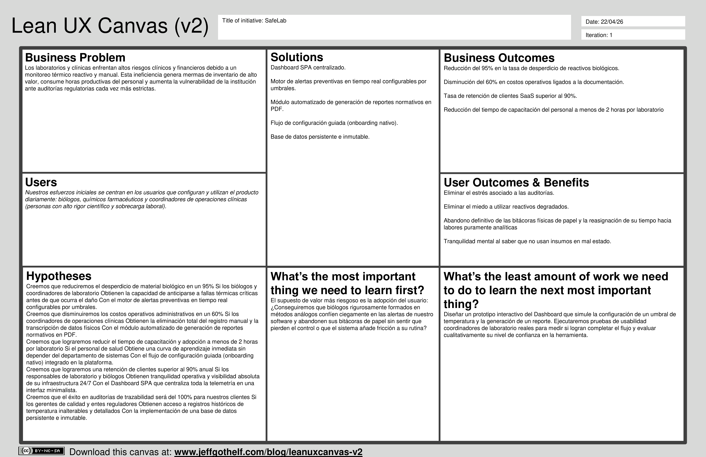

        
    <h1>Informe de Trabajo Final</h1>
    
<strong>Universidad:</strong> Universidad Peruana de Ciencias Aplicadas

    
<strong>Carrera:</strong> Ingeniería de Software

    
<strong>Ciclo:</strong> 2026-10

    
<strong>Código del Curso:</strong> 1ASI0729

    
<strong>Nombre del Curso:</strong> Desarrollo de Aplicaciones Open Source

    
<strong>Sección:</strong> 2610

    
<strong>Profesor:</strong> Alberto Wilmer Sánchez Seña

    
<strong>Startup:</strong> Safelab

    
<strong>Nombre del Producto:</strong> Safelab

<h3 align="center">Relación de Integrantes:</h3>

    <table>
        <tr>
            <th><strong>Código</strong></th>
            <th><strong>Apellidos y Nombres</strong></th>
        </tr>
        <tr>
            <td>U201817507</td>
            <td>Manuel Angel Sanchez Arenas</td>
        </tr>
        <tr>
            <td>U201919096</td>
            <td>Jean Niels Arizabal Condori</td>
        </tr>
        <tr>
            <td>U20241B761</td>
            <td>Esteban Eduardo Chavez Bardales</td>
        </tr>
        <tr>
            <td>U202520310</td>
            <td>Jhon Jordy Jaramillo Mayta</td>
        </tr>
    </table>

<strong>Mes y Año:</strong> Abril 2025

## **Registro de Versiones del Informe**

<table border="1" cellpadding="6" cellspacing="0">
  <thead>
    <tr>
      <th>Versión</th>
      <th>Fecha</th>
      <th>Autor(es)</th>
      <th>Descripción de Modificación</th>
    </tr>
  </thead>
  <tbody>
    <tr>
      <td><strong>1.0</strong></td>
      <td>2026-04-25</td>
      <td>
        <ul>
          <li>Sanchez Arenas, Manuel Angel</li>
          <li>Arizabal Condori, Jean Niels</li>
          <li>Chavez Bardales, Esteban Eduardo</li>
          <li>Jaramillo Mayta, Jhon Jordy</li>
        </ul>
      </td>
      <td>
        <strong>Se incluye:</strong>
        <ul>
          <li>Carátula, Registro de versiones, Student Outcome y Contenido de Informe</li>
          <li>Capitulo I: Introducción</li>
          <li>Capitulo II: Requirements Elicitation & Analysis</li>
          <li>Capitulo III: Especificación de Requerimientos</li>
          <li>Capitulo IV: Diseño del Producto</li>
          <li>Capitulo V: Implementación, Validación y Despliegue del Producto</li>
        </ul>
      </td>
    </tr>
    <tr>
      <td><strong>2.0</strong></td>
      <td>2026-05-14</td>
      <td>
        <ul>
          <li>Sanchez Arenas, Manuel Angel</li>
          <li>Arizabal Condori, Jean Niels</li>
          <li>Chavez Bardales, Esteban Eduardo</li>
          <li>Jaramillo Mayta, Jhon Jordy</li>
        </ul>
      </td>
      <td>
        <strong>Se incluye:</strong> 
        <ul>
          <li>Corrección de Capitulo III: User Stories </li>
          <li>Capitulo V: Documentación del Sprint 2 (Sprint Backlog, Deployment Evidence, Software Documentation) </li>
        </ul>
      </td>
    </tr>
    <tr>
      <td><strong>3.0</strong></td>
      <td>2026-06-14</td>
      <td>
        <ul>
          <li>Sanchez Arenas, Manuel Angel</li>
          <li>Arizabal Condori, Jean Niels</li>
          <li>Chavez Bardales, Esteban Eduardo</li>
          <li>Jaramillo Mayta, Jhon Jordy</li>
        </ul>
      </td>
      <td>
        <strong>Se incluye:</strong> 
        <ul>
          <li>Heurísticas </li>
          <li>Entrevistas de validación del producto </li>
          <li>Capitulo V: Documentación del Sprint 3 (Sprint Backlog, Deployment Evidence, Software Documentation) </li>
        </ul>
      </td>
    </tr>
  </tbody>
</table>

## **Project Report Collaboration Insights**

**URL del Repositorio:**  
[Repositorio de GitHub](https://github.com/upc-pre-1ASI0729-11834-Especialistas/report)

Este informe ha sido desarrollado de forma colaborativa mediante GitHub, empleando GitFlow y Conventional Commits. Cada miembro del equipo ha contribuido con commits y ramas individuales durante el desarrollo del proyecto.

**Participación del equipo:**

<table border="1" cellpadding="6" cellspacing="0">
  <thead>
    <tr>
      <th>Integrante</th>
      <th>Usuario GitHub</th>
      <th>Aportaciones destacadas</th>
    </tr>
  </thead>
  <tbody>
    <tr>
      <td>Manuel Sanchez</td>
      <td>@manuels7a</td>
      <td>Desarrollo de secciones del capítulo V relacionadas a la documentación del Sprint 4 (Nuevo despliegue de la aplicación web, Web Services y Landing page).</td>
    </tr>
    <tr>
      <td>Jean Niels Arizabal Condori</td>
      <td>@JeanArizabal</td>
      <td>Coordinación del desarrollo del backend que será integrado en la aplicación web.</td>
    </tr>
    <tr>
      <td>Esteban Eduardo Chavez Bardales</td>
      <td>@ECEB0704</td>
      <td>Correcciones de estructura del informe y revisión de heurísticas.</td>
    </tr>
    <tr>
      <td>Jhon Jordy Jaramillo Mayta</td>
      <td>@Marklnz1</td>
      <td>Documentación de las actualizaciones a la aplicación web y landing page.</td>
    </tr>
  </tbody>
</table>

## **Contenido**

- [Carátula](#carátula)
- [Registro de Versiones del Informe](#registro-de-versiones-del-informe)
- [Project Report Collaboration Insights](#project-report-collaboration-insights)
- [Contenido](#contenido)
- [Student Outcome](#student-outcome)
- [Capítulo I: Introducción](#capítulo-i-introducción)
  - [1.1 Startup Profile](#11-startup-profile)
    - [1.1.1 Descripción de la Startup](#111-descripción-de-la-startup)
    - [1.1.2 Perfiles de integrantes del equipo](#112-perfiles-de-integrantes-del-equipo)
  - [1.2 Solution Profile](#12-solution-profile)
    - [1.2.1 Antecedentes y problemática](#121-antecedentes-y-problemática)
    - [1.2.2 Lean UX Process](#122-lean-ux-process)
      - [1.2.2.1 Lean UX Problem Statements](#1221-lean-ux-problem-statements)
      - [1.2.2.2 Lean UX Assumptions](#1222-lean-ux-assumptions)
      - [1.2.2.3 Lean UX Hypothesis Statements](#1223-lean-ux-hypothesis-statements)
      - [1.2.2.4 Lean UX Canvas](#1224-lean-ux-canvas)
  - [1.3 Segmentos objetivo](#13-segmentos-objetivo)
- [Capítulo II: Requirements Elicitation & Analysis](#capítulo-ii-requirements-elicitation--analysis)
  - [2.1 Competidores](#21-competidores)
    - [2.1.1 Análisis competitivo](#211-análisis-competitivo)
    - [2.1.2 Estrategias y tácticas frente a competidores](#212-estrategias-y-tácticas-frente-a-competidores)
  - [2.2 Entrevistas](#22-entrevistas)
    - [2.2.1 Diseño de entrevistas](#221-diseño-de-entrevistas)
    - [2.2.2 Registro de entrevistas](#222-registro-de-entrevistas)
    - [2.2.3 Análisis de entrevistas](#223-análisis-de-entrevistas)
  - [2.3 Needfinding](#23-needfinding)
    - [2.3.1 User Personas](#231-user-personas)
    - [2.3.2 User Task Matrix](#232-user-task-matrix)
    - [2.3.3 User Journey Mapping](#233-user-journey-mapping)
    - [2.3.4 Empathy Mapping](#234-empathy-mapping)
  - [2.4 Big Picture Event Storming](#24-big-picture-event-storming)
  - [2.5 Ubiquitous Language](#25-ubiquitous-language)
- [Capítulo III: Requirements Specification](#capítulo-iii-requirements-specification)
  - [3.1 User Stories](#31-user-stories)
  - [3.2 Impact Mapping](#32-impact-mapping)
  - [3.3 Product Backlog](#33-product-backlog)
- [Capítulo IV: Product Design](#capítulo-iv-product-design)
  - [4.1 Style Guidelines](#41-style-guidelines)
    - [4.1.1 General Style Guidelines](#411-general-style-guidelines)
    - [4.1.2 Web Style Guidelines](#412-web-style-guidelines)
  - [4.2 Information Architecture](#42-information-architecture)
    - [4.2.1 Organization Systems](#421-organization-systems)
    - [4.2.2 Labeling Systems](#422-labeling-systems)
    - [4.2.3 SEO Tags and Meta Tags](#423-seo-tags-and-meta-tags)
    - [4.2.4 Searching Systems](#424-searching-systems)
    - [4.2.5 Navigation System](#425-navigation-system)
  - [4.3 Landing Page UI Design](#43-landing-page-ui-design)
    - [4.3.1 Landing Page Wireframe](#431-landing-page-wireframe)
    - [4.3.2 Landing Page Mock-up](#432-landing-page-mock-up)
  - [4.4 Web Applications UX/UI Design](#44-web-applications-uxui-design)
    - [4.4.1 Web Applications Wireframes](#441-web-applications-wireframes)
    - [4.4.2 Web Applications Wireflow Diagrams](#442-web-applications-wireflow-diagrams)
    - [4.4.3 Web Applications Mock-ups](#443-web-applications-mock-ups)
    - [4.4.4 Web Applications User Flow Diagrams](#444-web-applications-user-flow-diagrams)
  - [4.5 Web Applications Prototyping](#45-web-applications-prototyping)
  - [4.6 Domain-Driven Software Architecture](#46-domain-driven-software-architecture)
    - [4.6.1 Software Architecture Context Diagram](#461-software-architecture-context-diagram)
    - [4.6.2 Software Architecture Container Diagrams](#462-software-architecture-container-diagrams)
    - [4.6.3 Software Architecture Components Diagrams](#463-software-architecture-components-diagrams)
  - [4.7 Software Object-Oriented Design](#47-software-object-oriented-design)
    - [4.7.1 Class Diagrams](#471-class-diagrams)
  - [4.8 Database Design](#48-database-design)
    - [4.8.1 Database Diagrams](#481-database-diagrams)
- [Capítulo V: Product Implementation, Validation & Deployment](#capítulo-v-product-implementation-validation--deployment)
  - [5.1 Software Configuration Management](#51-software-configuration-management)
    - [5.1.1 Software Development Environment Configuration](#511-software-development-environment-configuration)
    - [5.1.2 Source Code Management](#512-source-code-management)
    - [5.1.3 Source Code Style Guide & Conventions](#513-source-code-style-guide--conventions)
    - [5.1.4 Software Deployment Configuration](#514-software-deployment-configuration)
  - [5.2 Landing Page, Services & Applications Implementation](#52-landing-page-services--applications-implementation)
    - [5.2.1 Sprint 1](#521-sprint-1)
      - [5.2.1.1 Sprint Planning](#5211-sprint-planning-1)
      - [5.2.1.2 Aspect Leaders and Collaborators](#5212-aspect-leaders-and-collaborators)
      - [5.2.1.3 Sprint Backlog 1](#5213-sprint-backlog-1)
      - [5.2.1.4 Development Evidence for Sprint Review](#5214-development-evidence-for-sprint-review)
      - [5.2.1.5 Execution Evidence for Sprint Review](#5215-execution-evidence-for-sprint-review)
      - [5.2.1.6 Services Documentation Evidence for Sprint Review](#5216-services-documentation-evidence-for-sprint-review)
      - [5.2.1.7 Software Deployment Evidence for Sprint Review](#5217-software-deployment-evidence-for-sprint-review)
      - [5.2.1.8 Team Collaboration Insights during Sprint](#5218-team-collaboration-insights-during-sprint)
    - [5.2.2 Sprint 2](#522-sprint-2)
      - [5.2.2.1 Sprint Planning](#5221-sprint-planning-2)
      - [5.2.2.2 Aspect Leaders and Collaborators](#5222-aspect-leaders-and-collaborators)
      - [5.2.2.3 Sprint Backlog 2](#5223-sprint-backlog-2)
      - [5.2.2.4 Development Evidence for Sprint Review](#5224-development-evidence-for-sprint-review)
      - [5.2.2.5 Execution Evidence for Sprint Review](#5225-execution-evidence-for-sprint-review)
      - [5.2.2.6 Services Documentation Evidence for Sprint Review](#5226-services-documentation-evidence-for-sprint-review)
      - [5.2.2.7 Software Deployment Evidence for Sprint Review](#5227-software-deployment-evidence-for-sprint-review)
      - [5.2.2.8 Team Collaboration Insights during Sprint](#5228-team-collaboration-insights-during-sprint)
    - [5.2.3 Sprint 3](#523-sprint-3)
      - [5.2.3.1 Sprint Planning](#5231-sprint-planning-3)
      - [5.2.3.2 Aspect Leaders and Collaborators](#5232-aspect-leaders-and-collaborators)
      - [5.2.3.3 Sprint Backlog 3](#5233-sprint-backlog-3)
      - [5.2.3.4 Development Evidence for Sprint Review](#5234-development-evidence-for-sprint-review)
      - [5.2.3.5 Execution Evidence for Sprint Review](#5235-execution-evidence-for-sprint-review)
      - [5.2.3.6 Services Documentation Evidence for Sprint Review](#5236-services-documentation-evidence-for-sprint-review)
      - [5.2.3.7 Software Deployment Evidence for Sprint Review](#5237-software-deployment-evidence-for-sprint-review)
      - [5.2.3.8 Team Collaboration Insights during Sprint](#5238-team-collaboration-insights-during-sprint)
    - [5.2.4 Sprint 4](#524-sprint-4)
      - [5.2.4.1 Sprint Planning](#5241-sprint-planning-4)
      - [5.2.4.2 Aspect Leaders and Collaborators](#5242-aspect-leaders-and-collaborators)
      - [5.2.4.3 Sprint Backlog 4](#5243-sprint-backlog-4)
      - [5.2.4.4 Development Evidence for Sprint Review](#5244-development-evidence-for-sprint-review)
      - [5.2.4.5 Execution Evidence for Sprint Review](#5245-execution-evidence-for-sprint-review)
      - [5.2.4.6 Services Documentation Evidence for Sprint Review](#5246-services-documentation-evidence-for-sprint-review)
      - [5.2.4.7 Software Deployment Evidence for Sprint Review](#5247-software-deployment-evidence-for-sprint-review)
      - [5.2.4.8 Team Collaboration Insights during Sprint](#5248-team-collaboration-insights-during-sprint)
  - [5.3. Validation Interviews](#53-validation-interviews)
    - [5.3.1. Diseño de entrevistas](#531-diseño-de-entrevistas)
    - [5.3.2. Registro de entrevistas](#532-registro-de-entrevistas)
    - [5.3.3. Evaluaciones según heuristicas](#533-evaluaciones-según-heuristicas)
  - [5.4. Video About-the-Product](#54-video-about-the-product)
- [Conclusiones](#conclusiones)
- [Anexos](#anexos)
- [Bibliografía](#bibliografía)

## **Student Outcome**

> Criterio: El estudiante comunica resultados y proceso de ingeniería aplicado para el ciclo de desarrollo y despliegue de una solución web distribuida bajo una arquitectura orientada a servicios, que satisface requisitos para empresas o público en general, con un enfoque innovador e inclusivo, desplegada sobre plataformas Server Side o Cloud, haciendo uso de tecnologías open-source basadas en el lenguaje de programación Java para la lógica de lado servidor y tecnologías open-source para los componentes de la aplicación.

<table border="1" cellpadding="6" cellspacing="0">
  <thead>
    <tr>
      <th>Criterio Específico</th>
      <th>Acciones Realizadas</th>
      <th>Conclusiones</th>
    </tr>
  </thead>
  <tbody>
    <tr>
      <td><strong>Comunica oralmente con efectividad a diferentes rangos de audiencia</strong></td>
      <td>
        <strong>Manuel Sanchez</strong> 
        <strong>AV1: </strong>Expongo con efectividad la propuestas del diseño de la aplicación. 
        <strong>TB1: </strong>A través de las reuniones de equipo, comparto las ideas y avances del proyecto. 
        <strong>AV2: </strong>Sustento verbalmente las propuestas para la integración del backend con el frontend y coordino con mi equipo la corrección de los errores que puede haber. 
        <strong>TB2:</strong> Expongo los resultados finales en el video "About the Team" y sustento el despliegue final y la arquitectura orientada a servicios de forma clara ante el jurado evaluador.  
         
        <strong>Jean Arizabal</strong> 
        <strong>AV1: </strong>Presento la propuesta de solución de forma detallada considerando los antecedentes, el perfil de la solución, el análisis competitivo y el needfinding. 
        <strong>TB1: </strong>Comunico a mi equipo mis ideas para el desarrollo del proyecto y para poder trabajar sin conflictos  
        <strong>AV2: </strong>Dirijo las entrevistas de validación con los usuarios finales, utilizando un lenguaje claro para obtener feedback sobre la plataforma integrada. 
        <strong>TB2:</strong> Conduzco la demostración del producto en el video "About the Product", utilizando un tono comercial enfocado en soluciones B2B para captar la atención de clientes potenciales.  
         
        <strong>Esteban Chavez</strong> 
        <strong>AV1: </strong>Explico detalladamente el event storming, desde el inicio hasta el final, los diagramas, tanto de clase como de base de datos y el diseño de la landing page. 
        <strong>TB1: </strong>Explico a mis compañeros las modificaciones y correcciones de los requisitos del proyecto para ajustar el desarrollo de la aplicación. 
        <strong>AV2: </strong>Muestro al equipo los resultados de las evaluaciones heurísticas, detallando los problemas de usabilidad encontrados para priorizar los cambios en la interfaz. 
        <strong>TB2:</strong> Sustento las mejoras implementadas a partir del feedback de validación en la presentación final y expongo mis aprendizajes clave en el video retrospectivo del equipo.  
         
        <strong>Jhon Jaramillo</strong> 
        <strong>AV1: </strong>Expongo y sustento las decisiones arquitectónicas del proyecto utilizando los diagramas C4, además de presentar el diseño, flujo y propósito de la landing page al equipo. 
        <strong>TB1: </strong>Consulto mis dudas con mis compañeros y busco orientación para resolver los desafíos del proyecto. 
        <strong>AV2: </strong>Explico la lógica de los endpoints del backend desarrollados al equipo para asegurar una integración fluida. 
        <strong>TB2:</strong> Articulo el proceso de despliegue continuo (Continuous Deployment en Vercel y Render) en la exposición final, dirigiéndome de forma precisa a una audiencia técnica. 
         
      </td>
      <td>
        <strong>AV1:</strong> Para poder comunicar efectivamente nuestras ideas fue necesario trabajar en nuestra capacidad de expresión y en la claridad de nuestra comunicación. 
        <strong>TB1:</strong> Para poder entregar un producto alineado a los requisitos fue necesario comprender las modificaciones de los requisitos. Para ello, la comunicación entre los miembros del equipo fue fundamental. 
        <strong>AV2:</strong>La comunicación oral en este avance fue clave para interactuar con audiencias externas (usuarios en validaciones) y coordinar la integración técnica y las mejoras de usabilidad. 
        <strong>TB2:</strong> Consolidamos nuestra capacidad de comunicar el valor comercial y técnico del producto SaaS a través de videos profesionales y una sustentación final argumentada con solidez. 
      </td>
    </tr>
    <tr>
      <td><strong>Comunica por escrito con efectividad a diferentes rangos de audiencia</strong></td>
      <td>
        <strong>Manuel Sanchez</strong> 
        <strong>AV1: </strong>Redacto documentos claros y objetivos sobre las historias de usuario de Safelab. 
        <strong>TB1: </strong>Redacto la documentación técnica del sprint del proyecto a través de estándares apropiados para su correcta lectura. 
        <strong>AV2: </strong>Documento las pruebas de integración del frontend y los ajustes realizados en el sprint. 
        <strong>TB2:</strong> Redacto las conclusiones finales del proyecto, consolido el registro de versiones y valido rigurosamente la ortografía y gramática técnica de la entrega final.  
         
        <strong>Jean Arizabal</strong> 
        <strong>AV1: </strong>Redacto con detenimiento detalles sobre la startup, el perfil de la solución, el análisis competitivo y el needfinding. 
        <strong>TB1: </strong>Redacto propuestas de corrección para mejorar la calidad del producto. Hago correcciones puntutales para alinear el producto con los requisitos. 
        <strong>AV2: </strong>Diseño las preguntas para las entrevistas de validación y registro de forma analítica el reporte con los hallazgos y conclusiones de los usuarios. 
        <strong>TB2:</strong> Documento las recomendaciones a futuro y redacto los guiones (técnicos y comerciales) que sirven como base para la grabación de los videos "About the Product" y "About the Team".  
         
        <strong>Esteban Chavez</strong> 
        <strong>AV1: </strong>Escribo claramente la informacion necesaria que cada diagrama, e imagen necesita, de forma sencilla y tecnica, demostrando conocimientos especificos para las diferentes secciones. 
        <strong>TB1: </strong>Recibo el feeback y coordino las correcciones necesarias siguiendo los estándares del informe. 
        <strong>AV2: </strong>Redacto detalladamente el informe de evaluación por heurísticas del equipo adyacente, clasificando cada problema de usabilidad según su severidad bajo un formato técnico y formal. 
        <strong>TB2:</strong> Redacto el informe final de desempeño del equipo (Performance Report) y aseguro la correcta citación en formato APA en las secciones de bibliografía y anexos.  
         
        <strong>Jhon Jaramillo</strong> 
        <strong>AV1: </strong>Redacto historias de usuario claras y detalladas para estructurar la landing page, y documento la arquitectura del sistema elaborando diagramas de contexto y contenedores bajo el modelo C4. 
        <strong>TB1: </strong>Documento las decisiones en las reuniones del equipo para asegurar la alineación y el progreso del proyecto. 
        <strong>AV2: </strong>Redacto la documentación técnica del backend, detallando el funcionamiento de los endpoints y respuestas de la API para el equipo y futuros desarrolladores que puedan involucrarse en el proyecto.  
        <strong>TB2:</strong> Elaboro la documentación detallada de la configuración del despliegue final (Software Deployment Configuration) e integro las evidencias de los 4 Sprints garantizando la cohesión del documento final. 
      </td>
      <td>
        <strong>AV1: </strong>Para poder comunicar efectivamente nuestras ideas en el reporte fue necesario tener un bien planteada nuestra propuesta. 
        <strong>TB1: </strong>A través del feedback del informe, logramos optimizar lac comunicación de la propuesta de nuestro producto en el documento. 
        <strong>AV2:</strong>La documentación técnica y correcta redacción del reporte nos permitieron formalizar el progreso de la start-up y asegurar que la landing page comunique su valor comercial mediante los CTA correspondientes. 
        <strong>TB2:</strong> Alcanzamos un nivel profesional en la redacción de informes de ingeniería, logrando transmitir el ciclo de vida completo y la arquitectura de la solución distribuida a audiencias técnicas y de negocio. 
      </td>
    </tr>
  </tbody>  
</table>

---

# **Capítulo I: Introducción**

## **1.1. Startup Profile**

### **1.1.1. Descripción de la Startup**

SafeLab es una startup tecnológica dedicada a la transformación digital y la seguridad operativa del sector bioclínico y farmacéutico. Nuestra organización nace de la necesidad de resolver una vulnerabilidad crítica en la industria de la salud: la incertidumbre y las ineficiencias asociadas al almacenamiento de materiales biológicos altamente sensibles. Como empresa emergente, canalizamos todos nuestros esfuerzos técnicos y estratégicos en nuestro primer gran despliegue en el mercado: el desarrollo de un ecosistema digital innovador que garantice la preservación absoluta de la cadena de frío clínica. En SafeLab, no solo desarrollamos software; construimos infraestructuras de confianza que blindan la calidad del diagnóstico y la sostenibilidad de los recursos médicos.

El núcleo de nuestra propuesta de valor es una plataforma integral de monitoreo ambiental automatizado, diseñada específicamente para las rigurosas exigencias de laboratorios, hospitales y redes de farmacias. A través de la integración de dispositivos de hardware con un dashboard centralizado, el producto de SafeLab sustituye la vulnerable supervisión humana intermitente por una vigilancia continua y predictiva. Nuestra solución permite a los profesionales de la salud configurar reglas precisas de alerta y mitigación automática, previniendo activamente la degradación química de reactivos y vacunas. Nuestra misión es empoderar al personal clínico, eliminando el desgaste asociado a las tareas mecánicas de documentación y permitiéndoles enfocar su tiempo y experiencia exclusivamente en la gestión analítica y el cuidado del paciente.

Desde una perspectiva operativa y comercial, SafeLab estructura sus servicios bajo un modelo B2B (Business-to-Business) sustentado en una arquitectura SaaS (Software as a Service). Este enfoque nos permite dotar a las instituciones de salud de una solución altamente escalable y de rápida implementación, donde una suscripción corporativa garantiza el acceso ininterrumpido a herramientas de auditoría en tiempo real, reportes automatizados para el cumplimiento normativo y una inmutabilidad total en la retención de datos históricos. La visión a largo plazo de SafeLab es convertirse en el estándar regional para la gestión inteligente de inventarios biológicos, impulsando a las instituciones de salud hacia un modelo operativo guiado por la innovación pragmática y un compromiso innegociable con la cultura del "Desperdicio Cero".

### **1.1.2. Perfiles de integrantes del equipo**

<table border="1" cellpadding="6" cellspacing="0">
  <thead>
    <tr>
      <th>Foto</th>
      <th>Nombre completo</th>
      <th>Código</th>
      <th>Carrera</th>
      <th>Habilidades técnicas y rol</th>
    </tr>
  </thead>
  <tbody>
    <tr>
      <td></td>
      <td>Manuel Sanchez</td>
      <td>u201817507</td>
      <td>Ingeniería de Software</td>
      <td>Desarrollo Fullstack: ASP.NetCORE MVC con Razor. Java básico. React.js</td>
    </tr>
    <tr>
      <td></td>
      <td>Jean Arizabal</td>
      <td>U201919096</td>
      <td>Ingeniería de Software</td>
      <td>Desarrollo backend: node.js ASP.net</td>
    </tr>
    <tr>
      <td></td>
      <td>Esteban Chavez</td>
      <td>U20241B761</td>
      <td>Ingeniería de Software</td>
      <td>Conocimientos y habilidades: C++, html, css, java. Responsable, creativa, y con diferentes conocimientos para el curso. Me destaco por mi creatividad e innovación.</td>
    </tr>
    <tr>
      <td></td>
      <td>Jhon Jaramillo</td>
      <td>U202520310</td>
      <td>Ingeniería de Software</td>
      <td>Habilidades técnicas y rol: Desarrollo FullStack</td>
    </tr>
  </tbody>
</table>

## **1.2. Solution Profile**

### **1.2.1 Antecedentes y Problemática**

La gestión de la cadena de frío en entornos bioclínicos no es únicamente un desafío logístico, sino un pilar crítico para la seguridad del paciente. Cuando los reactivos de diagnóstico, muestras biológicas y vacunas se exponen a excursiones térmicas (fluctuaciones fuera de los rangos normativos de 2 °C a 8 °C), sufren alteraciones moleculares que comprometen drásticamente su eficacia y estabilidad (Kumru et al., 2014). Un reactivo degradado térmicamente que sea utilizado en pruebas de laboratorio puede generar falsos negativos o alterar métricas diagnósticas, representando un riesgo clínico inminente que afecta directamente las decisiones médicas y la salud de los pacientes.

En segundo plano, esta vulnerabilidad operativa se traduce en un impacto financiero severo para las instituciones de salud. La Organización Mundial de la Salud (OMS, 2020) señala que las deficiencias en el control de temperatura obligan al descarte preventivo de lotes enteros de productos biológicos de alto costo. Esta pérdida económica (desperdicio de stock) se agrava por el desgaste humano: el personal invierte un volumen considerable de horas laborales documentando parámetros en bitácoras físicas. Este esfuerzo administrativo resulta ineficiente, ya que no previene el daño del material, sino que apenas lo registra de forma forense y tardía.

La raíz de este problema es bidimensional. Por un lado, existe un factor de infraestructura: las instalaciones de salud a menudo enfrentan cortes de suministro eléctrico o dependen de equipos de refrigeración que carecen de sistemas de respaldo térmico. Por otro lado, y de forma más crítica, los métodos convencionales de monitoreo manual generan "puntos ciegos" en la supervisión. Un análisis sistemático sobre la cadena de frío demuestra que las revisiones esporádicas durante los turnos diurnos dejan al inventario completamente vulnerable durante la madrugada, los fines de semana y los días festivos (Matthias et al., 2007). Es precisamente en estos intervalos de nula vigilancia donde ocurren la mayoría de las fallas irreversibles, obligando al descarte de los insumos ante la incertidumbre del tiempo de exposición.

Para delimitar el problema de manera estructurada, aplicamos la técnica The 5 'W's y 2 'H's:

- **Who (Quién)**: Coordinadores de laboratorio, técnicos de farmacia y personal administrativo responsable de la viabilidad clínica y la gestión presupuestal del inventario biológico.

- **What (Qué)**: Riesgo clínico elevado por la potencial utilización de insumos degradados, sumado a pérdidas económicas significativas debido al descarte obligatorio de reactivos y vacunas tras excursiones térmicas.

- **Where (Dónde)**: Cuartos fríos, refrigeradores de laboratorio y áreas de almacenamiento en farmacias clínicas y hospitalarias.

- **When (Cuándo)**: El riesgo es permanente, pero los incidentes críticos ocurren durante fallas de infraestructura eléctrica y, especialmente, durante los "puntos ciegos" de la supervisión manual (madrugadas, fines de semana y feriados).

- **Why (Por qué)**: Excesiva dependencia de la supervisión humana intermitente mediante bitácoras físicas, combinada con la falta de mecanismos que notifiquen proactivamente el mal funcionamiento del hardware de refrigeración.

- **How (Cómo)**: El personal constata la temperatura visualmente en intervalos de varias horas. Si ocurre un apagón o una falla técnica entre dos lecturas, es imposible determinar con exactitud el tiempo que el reactivo estuvo fuera de rango, lo que invalida su uso clínico.

- **How Much (Cuánto)**: Compromiso incalculable en la fiabilidad diagnóstica de los pacientes, sumado a la pérdida de miles de dólares por lote descartado y cientos de horas-hombre desperdiciadas anualmente en tareas mecánicas de documentación (Kumru et al., 2014; OMS, 2020).

### **1.2.2 Lean UX Process**

#### **1.2.2.1. Lean UX Problem Statements**

- **Contexto**: Las instituciones de salud, como laboratorios clínicos y farmacias hospitalarias, dependen de la integridad de inventarios biológicos (reactivos, vacunas y muestras) que requieren un control térmico estricto, generalmente entre 2 °C y 8 °C. La precisión de los diagnósticos médicos y la rentabilidad institucional están directamente ligadas a la estabilidad de estos insumos.

- **Observación del problema**: Se ha identificado que el proceso actual de control de la cadena de frío es mayoritariamente manual y reactivo. Profesionales altamente especializados, como biólogos y químicos, dedican hasta un 25% de su jornada a registrar temperaturas en bitácoras físicas. Este método genera "puntos ciegos" críticos durante las madrugadas y fines de semana, periodos en los que no existe supervisión activa ni capacidad de respuesta ante fallas de infraestructura o cortes eléctricos.

- **Impacto**: Esta deficiencia operativa provoca un elevado riesgo clínico por el uso potencial de insumos degradados y genera pérdidas económicas que pueden alcanzar miles de dólares por cada incidente térmico. Asimismo, la falta de una trazabilidad digital inmutable expone a las instituciones a sanciones legales y regulatorias por parte de entidades como DIGEMID o la FDA, además de comprometer certificaciones de calidad como la ISO 15189 (Kumru et al., 2014; Organización Mundial de la Salud, 2020).

#### **1.2.2.2. Lean UX Assumptions**

- **User Assumptions**:
    - Creemos que nuestros usuarios son biólogos y coordinadores de laboratorio con una carga laboral excesiva y altos niveles de estrés.
    - Creemos que estos profesionales poseen un criterio científico riguroso que les hace valorar la precisión de los datos sobre la facilidad administrativa.
    - Creemos que el personal siente una profunda desconfianza hacia las bitácoras manuales debido a su inherente margen de error.
    - Creemos que los usuarios tienen la competencia técnica necesaria para operar interfaces web modernas sin requerir capacitaciones extensas.
    - Creemos que las auditorías externas y el cumplimiento normativo representan la principal fuente de fricción y preocupación laboral para el personal.

- **User Outcome Assumptions**:
    - Creemos que el usuario obtendrá tranquilidad mental al disponer de visibilidad remota de sus equipos de frío las 24 horas del día.
    - Creemos que el éxito del sistema para el usuario implica la eliminación absoluta de las bitácoras de papel y los errores de transcripción.
    - Creemos que el personal podrá actuar preventivamente antes de que un reactivo sufra una degradación irreversible gracias a las alertas tempranas.
    - Creemos que el usuario logrará una curva de adopción técnica inmediata sin depender de manuales complejos o del departamento de sistemas.
    - Creemos que la automatización liberará tiempo valioso para que el personal se enfoque en tareas analíticas de alto valor clínico.

- **Business Assumptions**:
    - Creemos que las pérdidas económicas por desperdicio de reactivos son significativamente mayores al costo de suscripción de nuestro software.
    - Creemos que los laboratorios medianos optarán por un modelo B2B SaaS si el Retorno de Inversión (ROI) es demostrable en el corto plazo.
    - Creemos que la facilidad de uso del software es vital para evitar la resistencia operativa en entornos clínicos tradicionales.
    - Creemos que la creciente rigurosidad de los entes reguladores sanitarios actuará como el principal motor de ventas para nuestra solución.
    - Creemos que la reputación de SafeLab se consolidará mediante la reducción comprobada de mermas en los primeros clientes adoptantes.

- **Business Outcome Assumptions**:
    - Creemos que la plataforma logrará reducir el desperdicio de material biológico en un 95% durante el primer año de implementación.
    - Creemos que alcanzaremos una tasa de retención de clientes superior al 90% anual debido al valor crítico que aporta el sistema.
    - Creemos que los costos operativos de gestión de calidad en las clínicas disminuirán en un 60% al automatizar la recolección de datos.
    - Creemos que la usabilidad de la plataforma permitirá que el tiempo de capacitación y adopción del personal clínico se reduzca a menos de 2 horas por laboratorio.
    - Creemos que la acumulación de datos históricos permitirá ofrecer servicios de analítica predictiva como una fuente de ingresos adicional.

- **Feature Assumptions**:
    - Creemos que un Dashboard SPA (Single Page Application) es la interfaz más eficiente para centralizar el monitoreo de múltiples equipos.
    - Creemos que un motor de alertas configurable por umbrales permitirá adaptar el sistema a la sensibilidad térmica específica de cada reactivo.
    - Creemos que un módulo de exportación de reportes PDF automatizados garantizará el cumplimiento de los estándares de auditoría.
    - Creemos que un flujo de configuración guiada (onboarding nativo) en la plataforma facilitará la adopción autónoma del sistema.
    - Creemos que una base de datos inmutable es esencial para asegurar la veracidad de la trazabilidad ante inspecciones legales.

#### **1.2.2.3. Lean UX Hypothesis Statements**

- **Creemos que** reduciremos el desperdicio de material biológico en un 95% 
    **Si** los biólogos y coordinadores de laboratorio 
    **Obtienen** la capacidad de anticiparse a fallas térmicas críticas antes de que ocurra el daño 
    **Con** el motor de alertas preventivas en tiempo real configurables por umbrales. 
- **Creemos que** disminuiremos los costos operativos administrativos en un 60% 
    **Si** los coordinadores de operaciones clínicas 
    **Obtienen** la eliminación total del registro manual y la transcripción de datos físicos 
    **Con** el módulo automatizado de generación de reportes normativos en PDF. 
- **Creemos que** lograremos reducir el tiempo de capacitación y adopción a menos de 2 horas por laboratorio 
    **Si** el personal de salud 
    **Obtiene** una curva de aprendizaje inmediata sin depender del departamento de sistemas 
    **Con** el flujo de configuración guiada (onboarding nativo) integrado en la plataforma. 
- **Creemos que** lograremos una retención de clientes superior al 90% anual 
    **Si** los responsables de laboratorio y biólogos 
    **Obtienen** tranquilidad operativa y visibilidad absoluta de su infraestructura 24/7 
    **Con** el Dashboard SPA que centraliza toda la telemetría en una interfaz minimalista. 
- **Creemos que** el éxito en auditorías de trazabilidad será del 100% para nuestros clientes 
    **Si** los gerentes de calidad y entes reguladores 
    **Obtienen** acceso a registros históricos de temperatura inalterables y detallados 
    **Con** la implementación de una base de datos persistente e inmutable. 

#### **1.2.2.4. Lean UX Canvas**

Nota: Elaboración propia.

## **1.3. Segmentos Objetivo**

**El Coordinador de Operaciones Bioclínicas**

El mercado objetivo de SafeLab se concentra en el sector de la salud descentralizado, específicamente enfocado en laboratorios clínicos y farmacias hospitalarias ubicados en ciudades emergentes o provincias con poblaciones menores a 250,000 habitantes. Desde una perspectiva firmográfica y geográfica, estas instituciones representan un nicho altamente desatendido; mientras que los grandes complejos hospitalarios en metrópolis ya cuentan con ecosistemas de automatización de grado corporativo, los laboratorios en ciudades medianas y pequeñas operan con presupuestos más restringidos y dependen de infraestructura tecnológica rezagada. Al carecer de acceso a soluciones automatizadas accesibles, estas instituciones sufren de manera desproporcionada los impactos económicos de las excursiones térmicas, convirtiéndose en el ecosistema ideal para la adopción de un modelo B2B SaaS de rápida implementación.

A nivel demográfico, este segmento está compuesto por hombres y mujeres en un rango de edad amplio, situado entre los 24 y 60 años. Esta amplitud etaria abarca desde profesionales de la salud recién egresados que asumen roles de supervisión técnica, hasta directores de laboratorio con décadas de trayectoria. Todos comparten un nivel educativo superior (grados universitarios en biología, farmacia, biotecnología o tecnología médica). En el contexto institucional, estos profesionales poseen un poder de decisión híbrido: actúan como usuarios finales (End Users) que sufren directamente las ineficiencias del proceso diario, pero al mismo tiempo ejercen el rol de influenciadores críticos (Decision Influencers) frente a la gerencia médica. Si bien no siempre son quienes firman los presupuestos de la clínica, su aval técnico es el requisito indispensable para la adquisición de cualquier herramienta o equipamiento de laboratorio.

Desde un enfoque psicográfico y de comportamiento, el coordinador bioclínico se caracteriza por un rigor científico inquebrantable, moldeado por años de formación académica. Son individuos meticulosos y altamente analíticos, cuyo mayor temor profesional es la validación de un falso negativo derivado del uso de un reactivo degradado. Comportamentalmente, viven en un estado de alerta constante, experimentando altos niveles de estrés laboral al tener que equilibrar el procesamiento de muestras con tareas mecánicas de transcripción en bitácoras físicas. La presión por cumplir con normativas de calidad y superar auditorías sorpresa de entes reguladores rige su rutina diaria, generándoles una profunda frustración al saber que sus métodos de control manual son reactivos, propensos al error humano y consumen tiempo que debería ser destinado al análisis clínico.

Finalmente, el perfil tecnográfico de este segmento revela una dualidad interesante. En su entorno de trabajo, suelen interactuar con computadoras compartidas (generalmente PCs de escritorio con sistemas operativos heredados) y carecen de un departamento de soporte técnico (TI) dedicado exclusivamente a ellos. Sin embargo, en su vida personal, son usuarios asiduos de dispositivos móviles inteligentes (smartphones Android o iOS) y consumen información ágilmente. Esta realidad exige que las soluciones tecnológicas dirigidas a ellos no requieran instalaciones complejas ni mantenimientos locales; necesitan plataformas como aplicaciones web (SPA) que sean intuitivas, accesibles desde cualquier navegador o dispositivo móvil, y que ofrezcan una experiencia de usuario fluida que contrarreste la obsolescencia técnica de su entorno laboral.
