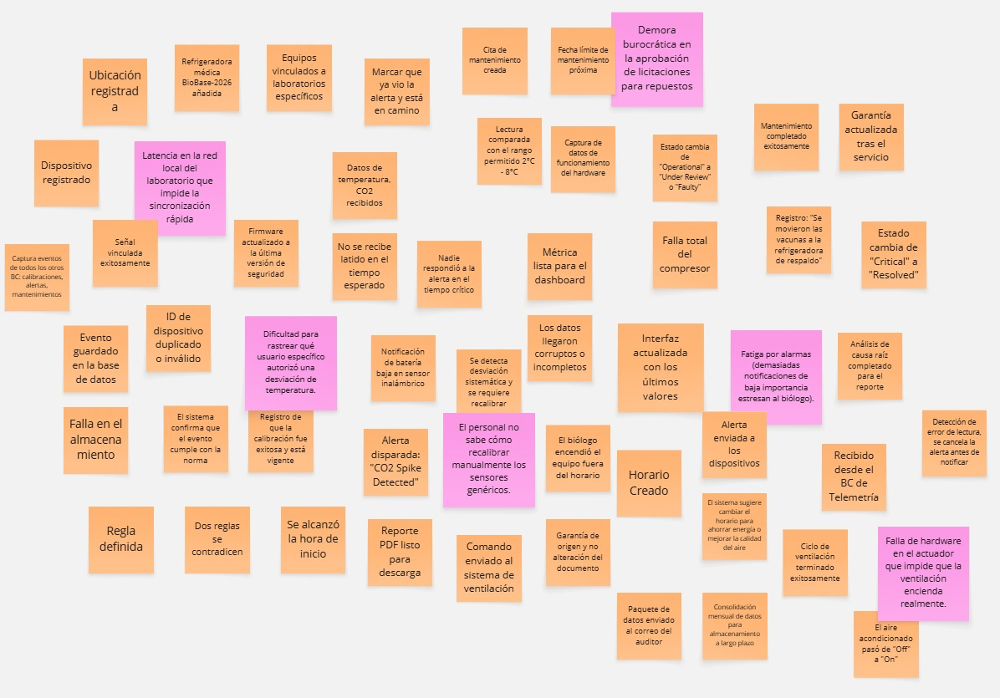

# **Capítulo II: Requirements Elicitation & Analysis**

## **2.1. Competidores**

### **2.1.1. Análisis competitivo**

**¿Por qué llevar a cabo este análisis?**
Identificar las barreras de entrada (tecnológicas y económicas) que imponen los líderes globales del monitoreo IoT, con el fin de validar que existe un nicho desatendido en instituciones de salud medianas y pequeñas. Este análisis nos permitirá posicionar a SafeLab como una alternativa ágil, específica para el flujo clínico y económicamente accesible.

<table border="1" cellpadding="6" cellspacing="0">
  <thead>
    <tr>
      <th>Atributo</th>
      <th>SafeLab</th>
      <th>SmartSense</th>
      <th>SenseAnywhere</th>
      <th>Monnit</th>
    </tr>
  </thead>
  <tbody>
    <tr>
      <td><strong>Overview</strong></td>
      <td>Startup B2B SaaS enfocada en erradicar mermas biológicas mediante automatización ágil y accesible.</td>
      <td>Plataforma corporativa IoT de alto nivel para trazabilidad y cumplimiento en redes hospitalarias y farmacéuticas.</td>
      <td>Sistema europeo de monitoreo en la nube, enfocado en hardware ultra duradero y logística de cadena de frío.</td>
      <td>Proveedor global de soluciones de monitoreo remoto con sensores inalámbricos para múltiples industrias.</td>
    </tr>
    <tr>
      <td><strong>Ventaja Competitiva</strong></td>
      <td>Plataforma agnóstica de hardware, altamente contextualizada al flujo de trabajo de biólogos.</td>
      <td>Capacidad masiva de escala e integración con sistemas ERP y cumplimiento estricto normativo (FDA).</td>
      <td>Confiabilidad extrema del hardware y registro ininterrumpido en la nube sin mantenimiento local.</td>
      <td>Accesibilidad económica inicial y personalización extrema para monitorear casi cualquier variable.</td>
    </tr>
    <tr>
      <td><strong>Mercado Objetivo</strong></td>
      <td>Laboratorios clínicos y farmacias hospitalarias en ciudades emergentes o periféricas.</td>
      <td>Grandes hospitales, cadenas de farmacias nacionales y logística farmacéutica global.</td>
      <td>Almacenes de alta tecnología, laboratorios farmacéuticos y empresas de transporte logístico.</td>
      <td>Pequeñas y medianas empresas (PyMEs) de cualquier sector (agricultura, IT, alimentos, clínicas).</td>
    </tr>
    <tr>
      <td><strong>Estrategias de Marketing</strong></td>
      <td>Inbound marketing enfocado en la "Cultura de Desperdicio Cero" y la simplificación de auditorías de calidad locales.</td>
      <td>Ventas corporativas B2B, enfocadas en el retorno de inversión (ROI) por mitigación de riesgos legales.</td>
      <td>Presencia en ferias farmacéuticas globales.</td>
      <td>Marketing digital masivo, e-commerce directo y posicionamiento en buscadores por bajo costo.</td>
    </tr>
    <tr>
      <td><strong>Productos y Servicios</strong></td>
      <td>Web Application SPA + Integración API con hardware genérico y económico de terceros.</td>
      <td>Software empresarial + Gateways + Sensores IoT propietarios.</td>
      <td>SenseAnywhere Cloud + AiroSensors (Hardware propietario cerrado).</td>
      <td>Plataforma iMonnit + Sensores ALTA inalámbricos.</td>
    </tr>
    <tr>
      <td><strong>Precios y Costos</strong></td>
      <td>Bajo. Modelo puramente SaaS con pagos mensuales/anuales, permitiendo reutilizar equipos genéricos.</td>
      <td>Muy alto. Contratos empresariales anuales que incluyen hardware costoso e instalación.</td>
      <td>Medio-Alto. Depende de la importación de sus sensores europeos especializados.</td>
      <td>Bajo-Medio. Hardware asequible y suscripciones mensuales o anuales escalonadas.</td>
    </tr>
    <tr>
      <td><strong>Canales de distribución</strong></td>
      <td>Venta directa B2B y self-onboarding.</td>
      <td>Venta directa corporativa. Plataforma Web y App Móvil.</td>
      <td>Red de distribuidores oficiales. Plataforma Web SaaS.</td>
      <td>Tienda online propia y distribuidores. Plataforma Web y Móvil.</td>
    </tr>
    <tr>
      <td><strong>Fortalezas</strong></td>
      <td>Alta agilidad para pivotar, bajo costo estructural e interfaz diseñada puramente para el usuario clínico</td>
      <td>Reputación de marca inquebrantable y certificaciones internacionales.</td>
      <td>Hardware líder en el mercado (10 años sin carga) y software muy estable.</td>
      <td>Amplísimo catálogo de sensores e interfaz altamente personalizable.</td>
    </tr>
    <tr>
      <td><strong>Oportunidades</strong></td>
      <td>Existencia de un inmenso mercado de laboratorios medianos que utilizan procesos de papel por no poder pagar a los grandes competidores.</td>
      <td>Absorción de competidores menores y contratos gubernamentales.</td>
      <td>Expansión en mercados emergentes y mejora de su integración API.</td>
      <td>Crecimiento constante en la digitalización post-pandemia en clínicas medianas.</td>
    </tr>
    <tr>
      <td><strong>Debilidades</strong></td>
      <td>Ausencia de hardware propietario y falta de reconocimiento de marca en la etapa inicial.</td>
      <td>Inaccesible para clínicas pequeñas. Requiere procesos lentos de implementación corporativa.</td>
      <td>Modelo de hardware cerrado; si se daña un sensor, hay que importar otro del fabricante.</td>
      <td>Plataforma demasiado genérica; no está diseñada específicamente para flujos de trabajo específicos.</td>
    </tr>
    <tr>
      <td><strong>Amenazas</strong></td>
      <td>Desconfianza inicial del sector salud hacia plataformas nuevas o ingreso de un gigante tecnológico al mercado de bajo costo.</td>
      <td>Surgimiento de startups ágiles y económicas en mercados locales.</td>
      <td>Problemas en cadenas de suministro global de microchips que encarecen su hardware.</td>
      <td>Soluciones de nicho que roben a sus clientes del sector salud por tener interfaces más especializadas.</td>
    </tr>
  </tbody>
</table>

### **2.1.2. Estrategias y tácticas frente a competidores**

**Estrategias Ofensivas** 
*Penetración por Hiper-especialización y Bajo Costo* 
Al cruzar nuestra fortaleza de tener una arquitectura de software agnóstica (sin hardware propietario) con el inmenso mercado desatendido en ciudades de menos de 250,000 habitantes, nuestra táctica principal será ofrecer un modelo SaaS puramente enfocado en el flujo clínico. Mientras los competidores obligan a comprar costosos paquetes de sensores cerrados, SafeLab permitirá a los laboratorios medianos digitalizar sus procesos utilizando sensores genéricos locales, democratizando el acceso a la tecnología de calidad y capturando rápidamente este nicho en expansión.
  
**Estrategias Adaptativas** 
*Alianzas Estratégicas de Distribución B2B* 
Para contrarrestar nuestra principal debilidad (la ausencia de hardware propio y el bajo reconocimiento de marca inicial), aprovecharemos la creciente necesidad de digitalización post-pandemia mediante alianzas. La táctica será asociarnos con distribuidores locales de refrigeradoras médicas y proveedores de sensores IoT genéricos, ofreciendo SafeLab como un "valor agregado" o software nativo en sus ventas. Esto nos permite llegar al cliente final a través de un canal que ya goza de confianza, mitigando el costo de adquisición.
  
**Estrategias Defensivas** 
*Diferenciación por Usabilidad Clínica (Self-Onboarding)* 
Ante la amenaza de la desconfianza del sector salud hacia nuevas tecnologías o el posible ingreso de gigantes tecnológicos con soluciones de bajo costo, utilizaremos nuestra agilidad y diseño centrado en el usuario clínico como escudo. La táctica es construir un flujo de onboarding "Plug & Play" y una interfaz (dashboard/reportes PDF) tan milimétricamente adaptada al estrés de las auditorías locales (ej. ISO 15189), que cualquier otra plataforma genérica se perciba como torpe e inadecuada para un biólogo.
  
**Estrategias de Supervivencia** 
*Validación Temprana y Cumplimiento Normativo Estricto* 
La combinación de ser una marca nueva (debilidad) en un sector altamente desconfiado y regulado (amenaza) es el mayor riesgo para la startup. Para sobrevivir a esta barrera, la táctica desde el "Día 1" será la estandarización estricta. El software se diseñará exclusivamente bajo los formatos exigidos por los entes reguladores de salud. Además, se implementarán programas piloto (pruebas Beta gratuitas) en laboratorios clave de ciudades secundarias para generar casos de éxito comprobables y métricas de ROI reales, sustituyendo la falta de reputación inicial por evidencia empírica irrefutable.
 

## **2.2. Entrevistas**

### **2.2.1. Diseño de entrevistas**

**Segmento: Coordinador**

1. ¿Podrías indicarnos tu nombre, edad, estado civil y en qué distrito resides?
2. Cuéntanos un poco sobre tí y qué sueles hacer en tu tiempo libre. ¿Cómo te describirías en tres palabras?
3. ¿Cuál es tu cargo actualmente y cuántos años de experiencia tienes? ¿Tienes un objetivo profesional a corto plazo?
4. En tu día a día, ¿qué dispositivos tecnológicos utilizas más (smartphone, tablet, laptop), qué sistema operativo y navegador prefieres?
5. ¿Cómo es actualmente el proceso de monitoreo en tu laboratorio/farmacia en el día a día?
6. ¿Cuánto tiempo estimas que le dedicas a registrar estas bitácoras y elaborar los reportes?
7. Háblame de la última vez que tuvieron un evento crítico, como una alta desviación de temperatura o una pérdida de reactivos/vacunas.
8. ¿Qué es lo que más te frustra o te estresa de tu trabajo actualmente?
9. Si existiera un sistema ideal para resolver tus problemas, ¿cómo sería?
10. Si un sistema te enviará una alerta a tu celular de que el refrigerador esté fallando, ¿preferirías solo recibir la notificación o que el sistema intente ejecutar una acción de contingencia?
11. Para que confíes al 100% en este sistema, ¿qué información o garantías tendría que mostrarte?
12. ¿Hay algo más sobre tu trabajo que creas que es importante discutir?

### **2.2.2. Registro de entrevistas**

Enlace de las entrevistas: https://upcedupe-my.sharepoint.com/:v:/g/personal/u201919096_upc_edu_pe/IQBdqMlL_u9rToY2ZTeE2nSjAQadDXLFwRLG9-oDESdV8MU?e=vSyiF7&nav=eyJyZWZlcnJhbEluZm8iOnsicmVmZXJyYWxBcHAiOiJTdHJlYW1XZWJBcHAiLCJyZWZlcnJhbFZpZXciOiJTaGFyZURpYWxvZy1MaW5rIiwicmVmZXJyYWxBcHBQbGF0Zm9ybSI6IldlYiIsInJlZmVycmFsTW9kZSI6InZpZXcifX0%3D

**Segmento: Coordinador**

* **Entrevista 1**: Abdul Muchica
    * **Inicio**: 00:00
    * **Duración**: 09:56
    * **Captura**:  
    * **Resumen**: Abdul Muchica es un biólogo de 29 años con experiencia en las áreas de microbiología y laboratorio clínico en los hospitales Honorio Delgado y Manuel Nuñez Butron. Se describe a sí mismo como una persona atlética y empática.
Su trabajo empieza monitoreando refrigeradoras en un banco de sangre, toma la temperatura manualmente usando un termómetro digital independiente de la refrigeradora y registra la hora, la persona responsable y la temperatura en una hoja de papel. Este procedimiento lo realiza tres veces por turno y le toma aproximadamente cinco minutos cada uno. Nos cuenta que a veces los termómetros pueden no ser manipulados correctamente y terminan siendo descalibrados. Lo que lo frustra es que no dispone de mucho espacio dentro del laboratorio, le es difícil manipular sus herramientas, y más aún cuando está en un apuro.
Le gustaría que los datos con los que trabaja no los tenga que medir y que estén disponibles para él por medio de su celular para más comodidad. Prefiere que, en caso suceda un problema, el sistema se encargue de arreglarlo por sí mismo, aunque expresa escepticismo en el caso de laboratorios con menor presupuesto. Considera de alta importancia, además de tener información sobre las temperaturas de las refrigeradoras, saber el estado de los equipos para prevenir que estos dejen de operar en momentos críticos.

 

* **Entrevista 2**: Fabrizio Palomino
    * **Inicio**: 09:57
    * **Duración**: 09:20
    * **Captura**:  
    * **Resumen**: Fabrizio Palomino es un biólogo de 24 años con dos años de experiencia en microbiología. Se describe a sí mismo como una persona entusiasta y cooperativa.
Su trabajo empieza con un control de calidad, revisa refrigeradoras donde guarda reactivos, algunos cuentan con termómetros, otros no. El control es manual, la temperatura y humedad son anotados en un cuaderno y a fin de mes debe generar un reporte con las variaciones de temperatura y averías que los equipos hayan sufrido. Le toma aproximadamente unos 5 minutos cada inspección. Algunos de los equipos no pueden ser examinados correctamente e inevitablemente fallan. Cuando esto sucede, le estresa el proceso de licitación para adquirir uno nuevo, él solo quiere tener un nuevo equipo funcionando lo más antes posible.
Lo principal que busca en una nueva aplicación es que demuestre confiabilidad, que la aplicación lo informe y esté disponible en todo momento. Prefiere que se envíen alertas siempre que suceda un imprevisto, priorizando al personal que se encuentre de turno en el momento de la falla. Espera que la aplicación muestre variación de temperatura entre periodos, preferiblemente entre semanas y meses.

 

* **Entrevista 3**: Efrain Palomino
    * **Inicio**: 09:57
    * **Duración**: 09:20
    * **Captura**:  
    * **Resumen**: Efrain Palomino es un biólogo de 65 años que trabaja en el servicio de laboratorio de EsSalud, tiene 26 años de experiencia en el área de microbiología. Se describe a sí mismo como una persona solidaria y trabajadora.
Al ingresar a trabajar, lo primero que hace es registrar las temperaturas de sus equipos, lo hace de forma manual, tres veces al día y tarda 35 minutos aproximadamente a lo largo de una semana. Estos registros se archivan diariamente en un “registro de incidencias”. Indica que no ha sufrido ninguna experiencia crítica hasta el momento, lo atribuye a un buen trabajo en equipo. Lo que lo estresa son las fallas administrativas al enfrentar ausencia de insumos y fallos de equipos.
Lo que más le importa es la constante comunicación entre el personal, aunque actualmente usa WhatsApp, le gustaría que esto se integre formalmente a su trabajo; menciona la necesidad de personalizar alertas para filtrar información y actuar inmediatamente. Requiere que esta app le muestre información de incidentes, estado de insumos y de equipos. Para finalizar, recalca la necesidad de las alarmas para que todo el personal esté informado sobre el estado de su servicio.

 

### **2.2.3. Análisis de entrevistas**

**Segmento: Coordinador**

**Características**
* **Sexo:** Masculino
* **Edad:** 24 - 65 años
* **Dispositivos:** Celular, Laptop
* **Sistemas Operativos:** Android, Windows
* **Navegadores:** Chrome
* **Influencia de Marcas:** Equipo de refrigeración (BioRack, BioBase, Helmer Inc), Insumos (Wiener), Comunicación (WhatsApp)

**Objetivos Comunes**
* Dejar de depender de procesos manuales al examinar sus equipos e insumos.
* Tener información detallada de sus equipos.
* Estandarizar sus controles y protocolos.
* Obtener rápida respuesta desde el nivel administrativo.

**Motivaciones Comunes**
* Contar con la seguridad de que sus equipos operan de forma correcta.
* Tener información que prevenga averías antes de que el equipo deje de funcionar.
* Contar con nuevos equipos totalmente operativos a la brevedad cuando uno deje de funcionar.

**Frustraciones Comunes**
* Procesos manuales sujetos a errores.
* Alcance a información superficial insuficiente.
* Largos tiempos de espera por procesos burocráticos debido a la falta de estandarización.

## **2.3. Needfinding**

### **2.3.1. User Personas**

**Segmento: Coordinador**

Nota: Elaboración propia.

### **2.3.2. User Task Matrix**

<table border="1" cellpadding="6" cellspacing="0">
  <thead>
    <tr>
      <th>#</th>
      <th>Tarea</th>
      <th>Frecuencia</th>
      <th>Importancia</th>
    </tr>
  </thead>
  <tbody>
    <tr>
      <td>1</td>
      <td>Monitoreo rutinario de temperatura</td>
      <td>Alta</td>
      <td>Alta</td>
    </tr>
    <tr>
      <td>2</td>
      <td>Respuesta ante incidentes de equipo</td>
      <td>Baja</td>
      <td>Crítica</td>
    </tr>
    <tr>
      <td>3</td>
      <td>Elaboración de reportes de calidad</td>
      <td>Media</td>
      <td>Alta</td>
    </tr>
    <tr>
      <td>4</td>
      <td>Traspaso de información entre turnos</td>
      <td>Alta</td>
      <td>Media</td>
    </tr>
    <tr>
      <td>5</td>
      <td>Gestión administrativa de reposición</td>
      <td>Muy Baja</td>
      <td>Media</td>
    </tr>
  </tbody>
</table>

### **2.3.3. User Journey Mapping**

**Segmento: Coordinador**

Nota: Elaboración propia.

### **2.3.4. Empathy Mapping**

**Segmento: Coordinador**

Nota: Elaboración propia.

## **2.4. Big Picture Event Storming**

El equipo llevó a cabo una sesión de **Big Picture Event Storming** con el objetivo de obtener una visión holística y compartida del dominio de **SafeLab**. A diferencia de un análisis técnico detallado, este proceso se centró en mapear el "landscape" del negocio, identificando los eventos de dominio más significativos desde que un sensor captura una lectura hasta que se genera un reporte de cumplimiento legal.

Durante esta fase, se priorizó la exploración del flujo de trabajo clínico y los puntos críticos de contacto entre el personal de laboratorio y la infraestructura tecnológica. El proceso se dividió en las siguientes etapas:

* **Identificación de Eventos de Dominio (Naranja):** Se plasmaron de forma cronológica todos los cambios de estado relevantes en el sistema (por ejemplo, el inicio de una excursión térmica o el reconocimiento de una alerta), utilizando un lenguaje común libre de tecnicismos excesivos.

* **Detección de Puntos de Fricción o Pain Points (Rosa):** De manera simultánea, el equipo identificó cuellos de botella, riesgos operativos y vacíos en la supervisión manual, como la fatiga por alarmas o la desconfianza en la integridad de los datos manuales durante los turnos nocturnos.

Esta primera aproximación visual permitió al equipo exponer oportunidades de mejora, como la automatización de acciones correctivas, y sentó las bases para delimitar los contextos de la solución, asegurando que la arquitectura de software propuesta responda fielmente a las necesidades críticas de seguridad bioclínica identificadas.

Nota: Elaboración propia en Miro.

## **2.5. Ubiquitous Language**

<table border="1" cellpadding="6" cellspacing="0">
  <thead>
    <tr>
      <th>Ubiquitous Term</th>
      <th>Definition</th>
    </tr>
  </thead>
  <tbody>
    <tr>
      <td><strong>Cold Chain</strong></td>
      <td>El proceso continuo e ininterrumpido de almacenamiento a temperatura controlada que garantiza la estabilidad y viabilidad de los insumos en el laboratorio.</td>
    </tr>
    <tr>
      <td><strong>Biological Reagent</strong></td>
      <td>Cualquier sustancia, reactivo clínico, vacuna o muestra de pacientes que requiera refrigeración estricta y sea altamente sensible a las variaciones térmicas.</td>
    </tr>
    <tr>
      <td><strong>Cold Storage Unit</strong></td>
      <td>El contenedor físico (refrigeradora médica, congeladora o cuarto frío) utilizado por el laboratorio para salvaguardar los insumos biológicos.</td>
    </tr>
    <tr>
      <td><strong>IoT Sensor</strong></td>
      <td>El dispositivo de hardware colocado en el interior del equipo de frío encargado de capturar la temperatura en tiempo real y transmitirla de forma inalámbrica a la plataforma.</td>
    </tr>
    <tr>
      <td><strong>Temperature Reading</strong></td>
      <td>El valor métrico exacto de temperatura o humedad capturado por un sensor en una marca de tiempo (timestamp) específica.</td>
    </tr>
    <tr>
      <td><strong>Safe Temperature Threshold</strong></td>
      <td>El rango numérico de temperatura permitido (usualmente entre 2 °C y 8 °C) dentro del cual un insumo biológico mantiene su integridad sin riesgo de daño.</td>
    </tr>
    <tr>
      <td><strong>Thermal Excursion</strong></td>
      <td>Evento crítico que ocurre cuando la temperatura de un equipo se desvía por fuera de su Safe Temperature Threshold, poniendo en riesgo la utilidad del reactivo.</td>
    </tr>
    <tr>
      <td><strong>Spoilage</strong></td>
      <td>La pérdida económica e irreversible (merma o desperdicio) de un lote de insumos biológicos debido a una exposición prolongada a una falla térmica.</td>
    </tr>
    <tr>
      <td><strong>Preventive Alert</strong></td>
      <td>Notificación automática generada por el sistema y enviada al personal de turno cuando la temperatura se acerca peligrosamente a los límites del umbral, antes de que ocurra la merma.</td>
    </tr>
    <tr>
      <td><strong>Incident Log</strong></td>
      <td>El registro inmutable y centralizado de todas las anomalías detectadas, incluyendo los comentarios sobre qué miembro del personal respondió a una alerta y qué acción correctiva tomó.</td>
    </tr>
    <tr>
      <td><strong>Compliance Report</strong></td>
      <td>Documento oficial generado automáticamente que consolida el historial de lecturas y el registro de incidencias en un formato normativo válido para superar auditorías de calidad (ej. ISO 15189, DIGEMID).</td>
    </tr>
  </tbody>
</table>