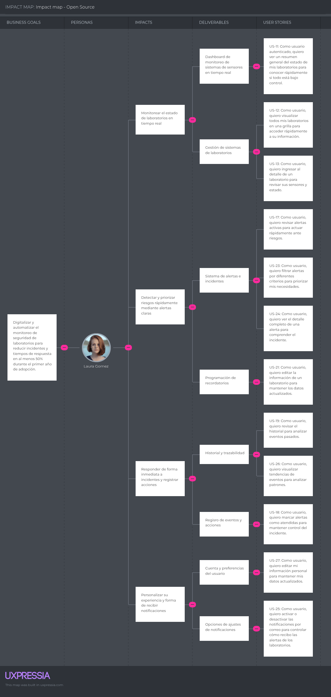

# Capitulo III: Requirements Specification

## Epics

<table border="1" cellpadding="6" cellspacing="0">
  <thead>
    <tr>
      <th>Epic ID</th>
      <th>Título</th>
      <th>Descripción</th>
    </tr>
  </thead>
  <tbody>
    <tr>
      <td>EP01</td>
      <td>Landing Page</td>
      <td>Landing page para la presentación y promoción del sistema SafeLab.</td>
    </tr>
    <tr>
      <td>EP02</td>
      <td>Gestión de Laboratorios</td>
      <td>Permitir a los usuarios crear, visualizar, administrar y monitorear sus laboratorios junto con sus sensores y sistemas ambientales en tiempo real.</td>
    </tr>
    <tr>
      <td>EP03</td>
      <td>Gestión de Alertas e Historial</td>
      <td>Permitir la detección, gestión, seguimiento y análisis de incidentes y alertas generadas por los laboratorios.</td>
    </tr>
    <tr>
      <td>EP04</td>
      <td>Cuenta, Seguridad y Experiencia del Usuario</td>
      <td>Gestionar la autenticación, la sesión, las preferencias del usuario y las notificaciones del sistema.</td>
    </tr>
  </tbody>
</table>

## 3.1 User Stories

<table border="1" cellspacing="0" cellpadding="8">
  <thead>
    <tr>
      <th>Epic / Story ID</th>
      <th>Título</th>
      <th>Descripción</th>
      <th>Criterios de Aceptación</th>
      <th>Relacionado con (Epic ID)</th>
    </tr>
  </thead>
  <tbody>
    <tr>
      <td>US01</td>
      <td>Navegación a secciones principales</td>
      <td>Como visitante, quiero acceder a las distintas secciones informativas desde un menú principal para encontrar la información deseada rápidamente.</td>
      <td>
        <b>Escenario 1: Navegación por anclas</b> 
        Dado que el visitante se encuentra en la página inicial, 
        Cuando selecciona la opción de una sección específica en el menú, 
        Entonces el sistema lo dirige suavemente hacia la información correspondiente.  
        <b>Escenario 2: Retorno al inicio</b> 
        Dado que el visitante navega en cualquier sección de la página, 
        Cuando selecciona el logo, 
        Entonces el sistema presenta nuevamente la vista superior de la página.
      </td>
      <td>EP01</td>
    </tr>
    <tr>
      <td>US02</td>
      <td>Navegación en dispositivos móviles</td>
      <td>Como visitante desde móvil, quiero disponer de un menú adaptable para acceder a las secciones sin saturar la pantalla.</td>
      <td>
        <b>Escenario 1:</b> Despliegue de menú 
        <b>Escenario 2:</b> Ocultamiento automático tras seleccionar sección.
      </td>
      <td>EP01</td>
    </tr>
    <tr>
      <td>US03</td>
      <td>Acceso a demo y características</td>
      <td>Como gerente de laboratorio, quiero solicitar una demo o ver características desde el primer vistazo.</td>
      <td>
        <b>Escenario 1:</b> Botón solicitar demo redirige a formulario. 
        <b>Escenario 2:</b> Botón ver características dirige a sección de features.
      </td>
      <td>EP01</td>
    </tr>
    <tr>
      <td>US04</td>
      <td>Visualización de interfaz del sistema</td>
      <td>Como prospecto, quiero ver imágenes de la plataforma para conocer su apariencia.</td>
      <td>
        <b>Escenario 1:</b> Carrusel automático. 
        <b>Escenario 2:</b> Indicadores manuales para cambiar vista.
      </td>
      <td>EP01</td>
    </tr>
    <tr>
      <td>US05</td>
      <td>Consulta de herramientas</td>
      <td>Como investigador, quiero consultar funciones principales estructuradas.</td>
      <td>
        <b>Escenario 1:</b> Mostrar título, descripción e icono de cada feature. 
        <b>Escenario 2:</b> Carga correcta de gráficos.
      </td>
      <td>EP01</td>
    </tr>
    <tr>
      <td>US06</td>
      <td>Comparativa de solución</td>
      <td>Como jefe de calidad, quiero comparar método tradicional vs plataforma.</td>
      <td>
        <b>Escenario 1:</b> Mostrar problemas del método tradicional. 
        <b>Escenario 2:</b> Mostrar beneficios de SafeLab.
      </td>
      <td>EP01</td>
    </tr>
    <tr>
      <td>US07</td>
      <td>Revisión de testimonios</td>
      <td>Como responsable de compras, quiero leer testimonios para ganar confianza.</td>
      <td>
        <b>Escenario 1:</b> Mostrar reseña, calificación y datos del autor. 
        <b>Escenario 2:</b> Adaptabilidad responsive.
      </td>
      <td>EP01</td>
    </tr>
    <tr>
      <td>US08</td>
      <td>Consulta de planes y precios</td>
      <td>Como administrador, quiero comparar planes y funcionalidades.</td>
      <td>
        <b>Escenario 1:</b> Mostrar costos y alcance. 
        <b>Escenario 2:</b> Destacar plan recomendado.
      </td>
      <td>EP01</td>
    </tr>
    <tr>
      <td>US09</td>
      <td>Información legal y soporte</td>
      <td>Como visitante, quiero encontrar políticas y soporte en el footer.</td>
      <td>
        <b>Escenario 1:</b> Mostrar enlaces organizados. 
        <b>Escenario 2:</b> Mostrar copyright actualizado.
      </td>
      <td>EP01</td>
    </tr>
    <tr>
      <td>US10</td>
      <td>Acceso a portal de usuarios</td>
      <td>Como visitante, quiero acceder a login y registro.</td>
      <td>
        <b>Escenario 1:</b> Botón login redirige a autenticación. 
        <b>Escenario 2:</b> Botón registro redirige a creación de cuenta.
      </td>
      <td>EP01</td>
    </tr>
    <tr>
      <td>US11</td>
      <td>Visualización del Dashboard</td>
      <td>Como usuario autenticado, quiero ver un resumen general del estado de mis laboratorios para conocer rápidamente si todo está bajo control.</td>
      <td>
        <b>Escenario 1:</b> Dado que el usuario ingresa al sistema, cuando accede al dashboard, entonces visualiza métricas clave  
        <b>Escenario 2:</b> Dado que existen alertas críticas activas, cuando el dashboard carga, entonces se muestran destacadas visualmente.
      </td>
      <td>EP02</td>
    </tr>
    <tr>
      <td>US12</td>
      <td>Listar laboratorios</td>
      <td>Como usuario, quiero visualizar todos mis laboratorios en una grilla para acceder rápidamente a su información.</td>
      <td>
        <b>Escenario 1:</b> Dado que el usuario accede a la sección Laboratories, entonces el sistema muestra tarjetas de cada laboratorio.  
        <b>Escenario 2:</b> Dado que no hay laboratorios registrados, cuando el usuario accede a la sección, entonces el sistema muestra un estado vacío con opción de crear uno nuevo.
      </td>
      <td>EP02</td>
    </tr>
    <tr>
      <td>US13</td>
      <td>Acceder al detalle de laboratorio</td>
      <td>Como usuario, quiero ingresar al detalle de un laboratorio para revisar sus sensores y estado.</td>
      <td>
        <b>Escenario 1:</b> Dado que el usuario selecciona un laboratorio, entonces el sistema abre la pantalla Laboratory Details.  
        <b>Escenario 2:</b> Dado que el laboratorio tiene sensores activos, entonces se muuestran métricas en tiempo real.
      </td>
      <td>EP02</td>
    </tr>
    <tr>
      <td>US14</td>
      <td>Visualización de métricas de ambiente</td>
      <td>Como usuario, quiero ver temperatura, vibraciones y calidad del aire para garantizar condiciones seguras.</td>
      <td>
        <b>Escenario 1:</b> Dado que existen sensores activos, cuando el usuario accede al laboratorio, entonces se muestran gráficos y valores actuales.  
        <b>Escenario 2:</b> Dado que un sensor está desactivado, cuando se muestra el panel, entonces se señala el estado offline.
      </td>
      <td>EP02</td>
    </tr>
    <tr>
      <td>US15</td>
      <td>Activación de sistemas automatizados</td>
      <td>Como usuario, quiero activar o desactivar sistemas como ventilación para reaccionar ante cambios en el laboratorio.</td>
      <td>
        <b>Escenario 1:</b> Dado que el usuario accede al laboratorio, cuando usa el interruptor de ventilación, entonces el sistema cambia el estado correctamente.  
        <b>Escenario 2:</b> Dado que el sistema cambia de estado, cuando la acción se completa, entonces se muestra un pop-up de confirmación.
      </td>
      <td>EP02</td>
    </tr>
    <tr>
      <td>US16</td>
      <td>Eliminación de laboratorio</td>
      <td>Como administrador, quiero eliminar laboratorios para mantener la información organizada.</td>
      <td>
        <b>Escenario 1:</b> Dado que el usuario selecciona eliminar laboratorio, entonces el sistema elimina el registro.  
        <b>Escenario 2:</b> Dado que el usuario cancela la acción, cuando cierra el modal, entonces el laboratorio permanece intacto.
      </td>
      <td>EP02</td>
    </tr>
    <tr>
      <td>US17</td>
      <td>Visualización de alertas activas</td>
      <td>Como usuario, quiero revisar alertas activas para actuar rápidamente ante riesgos.</td>
      <td>
        <b>Escenario 1:</b> Dado que existen alertas, cuando el usuario accede a Alerts, entonces se muestran en tarjetas destacadas.  
        <b>Escenario 2:</b> Dado que no existen alertas, cuando accede a la vista, entonces se muestra mensaje de sistema estable.
      </td>
      <td>EP03</td>
    </tr>
    <tr>
      <td>US18</td>
      <td>Gestión del estado de alertas</td>
      <td>Como usuario, quiero marcar alertas como atendidas para mantener control del incidente.</td>
      <td>
        <b>Escenario 1:</b> Dado que una alerta está activa, cuando el usuario la marca como resuelta, entonces cambia su estado.  
        <b>Escenario 2:</b> Dado que cambia el estado, cuando la acción se completa, entonces el cambio de estado se registra en el historial.
      </td>
      <td>EP03</td>
    </tr>
    <tr>
      <td>US19</td>
      <td>Consulta de historial de eventos</td>
      <td>Como usuario, quiero revisar el historial para analizar eventos pasados.</td>
      <td>
        <b>Escenario 1:</b> Dado que el usuario accede a History, entonces se muestran eventos ordenados por fecha.
      </td>
      <td>EP03</td>
    </tr>
    <tr>
      <td>US20</td>
      <td>Creación de nuevo laboratorio</td>
      <td>Como usuario, quiero registrar nuevos laboratorios para comenzar a monitorearlos.</td>
      <td>
        <b>Escenario 1:</b> Dado que el usuario completa el formulario correctamente, cuando envía la información, entonces el laboratorio se crea.  
        <b>Escenario 2:</b> Dado que faltan campos obligatorios, cuando se intenta enviar, entonces el sistema muestra validaciones.
      </td>
      <td>EP02</td>
    </tr>
    <tr>
      <td>US21</td>
      <td>Edición de laboratorio</td>
      <td>Como usuario, quiero editar la información de un laboratorio para mantener los datos actualizados.</td>
      <td>
        <b>Escenario 1:</b> Dado que el usuario accede al detalle del laboratorio, cuando selecciona editar, entonces puede activar o desactivar los sistemas o sensores disponibles.  
        <b>Escenario 2:</b> Dado que el usuario accede al detalle del laboratorio, cuando accede al  panel de recordatorios, entonces puede programar recordatorios.  
      </td>
      <td>EP02</td>
    </tr>
    <tr>
      <td>US22</td>
      <td>Búsqueda de laboratorios</td>
      <td>Como usuario, quiero buscar laboratorios por nombre para encontrarlos rápidamente.</td>
      <td>
        <b>Escenario 1:</b> Dado que el usuario escribe en la barra de búsqueda, cuando ingresa texto, entonces el sistema filtra los resultados en tiempo real.  
        <b>Escenario 2:</b> Dado que no hay coincidencias, cuando finaliza la búsqueda, entonces se muestra un mensaje de resultados vacíos.
      </td>
      <td>EP02</td>
    </tr>
    <tr>
      <td>US23</td>
      <td>Filtrado de alertas</td>
      <td>Como usuario, quiero filtrar alertas por diferentes criterios para priorizar mis necesidades.</td>
      <td>
        <b>Escenario 1:</b> Dado que el usuario selecciona un filtro de severidad o fecha, cuando aplica el filtro, entonces solo se muestran alertas correspondientes.  
        <b>Escenario 2:</b> Dado que elimina el filtro, cuando lo desactiva, entonces se muestran todas las alertas nuevamente.
      </td>
      <td>EP03</td>
    </tr>
    <tr>
      <td>US24</td>
      <td>Detalle completo de alerta</td>
      <td>Como usuario, quiero ver el detalle completo de una alerta para comprender el incidente.</td>
      <td>
        <b>Escenario 1:</b> Dado que el usuario selecciona una alerta, cuando abre el detalle, entonces visualiza fecha, sensor, laboratorio y descripción.  
        <b>Escenario 2:</b> Dado que la alerta tiene acciones registradas, cuando revisa el detalle, entonces ve el historial de acciones.
      </td>
      <td>EP03</td>
    </tr>
    <tr>
      <td>US25</td>
      <td>Gestión de notificaciones por correo</td>
      <td>Como usuario, quiero activar o desactivar las notificaciones por correo para controlar cómo recibo las alertas de los laboratorios.</td>
      <td>
        <b>Escenario 1:</b> Dado que el usuario accede a la configuración de notificaciones, cuando activa o desactiva el envío por correo, entonces el sistema guarda la preferencia.  
        <b>Escenario 2:</b> Dado que ocurre una alerta crítica, cuando el envío por correo está activado, entonces el sistema envía la notificación al email registrado.  
        <b>Escenario 3:</b> Dado que el envío por correo está desactivado, cuando ocurre una alerta, entonces el sistema no envía correos.
      </td>
      <td>EP04</td>
    </tr>
    <tr>
      <td>US26</td>
      <td>Visualización de tendencias históricas</td>
      <td>Como usuario, quiero visualizar tendencias de eventos para analizar patrones.</td>
      <td>
        <b>Escenario 1:</b> Dado que el usuario accede a History, cuando selecciona rango de fechas, entonces el sistema filtra los eventos.  
        <b>Escenario 2:</b> Dado que existen datos suficientes, cuando revisa la vista, entonces se muestran gráficos de tendencias.
      </td>
      <td>EP03</td>
    </tr>
    <tr>
      <td>US27</td>
      <td>Edición de perfil de usuario</td>
      <td>Como usuario, quiero editar mi información personal para mantener mis datos actualizados.</td>
      <td>
        <b>Escenario 1:</b> Dado que el usuario accede a su perfil, cuando modifica nombre, foto o correo, entonces el sistema permite guardar los cambios.  
        <b>Escenario 2:</b> Dado que el usuario cambia su correo electrónico, cuando confirma la actualización, entonces el sistema solicita verificación del nuevo correo.  
        <b>Escenario 3:</b> Dado que los cambios se guardan correctamente, cuando vuelve a acceder al perfil, entonces visualiza la información actualizada.
      </td>
      <td>EP04</td>
    </tr>
    <tr>
      <td>US28</td>
      <td>Notificaciones del sistema en tiempo real</td>
      <td>Como usuario, quiero recibir notificaciones visuales tras acciones importantes.</td>
      <td>
        <b>Escenario 1:</b> Dado que el usuario realiza una acción exitosa, cuando el proceso termina, entonces se muestra mensaje de confirmación.  
        <b>Escenario 2:</b> Dado que ocurre un error, cuando el sistema falla, entonces se muestra notificación de error.
      </td>
      <td>EP04</td>
    </tr>
    <tr>
      <td>US29</td>
      <td>Cierre de sesión</td>
      <td>Como usuario, quiero cerrar sesión para proteger el acceso a la plataforma.</td>
      <td>
        <b>Escenario 1:</b> Dado que el usuario selecciona cerrar sesión, cuando confirma, entonces el sistema finaliza la sesión activa.  
        <b>Escenario 2:</b> Dado que la sesión finaliza, cuando intenta acceder a rutas privadas, entonces es redirigido al login.
      </td>
      <td>EP04</td>
    </tr>
    <tr>
      <td>US30</td>
      <td>Persistencia de sesión</td>
      <td>Como usuario, quiero mantener mi sesión activa para no iniciar sesión constantemente.</td>
      <td>
        <b>Escenario 1:</b> Dado que el usuario vuelve al sistema, cuando su sesión es válida, entonces accede directamente al dashboard.  
        <b>Escenario 2:</b> Dado que la sesión expira, cuando intenta acceder, entonces el sistema solicita autenticación nuevamente.
      </td>
      <td>EP04</td>
    </tr>
  </tbody>
</table>

## 3.2 Impact Mapping

## 3.3 Product Backlog

<table border="1" cellpadding="6" cellspacing="0">
  <thead>
    <tr>
      <th>#Orden</th>
      <th>ID</th>
      <th>Título</th>
      <th>Descripción</th>
      <th>Story Points</th>
    </tr>
  </thead>
  <tbody>
    <tr>
      <td>01</td>
      <td>US-01</td>
      <td>Navegación a secciones principales</td>
      <td>Como visitante, quiero acceder a las distintas secciones informativas desde un menú principal para encontrar la información deseada rápidamente.</td>
      <td>3</td>
    </tr>
    <tr>
      <td>02</td>
      <td>US-02</td>
      <td>Navegación en dispositivos móviles</td>
      <td>Como visitante desde móvil, quiero disponer de un menú adaptable para acceder a las secciones sin saturar la pantalla.</td>
      <td>2</td>
    </tr>
    <tr>
      <td>03</td>
      <td>US-03</td>
      <td>Acceso a demo y características</td>
      <td>Como gerente de laboratorio, quiero solicitar una demo o ver características desde el primer vistazo.</td>
      <td>3</td>
    </tr>
    <tr>
      <td>04</td>
      <td>US-04</td>
      <td>Visualización de interfaz del sistema</td>
      <td>Como prospecto, quiero ver imágenes de la plataforma para conocer su apariencia.</td>
      <td>1</td>
    </tr>
    <tr>
      <td>05</td>
      <td>US-05</td>
      <td>Consulta de herramientas</td>
      <td>Como investigador, quiero consultar funciones principales estructuradas.</td>
      <td>3</td>
    </tr>
    <tr>
      <td>06</td>
      <td>US-06</td>
      <td>Comparativa de solución</td>
      <td>Como jefe de calidad, quiero comparar método tradicional vs plataforma.</td>
      <td>4</td>
    </tr>
    <tr>
      <td>07</td>
      <td>US-07</td>
      <td>Revisión de testimonios</td>
      <td>Como responsable de compras, quiero leer testimonios para ganar confianza.</td>
      <td>6</td>
    </tr>
    <tr>
      <td>08</td>
      <td>US-08</td>
      <td>Consulta de planes y precios</td>
      <td>Como administrador, quiero comparar planes y funcionalidades.</td>
      <td>5</td>
    </tr>
    <tr>
      <td>09</td>
      <td>US-09</td>
      <td>Información legal y soporte</td>
      <td>Como visitante, quiero encontrar políticas y soporte en el footer.</td>
      <td>2</td>
    </tr>
    <tr>
      <td>10</td>
      <td>US-10</td>
      <td>Acceso a portal de usuarios</td>
      <td>Como visitante, quiero acceder a login y registro.</td>
      <td>3</td>
    </tr>
  </tbody>
</table>
