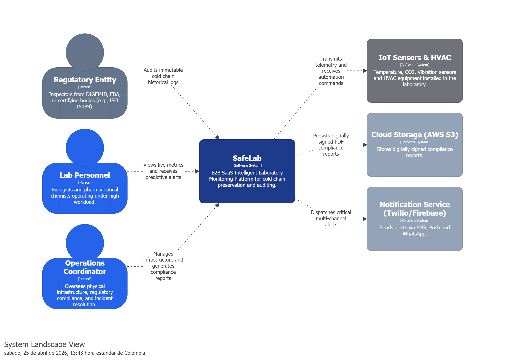
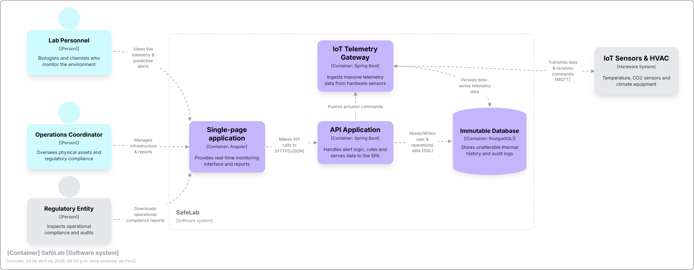
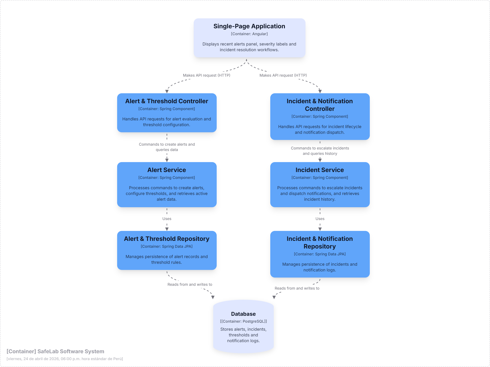

### 4.6.2. Software Architecture Context Diagram

El diagrama de contexto del sistema muestra la relación entre el sistema y los actores externos, proporcionando una visión general de la arquitectura del sistema y sus interacciones con el entorno externo.

### 4.6.3. Software Architecture Container Diagrams

Los diagramas de contenedores representan los distintos elementos que conforman el sistema, como aplicaciones web, bases de datos o microservicios, y muestran cómo se relacionan entre ellos. Ofrecen una perspectiva general de la arquitectura, resaltando las funciones de cada contenedor y la forma en que interactúan.

### 4.6.4. Software Architecture Components Diagrams

En esta sección, se presentan los diagramas de componentes de la arquitectura de software. Estos diagramas detallan los diferentes componentes que conforman el sistema, sus responsabilidades y cómo interactúan entre sí. 

Para el diseño interno de cada **Bounded Context**, se ha implementado una **Arquitectura en Capas Orientada al Dominio**. Como se observa en los diagramas, el flujo mantiene un alto nivel de cohesión:

- **Controladores:** Actúan como la capa de presentación (interfaces de entrada).
- **Servicios de Aplicación:** Orquestan los casos de uso interactuando con la lógica del dominio subyacente.
- **Repositorios:** Abstraen la capa de infraestructura garantizando que el modelo de negocio sea agnóstico a la tecnología de persistencia.

---

#### Bounded Context: Intelligent Alerting & Incident Response

Este bounded context engloba la gestión completa del ciclo de vida de las incidencias, desde su detección inicial hasta su resolución. Los componentes aquí dibujados coordinan la evaluación de lecturas contra umbrales, clasificación por gravedad y notificaciones multicanal, orquestando las entidades `Alert`, `Incident`, `Threshold` y `Notification`.

