# Capítulo IV: Product Design

## 4.1. Style Guidelines

En esta sección se presentan los estándares que definen el formato y el diseño de la solución, asegurando la calidad en su implementación.

### 4.1.1. General Style Guidelines

**Color**

La paleta de colores que hemos seleccionado para nuestra plataforma se compone principalmente de tonos azules, violetas y blancos, con acentos en verde y rojo para resaltar elementos clave. El azul transmite confianza, mientras que el violeta aporta un toque de innovación y creatividad. El blanco se utiliza para mantener una apariencia limpia y ordenada, facilitando la legibilidad y la navegación.

**Tipografia**

La tipografía que hemos elegido para nuestra plataforma es "Inter", una fuente sans-serif bastante sobria y versátil que ofrece una excelente legibilidad tanto en pantallas
grandes como pequeñas.
Además, su diseño moderno y limpio complementa la estética general de nuestra marca, transmitiendo profesionalismo y confianza a nuestros clientes.

**Branding**

Bautizamos a la aplicación como Safelab, un nombre que transmite seguridad para una plataforma que busca facilitar el monitoreo de laboratorios. El logo de Safelab se compone de un color azul claro que simboliza confianza y profesionalismo, reflejando la misión de nuestro producto de ofrecer una solución segura y confiable para el seguimiento de laboratorios.

Nota: Elaboración propia.

### 4.1.2. Web Style Guidelines

Esta sección define las pautas de diseño de la interfaz web de Safelab basadas en los mockups correspondientes.

**Layout**

El diseño de la interfaz web de Safelab se basa en una estructura de cuadrícula que organiza el contenido de manera clara y accesible. La página principal presenta un menú de navegación en la parte lateral izquierda, seguido de secciones claramente definidas para cada funcionalidad clave:
- Dashboard
- Laboratories
- Alerts
- History
- Settings

Cada sección está diseñada para ser intuitiva, con botones y enlaces destacados que guían al usuario a través de las diferentes acciones disponibles. El uso de espacios en blanco y una jerarquía visual clara contribuyen a una experiencia de usuario fluida y agradable.

**Responsive Design**

La interfaz web de Safelab está diseñada para ser completamente responsive, adaptándose a diferentes tamaños de pantalla y dispositivos. En dispositivos móviles, el menú lateral se transforma en un menú desplegable accesible desde un ícono de hamburguesa, mientras que el contenido se reorganiza para mantener la legibilidad y funcionalidad. En tabletas, el diseño se ajusta para aprovechar el espacio adicional sin perder la claridad visual. Esta adaptabilidad garantiza que los usuarios puedan acceder a todas las funcionalidades de Safelab de manera eficiente, independientemente del dispositivo que estén utilizando.

## 4.2. Information Architecture

### 4.2.1. Organization Systems

**Landing Page**

La landing page de Safelab está diseñada para presentar de manera clara los beneficios y características principales de la plataforma.

La organización de la información sigue una estructura jerárquica que guía al usuario a través de un recorrido lógico, comenzando con una introducción impactante, seguida de secciones detalladas sobre las funcionalidades, testimonios de clientes y el pricing respectivo.

Cada sección está claramente diferenciada mediante el uso de encabezados, imágenes y llamados a la acción (CTAs) estratégicamente ubicados para fomentar la conversión.

**Web Application**

La aplicación web de Safelab se organiza para facilitar la interacción entre los usuarios y las funcionalidades clave de la plataforma.

La información se presenta de manera estructurada, con un menú de navegación lateral que permite acceder rápidamente a las diferentes secciones.

Cada sección está diseñada para ser intuitiva, con una disposición clara de los elementos y un enfoque en la usabilidad a través del uso de tarjetas e indicadores de métricas, asegurando que los usuarios puedan realizar sus tareas mediante un flujo de trabajo eficiente.

Los módulos en el flujo de trabajo incluyen:

- Dashboard: Proporciona una visión general del estado de los laboratorios, con gráficos y estadísticas clave.
- Laboratories: Permite a los usuarios gestionar y monitorear los laboratorios registrados, con opciones para agregar, editar o eliminar laboratorios.
- Alerts: Muestra las alertas generadas por el sistema, con detalles sobre cada alerta y opciones para marcar como leídas o resolverlas.
- History: Ofrece un historial detallado de las actividades y eventos relacionados con los laboratorios, permitiendo a los usuarios revisar acciones pasadas y generar reportes.
- Settings: Permite a los usuarios configurar sus preferencias, gestionar su cuenta y ajustar las notificaciones.

### 4.2.2. Labeling Systems

Las etiquetas que utilizaremos para la página serán diseñadas para ser claras, directas y fáciles de entender, enfocándose en la eficiencia y simplicidad para usuarios con distintos niveles de experiencia tecnológica.

**Principios generales**

- Se limita el uso de **2-3 palabras** por ítem.
- Se mantiene la **consistencia terminológica** en todas las pantallas.
- Las etiquetas son descriptivas y responden a acciones directas, estados o categorías claras.

Algunas de las etiquetas principales de nuestras secciones serán las siguientes:

**Dashboard de Laboratorios**
- `Tendencia de temperatura`
- `Indicadores clave`
- `Alertas recientes`
- `Ver Laboratorios`

**Detalle de Laboratorio**
- `Métricas en tiempo real`
- `Indicadores de status`
- `Programaciones activas`
- `Actividad reciente`

**Alertas**
- `Lista de alertas`
- `Detalle de alerta`
- `Barra de filtros`
- `Indicadores de prioridad`

**Historial**
- `Vistas de línea de tiempo de eventos`
- `Detalle de eventos`
- `Filtros de búsqueda`
- `Indicadores de tipo de evento`

### 4.2.3. SEO Tags and Meta Tag

**Landing Page**:
- Title (SEO Tag): Safelab | Smart Lab Management
- Description (Meta Tag): Optimize your lab management process with Safelab — a centralized platform for researchers and lab managers to record experiments, upload documents, and track progress.
- Keywords (Meta Tag): Lab management, Monitoring, System Alerts, Scientific workflow
- Author (Meta Tag): Safelab Team

**Web Application**:
- Title (SEO Tag): Safelab | Monitor Laboratories in Real Time
- Description (Meta Tag): Access your dashboard to monitor your laboratories, export reports, and program schedules.
- Keywords (Meta Tag): Lab management, Monitoring, System Alerts, Scientific workflow
- Author (Meta Tag): Safelab Team

### 4.2.4. Searching Systems

Para garantizar navegación fluida y centrada al servicio del usuario, vamos a implementar los siguiente estándares tanto para la Landing Page como para la Web Application:

- <u>Menú de navegación</u>:
    
    Utilizaremos la Navigation Bar, que contendrá enlaces visibles a las secciones y opciones más importantes de la Landing Page y Web Application respectivamente.

    De esta forma, los nuevos usuarios se informarán rápidamente y a los usuarios existentes les permitirán acceder a sus cuentas fácilmente.

- <u>Navegación Visual Guiada</u>:
    
    El contenido de la Landing Page estará  organizado en bloques visuales de las secciones determinadas en la barra principal, permitiendo al usuario desplazarse verticalmente para descubrir las funcionalidades de manera fluida.

    Por otro lado, la Web Application tendrá un menú lateral fijo que permitirá a los usuarios acceder rápidamente a las secciones principales, como el Dashboard, Laboratories, Alerts, History y Settings.

- <u>Responsive Design</u>:

    Ambos productos serán construidos para adaptarse al tipo de dispositivo del usuario.
    
    Por ejemplo, la resolución de la pagina estará optimizada según como sea redimensionada y tendrá compatibilidad tanto en dispositivos de escritorio como en portatiles.
    
    De esta forma, los usuarios realizarán sus tareas independientemente del dispositivo que utilicen.

### 4.2.5. Navigation Systems

**Landing Page**

Para la Landing Page de Safelab, implementaremos un sistema de navegación basado en una barra de navegación horizontal ubicada en la parte superior de la página. Esta barra de navegación incluirá enlaces a las secciones principales de la página, como Features, Pricing y Contact. Además, se incluirán botones de llamada a la acción (CTA o Call To Action) para que los usuarios sean redirigidos a la aplicación y puedan registrarse o iniciar sesión fácilmente.

**Web Application**

Para la plataforma de Safelab implementaremos un sistema de navegación basado en una barra lateral fija que permitirá a los usuarios acceder rápidamente a las secciones principales de la aplicación web, como el Dashboard, Laboratories, Alerts, History y Settings. Esta barra lateral estará diseñada para ser intuitiva y fácil de usar, con íconos claros y etiquetas descriptivas para cada sección.

Además, cada pantalla dentro de la aplicación web contará con una barra de filtros y opciones de navegación adicionales que permitirán a los usuarios refinar su búsqueda y acceder a funcionalidades específicas dentro de cada sección. Por ejemplo, en la sección de Laboratories, los usuarios podrán filtrar por tipo de laboratorio, estado o fecha de creación, mientras que en la sección de Alerts podrán filtrar por prioridad o tipo de alerta.

## 4.3. Landing Page UI Design
Para el diseño de la interfaz de la Landing Page de Safelab, el equipo ha traducido las necesidades de monitoreo crítico en una experiencia visual que transmite seguridad, limpieza y precisión.

La arquitectura de información se estructuró siguiendo un modelo de **"AIDA" (Atención, Interés, Deseo y Acción)**, asegurando que los responsables de laboratorios encuentren rápidamente la propuesta de valor: la prevención de incidentes mediante inteligencia analítica. Se priorizó una navegación vertical fluida, donde cada sección refuerza la confianza del usuario antes de llegar a los planes de suscripción.

### 4.3.1. Landing Page Wireframe

Los wireframes de Safelab fueron diseñados con un enfoque **Mobile-First**, garantizando que la jerarquía de contenido sea clara tanto en navegadores de escritorio como en dispositivos móviles.

* **Principios de Diseño:** Se aplicó el principio de proximidad para agrupar las funcionalidades clave (Dashboard, Alertas, Historial) y el uso de espacios en blanco (*negative space*) para reducir la carga cognitiva del usuario.

* **Diseño Inclusivo:** La disposición de los elementos sigue un orden lógico de lectura (patrón en F), facilitando la accesibilidad para lectores de pantalla. Los botones de acción (CTAs) como "Solicitar Demo" cuentan con un tamaño táctil adecuado para dispositivos móviles.

* **Arquitectura de Información:** Se utilizó una estructura de cuadrícula (*grid system*) de 12 columnas para Desktop y 4 para Mobile, permitiendo que bloques como "El Problema" y "La Solución" se apilen de forma coherente, manteniendo siempre la visibilidad de los beneficios principales.

Nota: Elaboración propia en Figma.

### 4.3.2. Landing Page Mock-up

El paso al Mock-up integra el *Design System* de Safelab, aplicando la paleta de colores azul y violeta para evocar profesionalismo tecnológico.

* **Elementos de Diseño:** Se incorporaron iconografías personalizadas para cada funcionalidad, utilizando estilos lineales que mantienen la estética moderna. Las tarjetas de "Planes de Laboratorio" utilizan sombras sutiles (*box-shadows*) para generar profundidad y destacar el plan "Pro" como la opción recomendada.

* **Identidad Visual y Branding:** El logotipo de Safelab se ubica estratégicamente en el *header* persistente. Se seleccionó la tipografía **Inter** por su alta legibilidad en entornos técnicos, asegurando que las métricas y precios sean fáciles de leer.

* **Continuidad de Experiencia:** En la versión Mobile, el menú de navegación se sintetiza en un componente de "hamburguesa", mientras que los testimonios de los especialistas se presentan en un formato de carrusel optimizado para gestos táctiles. El uso de imágenes de alta fidelidad para el dashboard dentro del mock-up permite al usuario previsualizar la robustez de la herramienta antes de la conversión.

Nota: Elaboración propia en Figma.

## 4.4. Web Applications UX/UI Design

### 4.4.1. Web Applications Wireframes

**Login**
- Descripción: Esta pantalla muestra el formulario para que el usuario ingrese sus credenciales y acceda la pantalla de inicio de la aplicación.

  Nota: Elaboración propia en Figma.

**Dashboard**
- Descripción: En esta pantalla se pueden visualizar las métricas más importantes de los sistemas de los laboratorios, como la temperatura, ventilación, detección de elementos extraños, entre otros. Esta información se muestra en gráficos y pequeñas listas para facilitar la comprensión de la información.

  Nota: Elaboración propia en Figma.

**Laboratorios**
- Descripción: En esta pantalla se optó por una grilla de tarjetas para visualizar los laboratorios registrados en el sistema, con información resumida de cada uno, como temperatura, ubicación, entre otros.

  Nota: Elaboración propia en Figma.

**Detalles de Laboratorio**
- Descripción: En esta pantalla se muestra información detallada de cada laboratorio, con gráficos en tiempo real de las métricas más importantes, como temperatura, ventilación, entre otros. Además, se muestran los indicadores de status del laboratorio, programaciones activas y actividad reciente.

  Nota: Elaboración propia en Figma.

**Alertas**
- Descripción: En esta pantalla se muestran las alertas generadas por el sistema. Para mostrarlas, se optó por una columna de tarjetas, donde cada tarjeta representa una alerta, con información resumida como el mensaje de la alerta, su prioridad, entre otros. Para ver la información detallada de la alerta, emerge un panel lateral derecho al hacer clic sobre ella. Además, se incluyen filtros para facilitar la búsqueda de alertas específicas.

  Nota: Elaboración propia en Figma.

**Historial**
- Descripción: En esta pantalla se muestra el historial de eventos relacionados con los laboratorios. Para mostrar esta información, se optó por una vista de línea de tiempo, donde cada evento se ordena de forma cronológica, con información resumida del evento. Al hacer clic sobre un evento, emerge un panel lateral derecho con la información detallada del evento. Además, se incluyen filtros para facilitar la búsqueda de eventos específicos.

  Nota: Elaboración propia en Figma.

**Nuevo Laboratorio**
- Descripción: En esta pantalla se muestra un formulario para registrar un nuevo laboratorio en el sistema. El formulario se divide en secciones para facilitar su llenado, como información general del laboratorio, sistemas y sensores, entre otros.

  Nota: Elaboración propia en Figma.

### 4.4.2. Web Applications Wireflow Diagrams

### **Wireflow 1**
- User Persona: Supervisor de laboratorio
- User Goal: Como supervisor de laboratorio, deseo registrar un nuevo laboratorio en el sistema. Para ello, debo llenar la información del laboratorio y los detalles de sus sistemas y sensores.

  Nota: Elaboración propia.

### **Wireflow 2**
- User Persona: Supervisor de laboratorio
- User Goal: Como supervisor de laboratorio, deseo visualizar la información detallada de un laboratorio existente.

  Nota: Elaboración propia.

### **Wireflow 3**
- User Persona: Supervisor de laboratorio
- User Goal: Como supervisor de laboratorio, deseo revisar las alertas de alta prioridad generadas por el sistema para tomar acciones correctivas. Para ello, debo usar los filtros disponibles.

  Nota: Elaboración propia.

### 4.4.3. Web Applications Mock-ups

**Login**
- Objetivo: Permitir al usuario ingresar sus credenciales y acceder a la aplicación.

  Nota: Elaboración propia en Figma.

**Dashboard**
- Objetivo: Mostrar las métricas más importantes de los sistemas de los laboratorios.

  Nota: Elaboración propia en Figma.

**Laboratorios**
- Objetivo: Visualizar los laboratorios existentes y registrados en el sistema. Facilitar la búsqueda mediante filtros y presentación de información resumida de cada laboratorio.

  Nota: Elaboración propia en Figma.

**Detalles de Laboratorio**
- Objetivo: Mostrar la información detallada de de los sistemas de mantenimiento de cada laboratorio.
Se muestra la actividad reciente del laboratorio, programaciones activas y los indicadores de status del laboratorio.

  Nota: Elaboración propia en Figma.

**Alertas**
- Objetivo: Mostrar las alertas generadas por el sistema y permitir su gestión. Para resolver las alertas se muestra información detallada de cada alerta, como el mensaje, su prioridad, entre otros. Además, se incluyen filtros para facilitar la búsqueda de alertas específicas.

  Nota: Elaboración propia en Figma.

**Historial**
- Objetivo: Mostrar el historial de eventos relacionados con los laboratorios. Por defecto, se muestra la información en una vista de línea de tiempo, donde cada evento se ordena de forma cronológica, con información resumida del evento.

  Nota: Elaboración propia en Figma.

**Nuevo Laboratorio**
- Descripción: En esta pantalla se muestra un formulario para registrar un nuevo laboratorio en el sistema. El formulario se divide en secciones para facilitar su llenado, como información general del laboratorio, sistemas y sensores, entre otros.

  Nota: Elaboración propia en Figma.

### 4.4.4. Web Applications User Flow Diagrams

**Userflow 1**
- User Persona: Supervisor de laboratorio
- User Goal: Como supervisor de laboratorio, deseo registrar un nuevo laboratorio en el sistema. Para ello, debo llenar la información del laboratorio y los detalles de sus sistemas y sensores.
- Happy Paths:
    - El sistema muestra un mensaje indicando que el pedido fue creado exitosamente.
    - El nuevo laboratorio se muestra en la sección de laboratorios registrados.
- Unhappy Paths:
    - El sistema muestra un mensaje de error indicando que el pedido no pudo ser creado.

Nota: Elaboración propia.

**Userflow 2**
- User Persona: Supervisor de laboratorio
- User Goal: Como supervisor de laboratorio, deseo visualizar la información detallada de un laboratorio existente.
- Happy Paths:
    - El sistema muestra la información detallada del laboratorio seleccionado.
- Unhappy Paths:
    - El sistema muestra un pop-up que indica que no se pudo cargar la información del laboratorio.

Nota: Elaboración propia.

**Userflow 3**
- User Persona: Supervisor de laboratorio
- User Goal: Como supervisor de laboratorio, deseo revisar las alertas de alta prioridad generadas por el sistema para tomar acciones correctivas. Para ello, debo usar los filtros disponibles.
- Happy Paths:
    - El sistema muestra las alertas filtradas por alta prioridad.
- Unhappy Paths:
    - El sistema muestra un pop-up que indica que no se pudieron cargar las alertas filtradas.

Nota: Elaboración propia.

## 4.5. Web Applications Prototyping

**Landing Page Presentation**

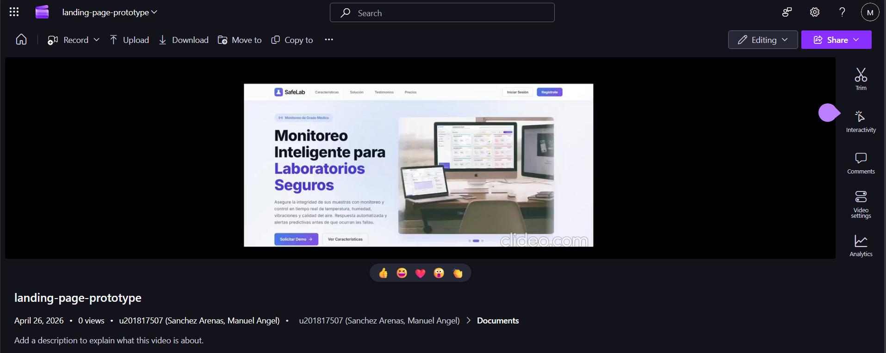

[Link de la presentación](https://upcedupe-my.sharepoint.com/:v:/g/personal/u201817507_upc_edu_pe/IQCmLmkatLNfRodxmcXY4QRUAahuQUi-b5KDhY58uA4VZxE?e=Gj9ceu&nav=eyJyZWZlcnJhbEluZm8iOnsicmVmZXJyYWxBcHAiOiJTdHJlYW1XZWJBcHAiLCJyZWZlcnJhbFZpZXciOiJTaGFyZURpYWxvZy1MaW5rIiwicmVmZXJyYWxBcHBQbGF0Zm9ybSI6IldlYiIsInJlZmVycmFsTW9kZSI6InZpZXcifX0%3D)

## 4.6. Domain-Driven Software Architecture

### 4.6.1. Design-Level Event Storming

En esta fase, el equipo realizó una inmersión técnica de nivel detallado para refinar el flujo de trabajo de **SafeLab**. A diferencia de la etapa anterior, el *Design-Level Event Storming* permitió identificar no solo qué sucede en el sistema (**Eventos**), sino también quién inicia la acción (**Actores**), qué intención tienen (**Comandos**) y qué reglas rigen el comportamiento del software (**Políticas**).

Durante una sesión de diseño enfocada, se estructuraron los elementos siguiendo la lógica de los sub-dominios críticos para una plataforma SaaS de monitoreo clínico. El resultado es un modelo que integra la captura de datos de sensores, la gestión de activos hospitalarios y la automatización inteligente, garantizando que cada interacción esté alineada con el lenguaje ubicuo y los objetivos de "Desperdicio Cero" de la startup.

Nota: Elaboración propia en Miro.

---

### Explicación de los Bounded Contexts Identificados

A continuación, se detallan los cinco contextos delimitados que componen la arquitectura de la solución:

#### 1. IoT Telemetry & Environment Monitoring
Este contexto actúa como la capa de ingesta de datos. Se encarga de la comunicación directa con el hardware (sensores) y la normalización de las métricas ambientales. Su responsabilidad es garantizar que cada lectura de temperatura o CO2 sea capturada y validada antes de ser procesada por el resto del sistema, gestionando además la salud de la conexión de los dispositivos.

Nota: Elaboración propia en Miro.

#### 2. Lab Asset & Infrastructure Management
Orientado a la gestión de recursos físicos, este contexto administra el ciclo de vida de las refrigeradoras, congeladores y sistemas de ventilación (HVAC). Su enfoque principal es el mantenimiento preventivo y la organización jerárquica del laboratorio (edificios, pisos y áreas), asegurando que la infraestructura física sea apta para el almacenamiento bioclínico.

Nota: Elaboración propia en Miro.

#### 3. Intelligent Alerting & Incident Response
Representa el cerebro reactivo de la plataforma. Analiza las anomalías detectadas en la telemetría para clasificar incidentes según su gravedad (*Critical/Warning*). Gestiona la omnicanalidad de las notificaciones hacia el personal de turno y rastrea las acciones de mitigación tomadas por los biólogos, cerrando la brecha entre la falla técnica y la intervención humana.

Nota: Elaboración propia en Miro.

#### 4. Operational Compliance & Activity Logging
Este contexto de soporte garantiza la integridad legal de la operación. Registra de forma inmutable cada evento relevante del sistema, desde calibraciones de sensores hasta resoluciones de alertas. Su función principal es la generación automatizada de reportes de cumplimiento (*Compliance Reports*) que permitan al laboratorio superar auditorías normativas como la ISO 15189.

Nota: Elaboración propia en Miro.

#### 5. Smart Automation & Scheduling
Es el componente proactivo que permite a SafeLab ejecutar acciones correctivas automáticas. Gestiona horarios de funcionamiento y reglas lógicas (por ejemplo, activación de ventilación ante picos de CO2). Este contexto permite que el sistema actúe sobre los actuadores físicos, reduciendo la dependencia de la intervención manual constante.

Nota: Elaboración propia en Miro.

### 4.6.2. Software Architecture Context Diagram

El diagrama de contexto del sistema muestra la relación entre el sistema y los actores externos, proporcionando una visión general de la arquitectura del sistema y sus interacciones con el entorno externo.

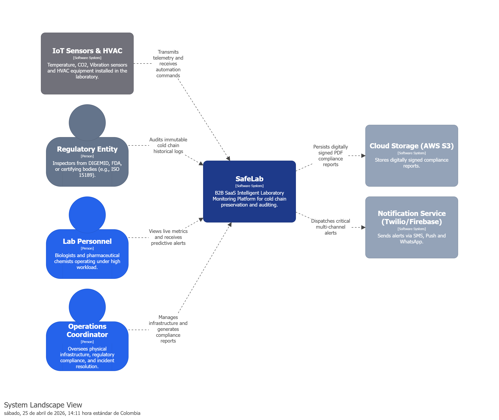
Nota: Elaboración propia en Structurizr.

### 4.6.3. Software Architecture Container Diagrams

Los diagramas de contenedores representan los distintos elementos que conforman el sistema, como aplicaciones web, bases de datos o microservicios, y muestran cómo se relacionan entre ellos. Ofrecen una perspectiva general de la arquitectura, resaltando las funciones de cada contenedor y la forma en que interactúan.

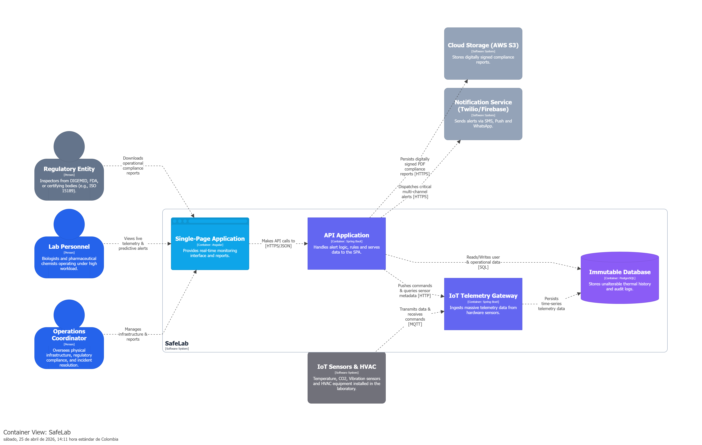
Nota: Elaboración propia en Structurizr.

### 4.6.4. Software Architecture Components Diagrams

En esta sección, se presentan los diagramas de componentes de la arquitectura de software. Estos diagramas detallan los diferentes componentes que conforman el sistema, sus responsabilidades y cómo interactúan entre sí. 

Para el diseño interno de cada **Bounded Context**, se ha implementado una **Arquitectura en Capas Orientada al Dominio**. Como se observa en los diagramas, el flujo mantiene un alto nivel de cohesión:

- **Controladores:** Actúan como la capa de presentación (interfaces de entrada).
- **Servicios de Aplicación:** Orquestan los casos de uso interactuando con la lógica del dominio subyacente.
- **Repositorios:** Abstraen la capa de infraestructura garantizando que el modelo de negocio sea agnóstico a la tecnología de persistencia.

---

#### Bounded Context: Intelligent Alerting & Incident Response

Este bounded context engloba la gestión completa del ciclo de vida de las incidencias, desde su detección inicial hasta su resolución. Los componentes aquí dibujados coordinan la evaluación de lecturas contra umbrales, clasificación por gravedad y notificaciones multicanal, orquestando las entidades `Alert`, `Incident`, `Threshold` y `Notification`.

Nota: Elaboración propia en Structurizr.

#### Bounded Context: IoT Telemetry & Environment Monitoring

Este bounded context es el motor de fuerza bruta del sistema, encargado de la ingesta masiva de datos provenientes de los sensores de hardware, la normalización de unidades de medida (ºC, ppm, %) y la provisión del estado Live para los tableros. En este diagrama se incluyen componentes para las entidades de `Sensor`, `Metric`, `Reading` y `EnvironmentalGateway`.

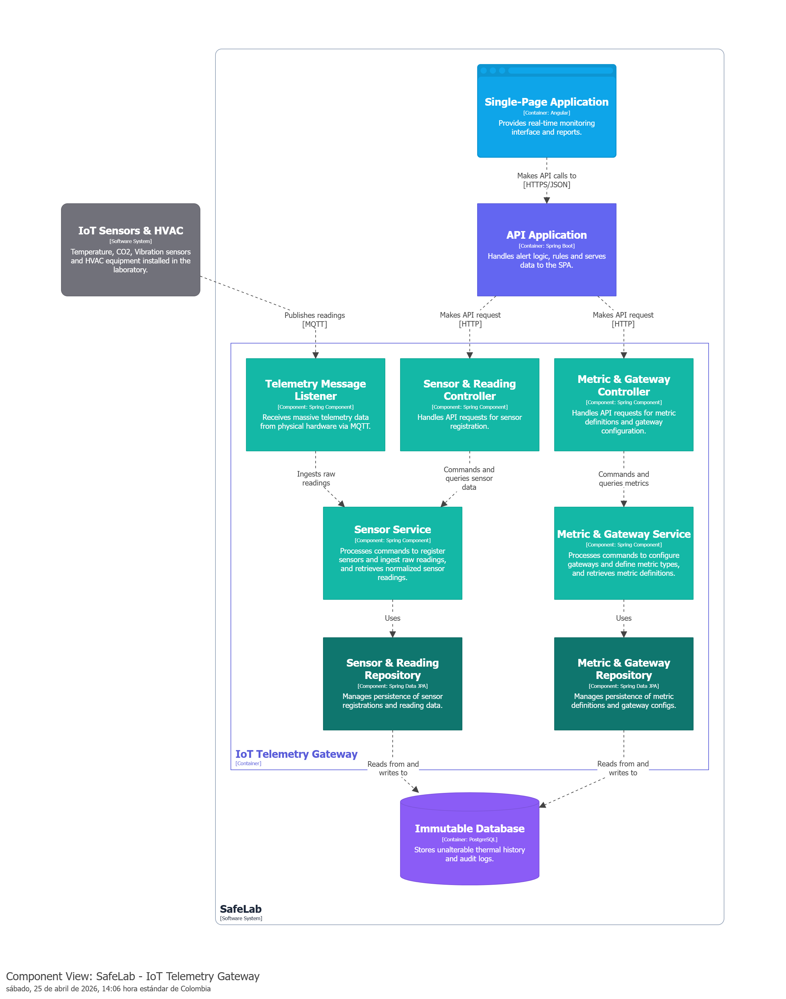
Nota: Elaboración propia en Structurizr.

#### Bounded Context: Lab Asset & Infrastructure Management

Este bounded context asume la responsabilidad de controlar el ciclo de vida de los espacios físicos y el hardware estructural del laboratorio, así como la programación de mantenimientos preventivos y correctivos. Sus diagramas de componentes incluyen la gestión de entidades como `Laboratory`, `Equipment` (Refrigeradores, HVAC), `MaintenanceSchedule` y `Location`.

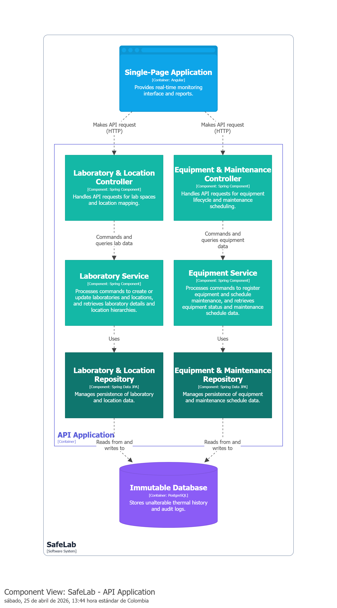
Nota: Elaboración propia en Structurizr.

#### Bounded Context: Operational Compliance & Activity Logging

Este bounded context actúa como el cerebro auditor del sistema. Registra de manera inmutable el **quién, cuándo y qué** de cada evento operativo para garantizar la trazabilidad requerida por las normas ISO y entidades reguladoras. Sus entidades principales son `ActivityLog`, `AuditReport` y `ComplianceStandard`.

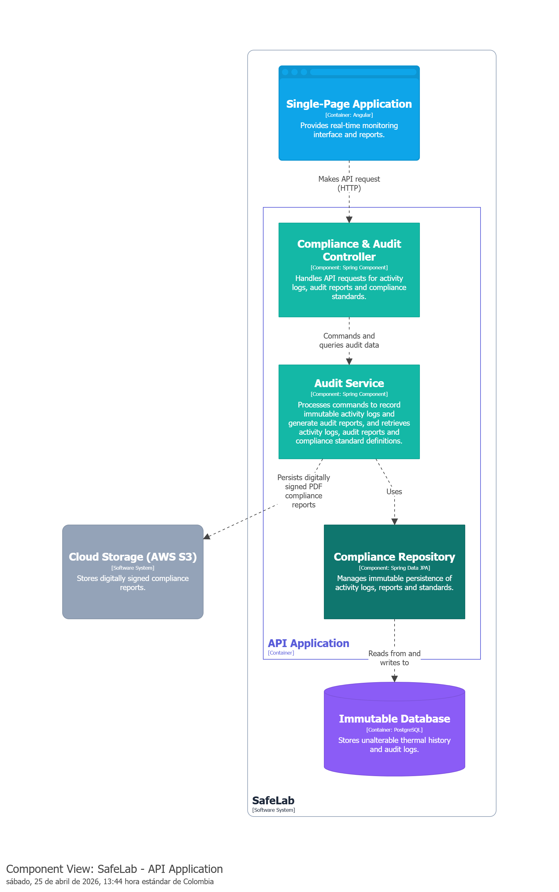
Nota: Elaboración propia en Structurizr.

#### Bounded Context: Smart Automation & Scheduling

Este bounded context se encarga de ejecutar acciones mecánicas o lógicas de forma automatizada, basadas en temporizadores o reglas de negocio reactivas. En este diagrama se representa la interacción entre componentes que manejan las entidades `Schedule`, `AutomationRule` y `ActuatorCommand`.

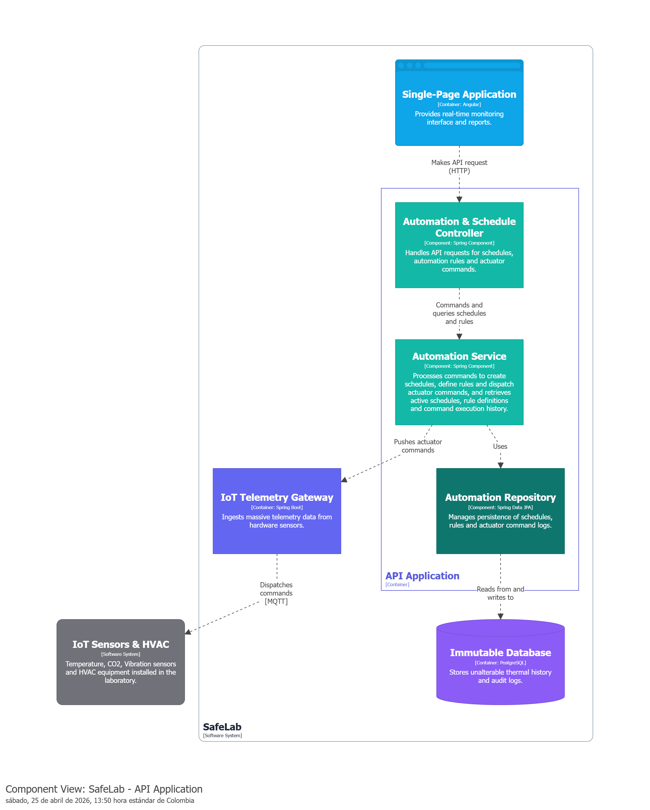
Nota: Elaboración propia en Structurizr.

## 4.7. Software Object-Oriented Design

### 4.7.1. Class Diagrams

El diagrama de clases de SafeLab representa la estructura estática del sistema, detallando las entidades fundamentales, sus atributos, comportamientos (métodos) y las relaciones que permiten la lógica de negocio. El diseño se ha organizado siguiendo los límites de los *Bounded Contexts* identificados en el *Event Storming*, asegurando que la implementación técnica respete el lenguaje ubicuo del dominio.

El siguiente Diagrama de Clases ha sido diseñado aplicando estrictamente los principios de Domain-Driven Design (DDD) para modelar el núcleo de negocio de SafeLab. A diferencia de un modelo de datos tradicional (CRUD), este diagrama refleja el comportamiento y las reglas de negocio de un sistema de misión crítica. La arquitectura se divide en Bounded Contexts (Contextos Delimitados) altamente desacoplados, comunicados mediante referencias por ID y Domain Events (Eventos de Dominio). Se ha hecho una clara distinción entre Aggregate Roots (raíces de agregación que garantizan la consistencia), Entities (objetos con identidad a lo largo del tiempo) y Value Objects (objetos inmutables que describen características).

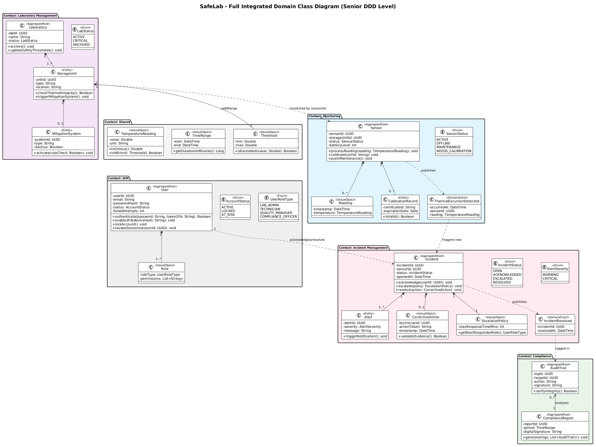
Nota: Elaboración propia.

### Laboratory Management
Este es el contexto estructural del dominio. Modela la jerarquía física y operativa de la infraestructura a través del Aggregate Root Laboratory, que contiene StorageUnits (unidades de almacenamiento). Aquí residen las reglas de negocio sobre la integridad física y la capacidad de reaccionar ante emergencias, orquestando acciones como la activación de MitigationSystems (sistemas de ventilación o enfriamiento de respaldo) en base a los umbrales térmicos configurados.

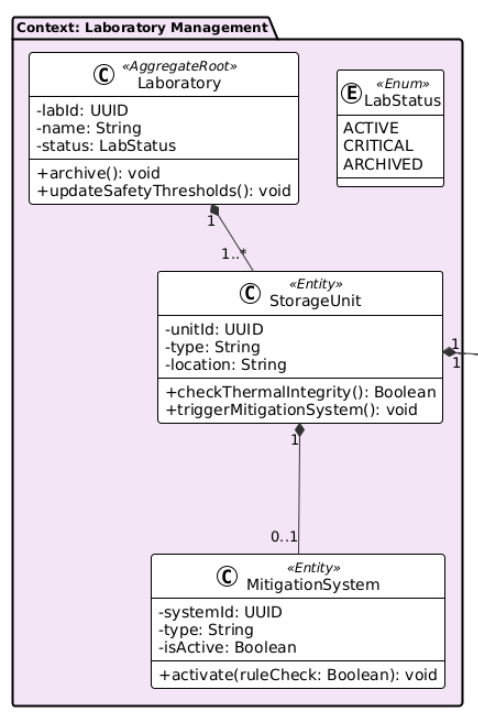
Nota: Elaboración propia.

### Monitoring
El motor telemétrico de SafeLab. Gestionado por el Aggregate Root Sensor, este contexto procesa el flujo continuo de lecturas de temperatura. No solo almacena datos, sino que aplica lógica de hardware crítico: verifica el estado de la batería, administra los certificados de calibración técnica (CalibrationRecord) y, lo más importante, es el encargado de detectar desviaciones térmicas y emitir el evento de dominio ThermalExcursionDetected para alertar al resto del sistema.

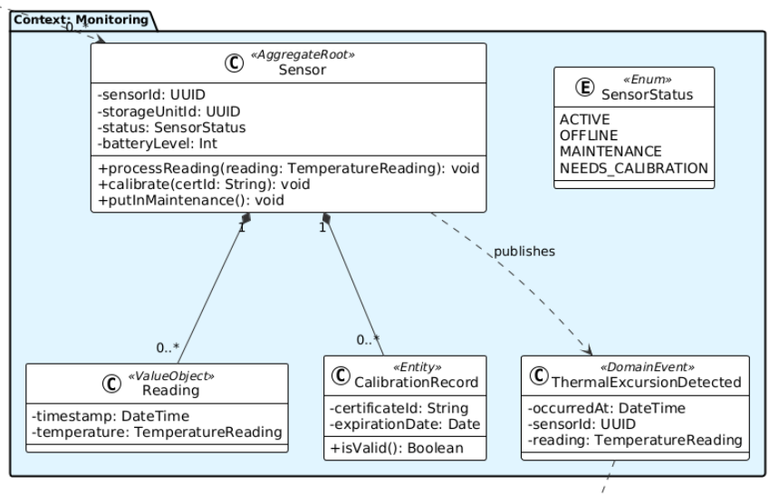
Nota: Elaboración propia.

### Incident Management
Diseñado para la gestión reactiva y correctiva. Su Aggregate Root, Incident, escucha los eventos del contexto de monitoreo e inicia un ciclo de vida de resolución. Aplica reglas de negocio vitales como la EscalationPolicy (escalamiento jerárquico si una alerta no es atendida a tiempo) y exige el registro obligatorio de una CorrectiveAction (acción correctiva con sustento técnico) antes de permitir que un incidente crítico sea marcado como resuelto.

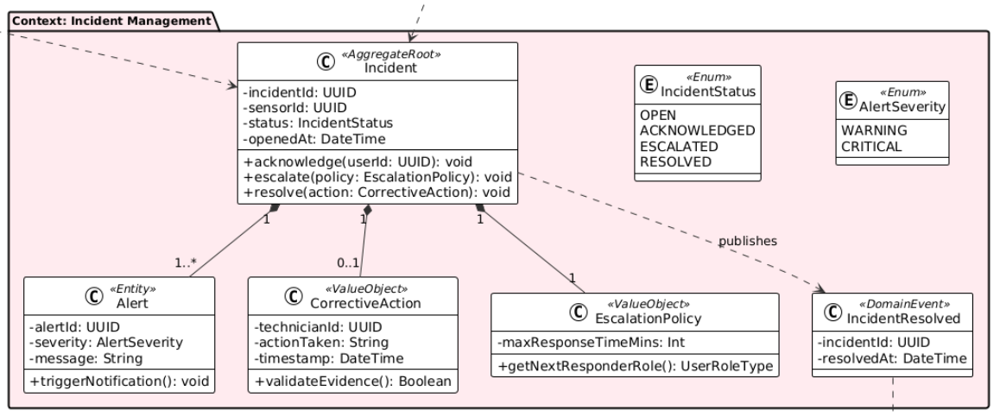
Nota: Elaboración propia.

### Compliance
El contexto legal y regulatorio. Es un entorno de solo lectura que consolida la información para auditorías. Registra un AuditTrail (trazabilidad forense inmutable) de cada acción crítica y resolución de incidentes, generando el ComplianceReport. Su diseño garantiza que los datos históricos no puedan ser manipulados, cumpliendo con las normativas ISO y los estándares de entidades reguladoras de salud.

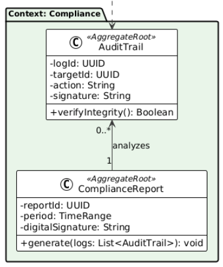
Nota: Elaboración propia.

### IAM
Encargado de la seguridad perimetral y el control de acceso corporativo. Su Aggregate Root es User, el cual gestiona la autenticación, la protección contra fuerza bruta y el control de sesiones. Se incluyen funcionalidades avanzadas de seguridad como el estado de la cuenta (AccountStatus) y la activación del segundo factor de autenticación (enable2FA), garantizando que solo personal autorizado y con roles específicos pueda tomar decisiones operativas.

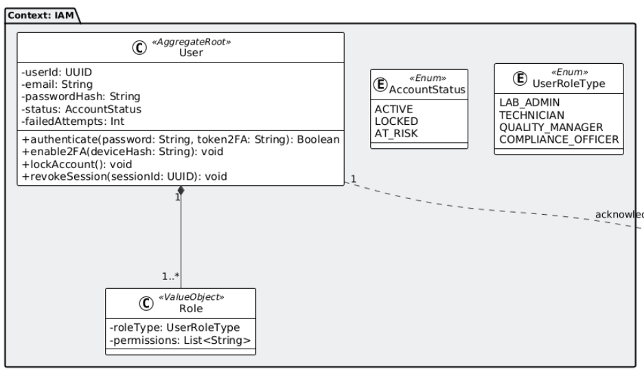
Nota: Elaboración propia.

### Shared
Este contexto actúa como el núcleo de tipos de datos compartidos en todo el sistema. Contiene Value Objects inmutables como TemperatureReading, Threshold y TimeRange. Al encapsular lógica de validación básica (como verificar si una temperatura excede un límite) dentro de estos objetos, evitamos la duplicación de código y garantizamos que los conceptos fundamentales del dominio se traten de manera uniforme en todos los demás contextos.

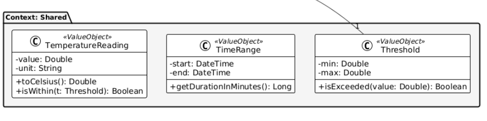
Nota: Elaboración propia.

## 4.8. Database Design

### 4.8.1. Database Diagram

El diseño de la base de datos de **SafeLab** ha sido normalizado para garantizar la integridad referencial y la eficiencia en la consulta de grandes volúmenes de telemetría. A diferencia del diagrama de clases, este modelo se enfoca en la persistencia de datos mediante el uso de Claves Primarias (**PK**) y Claves Foráneas (**FK**).

El siguiente Diagrama de Entidad-Relación (ERD) representa la persistencia física del modelo de dominio de SafeLab en una base de datos relacional (como PostgreSQL). El diseño traduce la arquitectura DDD en esquemas de datos altamente optimizados y normalizados. Como decisión arquitectónica clave, los Value Objects del modelo de dominio (como Location o Threshold) han sido aplanados (flattening); es decir, en lugar de crear tablas separadas que requerirían uniones (JOINs) costosas en rendimiento, sus propiedades se han integrado como columnas directas en las tablas de sus entidades anfitrionas (ej. threshold_min y threshold_max dentro de la tabla storage_units). Además, se mantiene el principio de desacoplamiento entre contextos mediante el uso estricto de Foreign Keys y el almacenamiento de datos semi-estructurados usando JSONB (para la gestión dinámica de permisos). La trazabilidad está garantizada mediante la tabla centralizada audit_trails, la cual indexa las acciones operativas sin acoplar rígidamente el contexto de Compliance con el resto del sistema, logrando así una base de datos robusta, escalable y lista para auditorías regulatorias.

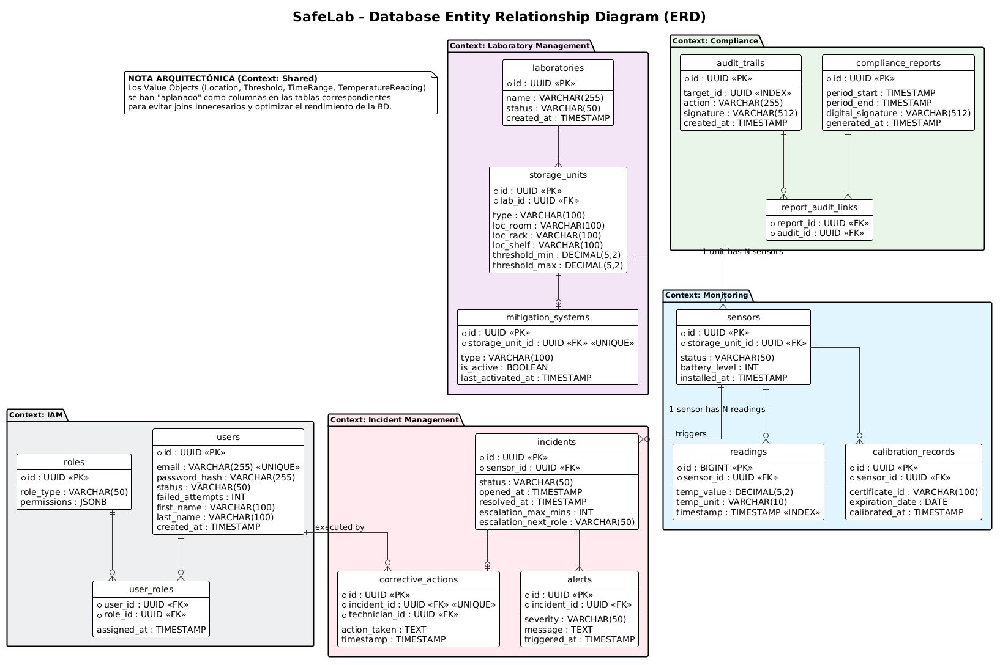
Nota: Elaboración propia.