# **Capítulo V: Product Implementation, Validation & Deployment**

## **5.1. Software Configuration Management**

## **5.1.1. Software Development Environment Configuration**

Para el desarrollo de SafeLab, utilizaremos el siguiente conjunto de herramientas, respetando las restricciones tecnológicas del curso:

<table border="1" cellpadding="6" cellspacing="0">
  <thead>
    <tr>
      <th>Actividad</th>
      <th>Producto</th>
      <th>Propósito / Uso</th>
    </tr>
  </thead>
  <tbody>
    <tr>
      <td>Project Management</td>
      <td>Jira Software</td>
      <td>Gestión del Product Backlog, planificación de Sprints y seguimiento de tareas mediante tableros Kanban.</td>
    </tr>
    <tr>
      <td>Requirements Management</td>
      <td>UXPressia</td>
      <td>Elaboración de artefactos de descubrimiento (User Personas, Empathy Maps) para la definición de requisitos.</td>
    </tr>
    <tr>
      <td>UX/UI Design</td>
      <td>Figma</td>
      <td>Diseño de la guía de estilo, prototipos de baja fidelidad (wireframes) y alta fidelidad (mockups).</td>
    </tr>
    <tr>
      <td>Software Development (Backend)</td>
      <td>IntelliJ IDEA</td>
      <td>IDE para el desarrollo de los RESTful Web Services utilizando Java y Spring Boot.</td>
    </tr>
    <tr>
      <td>Software Development (Frontend)</td>
      <td>Visual Studio Code</td>
      <td>IDE para el desarrollo de la Web Application (Angular) y el Landing Page.</td>
    </tr>
    <tr>
      <td>Version Control</td>
      <td>GitHub</td>
      <td>Sistema de control de versiones distribuido para el alojamiento y gestión de repositorios.</td>
    </tr>
    <tr>
      <td>Documentation (API)</td>
      <td>Swagger / OpenAPI</td>
      <td>Herramienta para la documentación técnica y pruebas de los endpoints de la API.</td>
    </tr>
  </tbody>
</table>

## **5.1.2. Source Code Management**

El control de versiones se realizará en GitHub bajo una organización pública. Se han implementado repositorios independientes para garantizar la modularidad y el despliegue continuo de cada componente:

* **Landing Page Repository:** [https://github.com/upc-pre-1ASI0729-11834-Especialistas/landing-page](https://github.com/upc-pre-1ASI0729-11834-Especialistas/landing-page)

**A. Estrategia de Branching (GitFlow)**

Se implementará el modelo GitFlow para asegurar un ciclo de vida de desarrollo robusto y ordenado:

* **main branch:** Contiene exclusivamente el código en producción. Cada cambio en esta rama debe estar etiquetado con una versión estable.

* **develop branch:** Rama principal de integración donde reside el código más reciente de desarrollo.

* **feature branches:** Ramas temporales para el desarrollo de nuevas User Stories.
  * Convención: `feature/short-description` (ej. `feature/order-registration`).

* **release branches:** Ramas de preparación para despliegues a producción, permitiendo correcciones menores y preparación de metadatos.
  * Convención: `release/vX.Y.Z` (siguiendo Semantic Versioning).

* **hotfix branches:** Para correcciones críticas inmediatas en la rama main.
  * Convención: `hotfix/issue-description`.

**B. Mensajes de Commit (Conventional Commits)**

Para mantener un historial de cambios legible y facilitar la generación automática de changelogs, se utilizará el estándar de Conventional Commits:

* **Estructura:** `<tipo>(<scope>): <descripción>`

* **Tipos permitidos:**
  * **feat:** Nueva funcionalidad.
  * **fix:** Corrección de un error.
  * **docs:** Cambios solo en la documentación.
  * **style:** Cambios de formato (espacios, puntos y comas) que no afectan el código.
  * **refactor:** Cambio de código que no corrige un error ni añade una función.

* **Ejemplos:**
  * `feat(ordering): add automated order validation policy`
  * `fix(auth): resolve token expiration on mobile devices`
  * `docs(interviews): update stakeholder interview records`

## **5.1.3. Source Code Style Guide & Conventions**

Para garantizar la calidad, mantenibilidad y legibilidad del código de SafeLab, el equipo ha adoptado las siguientes convenciones de estilo. Siguiendo los estándares de la industria y las exigencias del curso, todo el código fuente (nombres de variables, clases, métodos y comentarios) se escribirá estrictamente en inglés.

**A. HTML & CSS**
Se seguirá la **Google HTML/CSS Style Guide**.

* **HTML:** Se utilizará una estructura semántica (uso de `<header>`, `<nav>`, `<main>`, `<section>`, `<article>`). La indentación será de 2 espacios. Los atributos de los elementos deben estar en minúsculas y los valores entre comillas dobles.

* **CSS:** Se utilizará la metodología **BEM (Block Element Modifier)** para el nombramiento de clases, facilitando el mantenimiento de los componentes de la interfaz.

* **Naming Convention:** Se aplicará `kebab-case` para IDs y nombres de clases (ej. `sensor-card`, `alert-status-critical`).

* **Colors & Units:** Se priorizará el uso de variables CSS para la paleta de colores corporativa y unidades relativas (`rem`, `em`, `%`) para asegurar que el diseño sea adaptable (responsive).

**B. JavaScript & TypeScript**
Se seguirá la **Google TypeScript Style Guide**.

* **Variables y Funciones:** Se utilizará `camelCase` (ej. `getSensorReading`, `updateLaboratoryStatus`). Los nombres deben ser semánticos; se prefiere `isTemperatureHigh` sobre `tempCheck`.

* **Clases e Interfaces:** Se utilizará `PascalCase` (ej. `EnvironmentMonitor`, `ISensorData`). Las interfaces llevarán el prefijo "I" para distinguirlas claramente.

* **Estructura:** Se utilizará `const` por defecto y `let` solo si el valor requiere reasignación. Se evitará el uso de `var`. Se implementarán funciones de flecha (**Arrow Functions**) para una sintaxis más limpia.

* **Asincronía:** Se utilizará exclusivamente `async/await` para el manejo de peticiones al API, evitando el anidamiento de promesas.

**C. Java (Backend - Spring Boot)**
Se seguirá la **Google Java Style Guide** y las convenciones oficiales de **Spring Framework**.

* **Naming:** `PascalCase` para clases (ej. `LaboratoryController`, `SensorService`) y `camelCase` para métodos y variables (ej. `calculateAverageHumidity`).

* **Arquitectura:** Se respetará estrictamente el patrón por capas: Controller, Service, Repository, Entity y DTO (Data Transfer Object).

* **API REST:** Los endpoints utilizarán sustantivos en plural y minúsculas (ej. `/api/v1/laboratories`, `/api/v1/sensors/{id}/logs`). Se aplicarán los verbos HTTP de forma correcta (GET para consulta, POST para creación, etc.).

* **Annotations:** Se emplearán anotaciones de **Lombok** (como `@Getter`, `@Setter`, `@NoArgsConstructor`) para mantener el código limpio y libre de boilerplate.

**D. Gherkin**
Para las especificaciones de pruebas de aceptación, se aplicarán las **Gherkin Conventions**.

* **Idioma:** Se redactarán en inglés para mantener la consistencia con el código fuente y las mejores prácticas de desarrollo open source.

* **Estructura:** Uso de palabras clave: **Scenario:**, **Given**, **When**, **Then**, **And**.

* **Claridad:** Los pasos deben describir el comportamiento del negocio.

* **Ejemplo:**
  * `Given the temperature sensor "T-01" exceeds 30°C`
  * `When the system processes the signal`
  * `Then a critical alert should be generated`

## **5.1.4. Software Deployment Configuration**

En esta sección se especifica la configuración y los pasos necesarios para el despliegue de cada uno de los productos que conforman la solución SafeLab. Se ha adoptado un enfoque de despliegue continuo (**Continuous Deployment**) para asegurar que los cambios validados en los repositorios de GitHub se reflejen automáticamente en los entornos de producción.

<table border="1" cellpadding="6" cellspacing="0">
  <thead>
    <tr>
      <th>Producto</th>
      <th>Entorno de Despliegue</th>
      <th>Pipeline / Herramienta</th>
    </tr>
  </thead>
  <tbody>
    <tr>
      <td><strong>Landing Page</strong></td>
      <td>Vercel / GitHub Pages</td>
      <td>GitHub Actions</td>
    </tr>
    <tr>
      <td><strong>Web Services (API)</strong></td>
      <td>Azure App Service / Render</td>
      <td>Docker / Maven Build</td>
    </tr>
    <tr>
      <td><strong>Web Application</strong></td>
      <td>Firebase Hosting / Vercel</td>
      <td>Angular CLI / GitHub Actions</td>
    </tr>
  </tbody>
</table>

**CONFIGURACIÓN POR COMPONENTE:**

**1. Landing Page:**
* **Tecnología:** HTML5, CSS3 (SASS) y JavaScript.

* **Proceso:** El despliegue se activa automáticamente al realizar un `merge` en la rama `main`. Se utiliza **Vercel** por su optimización para sitios estáticos y soporte nativo para HTTPS, garantizando un tiempo de carga mínimo para los usuarios interesados en el modelo de negocio.

**2. Web Services (Backend):**
* **Tecnología:** Java 17 con Spring Boot.

* **Proceso:** Se utiliza **Maven** para la gestión de dependencias y construcción del archivo ejecutable (JAR). La aplicación se despliega en **Azure App Service**, configurando una instancia de base de datos **Azure Database for MySQL**. Se han configurado variables de entorno (`ENVIRONMENT_VARIABLES`) para proteger las credenciales de la base de datos y las llaves del servicio externo de monitoreo.

* **Documentación:** Una vez desplegado, el contrato de la API es accesible a través de **Swagger UI** para facilitar la integración con el equipo de frontend.

**3. Frontend Web Application:**
* **Tecnología:** Angular Framework.

* **Proceso:** Se ejecuta el comando `ng build --configuration production` para generar los archivos de distribución optimizados. Estos archivos son cargados en **Firebase Hosting**, aprovechando su red de entrega de contenidos (CDN) para asegurar que el Dashboard de monitoreo en tiempo real sea fluido y responsivo en cualquier dispositivo.

**CONSIDERACIONES DE SEGURIDAD Y DOMINIO:**

* **SSL/TLS:** Todos los productos cuentan con certificados de seguridad para garantizar que la transmisión de datos entre los sensores de laboratorio y la aplicación sea cifrada.

* **Integración:** La Web Application está configurada para consumir los servicios del RESTful API mediante el intercambio de recursos de origen cruzado (**CORS**), permitiendo únicamente peticiones desde los dominios autorizados de la solución.

## **5.2. Landing Page, Services & Applications Implementation**

## **5.2.1. Sprint 1**

### **5.2.1.1. Sprint Planning 1**

<table border="1" cellspacing="0" cellpadding="6">
    <tr>
        <th><strong>Sprint #</strong></th>
        <td>Sprint 1</td>
    </tr>
    <tr>
        <th><strong>Resumen del Sprint Planning</strong></th>
        <td></td>
    </tr>
    <tr>
        <th><strong>Fecha</strong></th>
        <td>2026-04-14</td>
    </tr>
    <tr>
        <th><strong>Hora</strong></th>
        <td>3:00 PM</td>
    </tr>
    <tr>
        <th><strong>Ubicación</strong></th>
        <td>Google Meet</td>
    </tr>
    <tr>
        <th><strong>Preparado por</strong></th>
        <td>Manuel Angel Sanchez Arenas</td>
    </tr>
    <tr>
        <th><strong>Asistentes a la reunión de planificación</strong></th>
        <td>
            Manuel Angel Sanchez Arenas, 
            Jean Niels Arizabal Condori, 
            Esteban Eduardo Chavez Bardales, 
            Jhon Jordy Jaramillo Mayta
        </td>
    </tr>
    <tr>
        <th><strong>Resumen del Sprint 0 (Revisión)</strong></th>
        <td>No hubo Sprint 0 previo.</td>
    </tr>
    <tr>
        <th><strong>Resumen del Sprint 0 (Retrospectiva)</strong></th>
        <td>No hubo Sprint 0 previo.</td>
    </tr>
</table>

**Objetivo del Sprint y User Stories**

<table border="1" cellspacing="0" cellpadding="6">
  <tr>
    <th><strong>Item</strong></th>
    <th><strong>Descripción</strong></th>
  </tr>
  <tr>
    <td><strong>Objetivo del Sprint 1</strong></td>
    <td>
      Nuestro enfoque está en implementar la versión inicial de la Landing Page de Safelab. 
      Creemos que entrega una primera aproximación completa de la plataforma a los clientes. 
      Esto se confirmará cuando la Landing Page esté desplegada en vivo en GitHub Pages y sea accesible desde cualquier dispositivo.
    </td>
  </tr>
  <tr>
    <td><strong>Velocidad del Sprint 1</strong></td>
    <td>32 Story Points</td>
  </tr>
  <tr>
    <td><strong>Suma de Story Points</strong></td>
    <td>32</td>
  </tr>
</table>

### **5.2.1.2. Aspect Leaders and Collaborators**

<table border="1" cellspacing="0" cellpadding="6">
  <thead>
    <tr>
      <th>Miembro del equipo</th>
      <th>Usuario de GitHub</th>
      <th>Landing Page (L/C)</th>
      <th>Documentación (L/C)</th>
    </tr>
  </thead>
  <tbody>
    <tr>
      <td>Manuel Sanchez</td>
      <td>@manuels7a</td>
      <td>C</td>
      <td>L</td>
    </tr>
    <tr>
      <td>Jean Arizabal</td>
      <td>@JeanArizabal</td>
      <td>C</td>
      <td>C</td>
    </tr>
    <tr>
      <td>Esteban Chavez</td>
      <td>@ECEB0704</td>
      <td>C</td>
      <td>C</td>
    </tr>
    <tr>
      <td>Jhon Jaramillo</td>
      <td>@Marklnz1</td>
      <td>L</td>
      <td>C</td>
    </tr>
  </tbody>
</table>

### **5.2.1.3. Sprint Backlog 1**

**Sprint Objective:**
Implementar las secciones de la Landing Page como Funcionalidades, Beneficios, Pricing y Contacto.

<h4>Tabla de Sprint Backlog</h4>

<table border="1" cellspacing="0" cellpadding="6">
  <thead>
    <tr>
      <th>Historia de Usuario</th>
      <th>Tarea</th>
      <th>Descripción</th>
      <th>Estimación (Horas)</th>
      <th>Asignado a</th>
      <th>Estado</th>
    </tr>
  </thead>
  <tbody>
    <tr>
      <td>US01</td>
      <td>Navegación a secciones principales</td>
      <td>Como visitante, quiero acceder a las distintas secciones informativas desde un menú principal para encontrar la información deseada rápidamente.</td>
      <td>3</td>
      <td>Jhon Jaramillo</td>
      <td>Finalizado</td>
    </tr>
    <tr>
      <td>US02</td>
      <td>Navegación en dispositivos móviles</td>
      <td>Como visitante desde móvil, quiero disponer de un menú adaptable para acceder a las secciones sin saturar la pantalla.</td>
      <td>7</td>
      <td>Jhon Jaramillo</td>
      <td>Finalizado</td>
    </tr>
    <tr>
      <td>US03</td>
      <td>Acceso a demo y características</td>
      <td>Como gerente de laboratorio, quiero solicitar una demo o ver características desde el primer vistazo.</td>
      <td>8</td>
      <td>Jhon Jaramillo</td>
      <td>Pendiente</td>
    </tr>
    <tr>
      <td>US04</td>
      <td>Visualización de interfaz del sistema</td>
      <td>Como prospecto, quiero ver imágenes de la plataforma para conocer su apariencia.</td>
      <td>5</td>
      <td>Jean Niels</td>
      <td>Finalizado</td>
    </tr>
    <tr>
      <td>US05</td>
      <td>Consulta de herramientas</td>
      <td>Como investigador, quiero consultar funciones principales estructuradas.</td>
      <td>3</td>
      <td>Jhon Jaramillo</td>
      <td>Finalizado</td>
    </tr>
    <tr>
      <td>US06</td>
      <td>Comparativa de solución</td>
      <td>Como jefe de calidad, quiero comparar método tradicional vs plataforma.</td>
      <td>2</td>
      <td>Jhon Jaramillo</td>
      <td>Finalizado</td>
    </tr>
    </tr>
    <tr>
      <td>US07</td>
      <td>Revisión de testimonios</td>
      <td>Como responsable de compras, quiero leer testimonios para ganar confianza.</td>
      <td>3</td>
      <td>Esteban Chavez</td>
      <td>Finalizado</td>
    </tr>
    <tr>
      <td>US08</td>
      <td>Consulta de planes y precios</td>
      <td>Como administrador, quiero comparar planes y funcionalidades.</td>
      <td>5</td>
      <td>Jhon Jaramillo</td>
      <td>Finalizado</td>
    </tr>
    </tr>
    <tr>
      <td>US09</td>
      <td>Información legal y soporte</td>
      <td>Como visitante, quiero encontrar políticas y soporte en el footer.</td>
      <td>1</td>
      <td>Manuel Sanchez</td>
      <td>Finalizado</td>
    </tr>
    <tr>
      <td>US10</td>
      <td>Acceso a portal de usuarios</td>
      <td>Como visitante, quiero acceder a login y registro.</td>
      <td>5</td>
      <td>Jhon Jaramillo</td>
      <td>Pendiente</td>
    </tr>
  </tbody>
</table>

### **5.2.1.4. Development Evidence for Sprint Review**

Esta tabla lista los commits realizados durante los primeros sprints de desarrollo, incluyendo el trabajo en la Landing Page, documentación y configuración del proyecto.

<table border="1">
  <thead>
    <tr>
      <th>Repositorio</th>
      <th>Rama</th>
      <th>ID de Commit</th>
      <th>Mensaje de Commit</th>
      <th>Descripción de Commit</th>
      <th>Fecha de Commit</th>
    </tr>
  </thead>
  <tbody>
    <tr><td>landing-page</td><td>main</td><td>bf714a3</td><td>docs: minor documentation update and code cleanup</td><td></td><td>26/04/2026</td></tr>
    <tr><td>landing-page</td><td>main</td><td>c80a160</td><td>Merge pull request #2 from upc-pre-1ASI0729-11834-Especialistas/develop</td><td></td><td>24/04/2026</td></tr>
    <tr><td>landing-page</td><td>main</td><td>e9d8c85</td><td>feat: enhance feature cards with incident management, forensic audit and automated response</td><td></td><td>24/04/2026</td></tr>
    <tr><td>landing-page</td><td>main</td><td>80584ca</td><td>feat: replace testimonial placeholder icons with real avatar images</td><td></td><td>23/04/2026</td></tr>
    <tr><td>landing-page</td><td>main</td><td>dbb9177</td><td>Merge pull request #1 from upc-pre-1ASI0729-11834-Especialistas/develop</td><td></td><td>23/04/2026</td></tr>
    <tr><td>landing-page</td><td>main</td><td>42e0112</td><td>feat: add testimonials section with user reviews and navigation links</td><td></td><td>23/04/2026</td></tr>
    <tr><td>landing-page</td><td>main</td><td>e64e083</td><td>Merge branch 'release/v1.0.0' into main for production</td><td></td><td>20/04/2026</td></tr>
    <tr><td>landing-page</td><td>main</td><td>7c53f7f</td><td>feat(landing): add responsive footer with brand info and navigation links</td><td></td><td>20/04/2026</td></tr>
    <tr><td>landing-page</td><td>main</td><td>5637bab</td><td>feat(landing): add pricing section and fix navigation ux</td><td></td><td>20/04/2026</td></tr>
    <tr><td>landing-page</td><td>main</td><td>5c48a3d</td><td>feat: implement interactive hero carousel and refine UI styles</td><td></td><td>20/04/2026</td></tr>
    <tr><td>landing-page</td><td>main</td><td>a710920</td><td>style: align feature card titles to the right of icons</td><td></td><td>18/04/2026</td></tr>
    <tr><td>landing-page</td><td>main</td><td>659bc84</td><td>Merge branch 'feature/funcionalidades' into develop</td><td></td><td>18/04/2026</td></tr>
    <tr><td>landing-page</td><td>main</td><td>7beeabc</td><td>feat: create card grid for key features</td><td></td><td>18/04/2026</td></tr>
    <tr><td>landing-page</td><td>main</td><td>38e41ca</td><td>style: enhance comparison section shadow and contrast</td><td></td><td>18/04/2026</td></tr>
    <tr><td>landing-page</td><td>main</td><td>fae6194</td><td>Merge branch 'feature/problema-solucion' into develop</td><td></td><td>18/04/2026</td></tr>
    <tr><td>landing-page</td><td>main</td><td>16a225e</td><td>feat: add problem and solution comparison section</td><td></td><td>18/04/2026</td></tr>
    <tr><td>landing-page</td><td>main</td><td>98fe9c2</td><td>chore: remove unused assets folder</td><td></td><td>18/04/2026</td></tr>
    <tr><td>landing-page</td><td>main</td><td>72d2a4d</td><td>Merge branch 'feature/hero-section' into develop</td><td></td><td>18/04/2026</td></tr>
    <tr><td>landing-page</td><td>main</td><td>5a4d700</td><td>feat: build hero section</td><td></td><td>18/04/2026</td></tr>
    <tr><td>landing-page</td><td>main</td><td>efac5ac</td><td>Merge branch 'feature/navbar' into develop</td><td></td><td>18/04/2026</td></tr>
    <tr><td>landing-page</td><td>main</td><td>26d4302</td><td>feat: build responsive navbar</td><td></td><td>18/04/2026</td></tr>
    <tr><td>landing-page</td><td>main</td><td>264037c</td><td>Merge branch 'feature/setup-inicial' into develop</td><td></td><td>18/04/2026</td></tr>
    <tr><td>landing-page</td><td>main</td><td>2420f21</td><td>chore: initial setup and global CSS variables</td><td></td><td>18/04/2026</td></tr>
    <tr><td>landing-page</td><td>main</td><td>ee1f6dc</td><td>chore: fix .gitignore encoding</td><td></td><td>18/04/2026</td></tr>
    <tr><td>landing-page</td><td>main</td><td>8b944ed</td><td>chore: initial commit con gitignore</td><td></td><td>17/04/2026</td></tr>
  </tbody>
</table>

### **5.2.1.5. Execution Evidence for Sprint Review**

Las principales secciones de la Landing Page de Safelab fueron desarrolladas y desplegadas exitosamente. A continuación se presentan las evidencias correspondientes de la implementación.

<ul>
  <li><strong>Hero Section</strong> 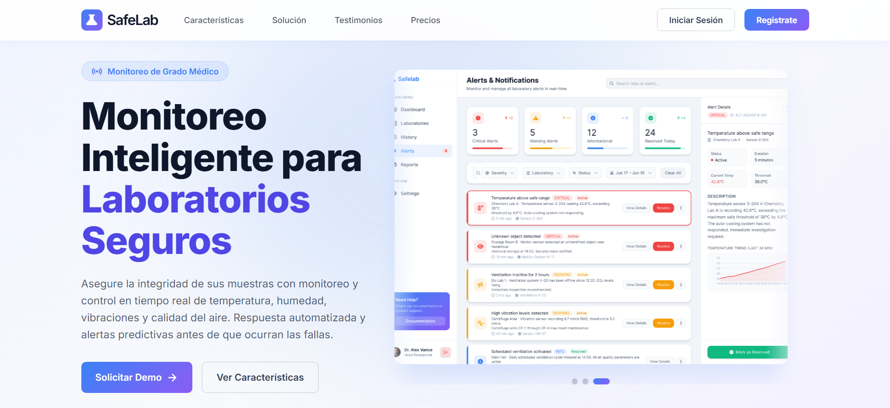</li>
  <li><strong>Features Section</strong> 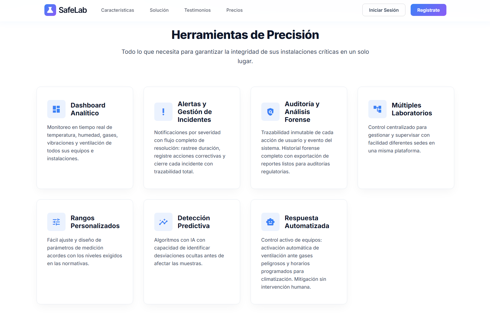</li>
  <li><strong>Solution Section</strong> 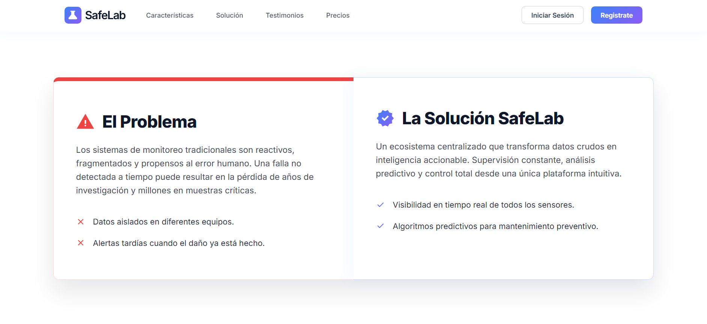</li>
  <li><strong>Pricing Section</strong> 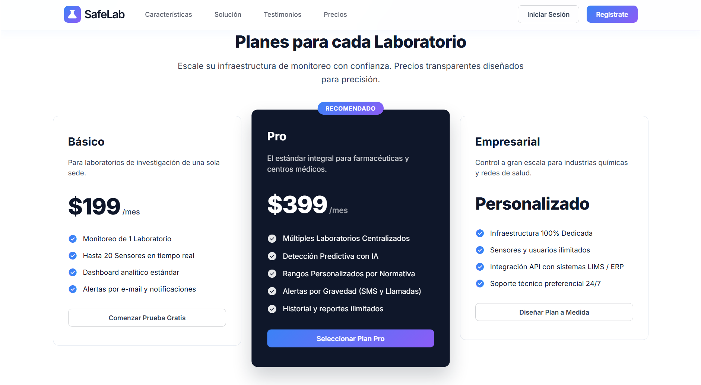</li>
  <li><strong>Testimonial Section</strong> 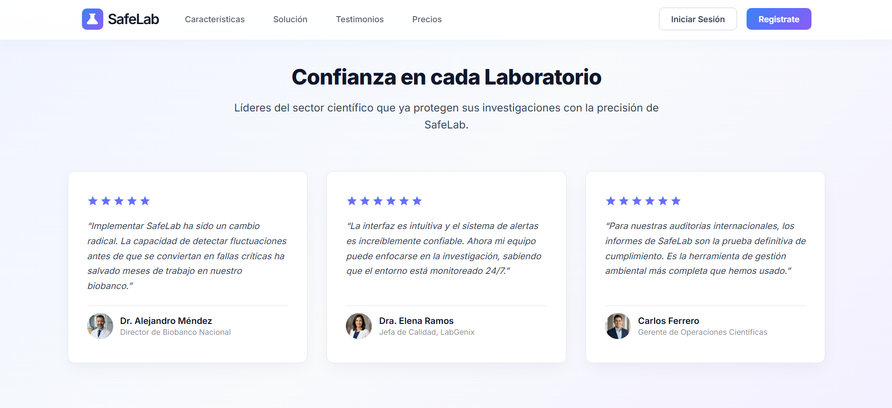</li>
</ul>

<strong>Enlace a Demo en Vivo:</strong> 
<a href="https://upc-pre-1asi0729-11834-especialistas.github.io/landing-page/#">Safelab Landing Page</a>

### **5.2.1.6. Services Documentation Evidence for Sprint Review**

En este Sprint el equipo se enfocó en el desarrollo y el despliegue de la Landing Page de Safelab, motivo por el cual no se implementaron ni documentaron endpoints relacionados a Web Services.
Los avances relacionados al desarrollo del frontend y backend, así como la documentación de la API con OpenAPI, están programados para los próximos Sprints, donde se abordarán las funcionalidades específicas del sistema de monitoreo de laboratorios y la integración con sensores IoT.

### **5.2.1.7. Software Deployment Evidence for Sprint Review**

El despliegue inicial de la Landing Page de FuelTrack fue realizado exitosamente utilizando GitHub Pages.

<ul>
  <li><strong>URL de la Landing Page:</strong> <a href="https://upc-pre-1asi0729-11834-especialistas.github.io/landing-page/#" target="_blank">https://upc-pre-1asi0729-11834-especialistas.github.io/landing-page/#</a></li>
  <li><strong>Repositorio:</strong> <a href="https://github.com/upc-pre-1ASI0729-11834-Especialistas/landing-page" target="_blank">https://github.com/upc-pre-1ASI0729-11834-Especialistas/landing-page</a></li>
</ul>

### **5.2.1.8. Team Collaboration Insights during Sprint**

Nuestro grupo, Especialistas, gestionó los entregables mediante GitHub, WhatsApp y Google Meet durante el Sprint. Las actividades principales se centraron en el desarrollo y despliegue de la Landing Page.

**Evidencia de Colaboración:**

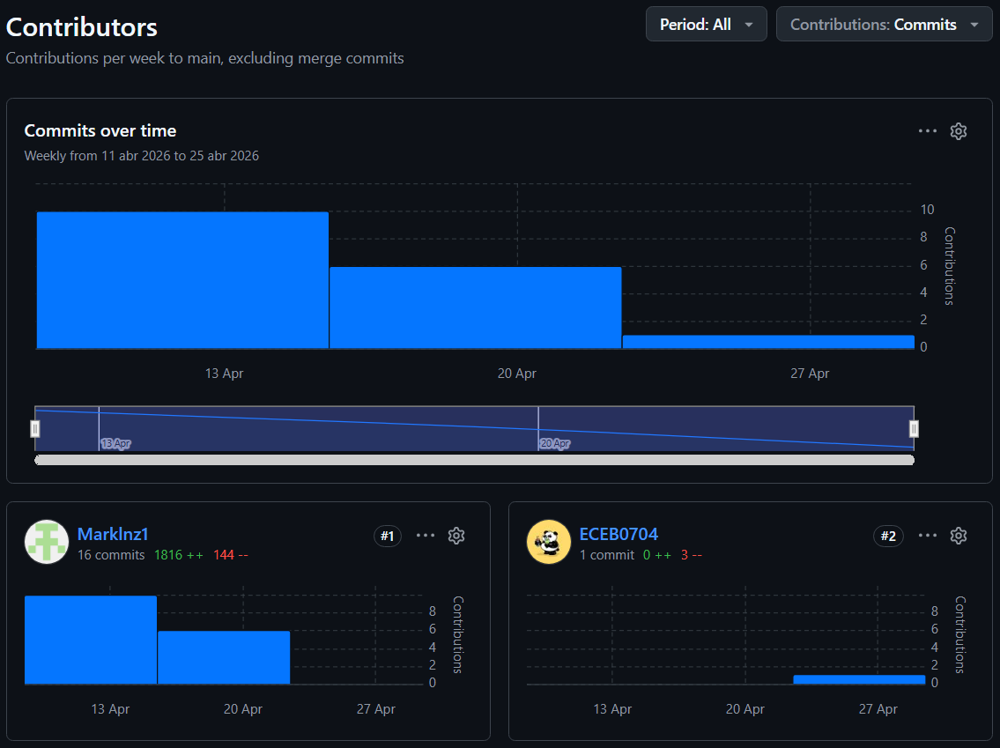

**Principales Herramientas de Comunicación:**
- Github: Para el control de versiones, gestión de issues y revisión de código.
- WhatsApp: Para comunicación rápida, coordinación de tareas y apoyo mutuo.
- Google Meet: Para reuniones de planificación, revisión de avances y aclaración de dudas específicas.

## **5.2.2. Sprint 2**

### **5.2.2.1. Sprint Planning 2**

<table border="1" cellspacing="0" cellpadding="6">
    <tr>
        <th><strong>Sprint #</strong></th>
        <td>Sprint 2</td>
    </tr>
    <tr>
        <th><strong>Resumen del Sprint Planning</strong></th>
        <td>Distribución de tareas y asignación de desarrollo de vistas incluyendo fake-api</td>
    </tr>
    <tr>
        <th><strong>Fecha</strong></th>
        <td>2026-05-02</td>
    </tr>
    <tr>
        <th><strong>Hora</strong></th>
        <td>1:00 PM</td>
    </tr>
    <tr>
        <th><strong>Ubicación</strong></th>
        <td>Google Meet</td>
    </tr>
    <tr>
        <th><strong>Preparado por</strong></th>
        <td>Manuel Angel Sanchez Arenas</td>
    </tr>
    <tr>
        <th><strong>Asistentes a la reunión de planificación</strong></th>
        <td>
            - Manuel Angel Sanchez Arenas, 
            - Jean Niels Arizabal Condori, 
            - Esteban Eduardo Chavez Bardales, 
            - Jhon Jordy Jaramillo Mayta
        </td>
    </tr>
    <tr>
        <th><strong>Resumen del Sprint 1 (Revisión)</strong></th>
        <td>El Sprint 1 se enfocó en la implementación de la Landing Page de Safelab. Las tareas fueron completadas exitosamente. Las secciones requeridas en la página fueron desarrolladas y probadas.</td>
    </tr>
</table>

**Objetivo del Sprint y User Stories**

<table border="1" cellspacing="0" cellpadding="6">
  <tr>
    <th><strong>Item</strong></th>
    <th><strong>Descripción</strong></th>
  </tr>
  <tr>
    <td><strong>Objetivo del Sprint 2</strong></td>
    <td>
      Nos enfocamos en la implementación de las vistas principales de la aplicación web. 
      Creemos que este avance permitirá a nuestros usuarios mostrar las funcionalidades core de la plataforma. 
      Esto se confirmará cuando las vistas estén desarrolladas, integradas con el backend y desplegadas en un entorno de staging para pruebas internas.
    </td>
  </tr>
  <tr>
    <td><strong>Velocidad del Sprint 2</strong></td>
    <td>-- Story Points</td>
  </tr>
  <tr>
    <td><strong>Suma de Story Points</strong></td>
    <td>--</td>
  </tr>
</table>

### **5.2.2.2. Aspect Leaders and Collaborators**

<table border="1" cellspacing="0" cellpadding="6">
  <thead>
    <tr>
      <th>Miembro del equipo</th>
      <th>Usuario de GitHub</th>
      <th>Web Application (L/C)</th>
      <th>Fake Api (L/C)</th>
      <th>Documentación (L/C)</th>
    </tr>
  </thead>
  <tbody>
    <tr>
      <td>Manuel Sanchez</td>
      <td>@manuels7a</td>
      <td>L</td>
      <td>L</td>
      <td>C</td>
    </tr>
    <tr>
      <td>Jean Arizabal</td>
      <td>@JeanArizabal</td>
      <td>C</td>
      <td>C</td>
      <td>L</td>
    </tr>
    <tr>
      <td>Esteban Chavez</td>
      <td>@ECEB0704</td>
      <td>C</td>
      <td>C</td>
      <td>C</td>
    </tr>
    <tr>
      <td>Jhon Jaramillo</td>
      <td>@Marklnz1</td>
      <td>C</td>
      <td>C</td>
      <td>C</td>
    </tr>
  </tbody>
</table>

### **5.2.2.3. Sprint Backlog 2**

**Sprint Objective:**
Implementar las vistas principales (core) de la aplicación web.

<h4>Tabla de Sprint Backlog</h4>

<table border="1" cellspacing="0" cellpadding="6">
  <thead>
    <tr>
      <th>Historia de Usuario</th>
      <th>Tarea</th>
      <th>Descripción</th>
      <th>Estimación (Horas)</th>
      <th>Asignado a</th>
      <th>Estado</th>
    </tr>
  </thead>
  <tbody>
    <tr>
      <td>US08</td>
      <td>Trazabilidad de Alertas Críticas Recientes</td>
      <td>Como: Auditor de Cumplimiento (Compliance Officer). Quiero: Supervisar el log de alertas recientes disparadas por el sistema en el Dashboard. Para: Verificar que cada evento de riesgo térmico tenga una trazabilidad clara y cumpla con los tiempos de respuesta exigidos por la normativa bioclínica.</td>
      <td>6</td>
      <td>Manuel Sanchez</td>
      <td>Finalizado</td>
    </tr>
    <tr>
      <td>US09</td>
      <td>Respuesta Rápida ante Alertas desde el Dashboard</td>
      <td>Como: Técnico de Laboratorio. Quiero: Interactuar con las alertas recientes directamente desde el panel del Dashboard. Para: Iniciar las acciones correctivas de forma inmediata sin navegar por menús complejos, reduciendo el tiempo de exposición al riesgo de las muestras.</td>
      <td>7</td>
      <td>Manuel Sanchez</td>
      <td>Finalizado</td>
    </tr>
    <tr>
      <td>US10</td>
      <td>Gestión Preventiva basada en Métricas Ambientales</td>
      <td>Como: Coordinador de Laboratorio. Quiero: Analizar las métricas combinadas (temperatura, vibraciones y humedad) para ejecutar acciones preventivas sobre los equipos de almacenamiento. Para: Mitigar riesgos antes de que ocurra una falla crítica en la cadena de frío y asegurar condiciones óptimas según el tipo de muestra.</td>
      <td>8</td>
      <td>Jean Arizabal</td>
      <td>Finalizado</td>
    </tr>
    <tr>
      <td>US12</td>
      <td>Gestión Operativa y Control de Unidades de Almacenamiento</td>
      <td>Como: Coordinador de Laboratorio. Quiero: Acceder al panel de control detallado de un laboratorio específico para gestionar sus unidades de almacenamiento y sensores. Para: Ejecutar decisiones operativas como el ajuste de umbrales o el mantenimiento preventivo de los equipos de frío.</td>
      <td>8</td>
      <td>Jhon Jaramillo</td>
      <td>Finalizado</td>
    </tr>
    <tr>
      <td>US13</td>
      <td>Registro y Vinculación Técnica de Sensores</td>
      <td>Como: Técnico de Laboratorio. Quiero: Registrar y vincular nuevos sensores a unidades de almacenamiento específicas (Racks/Refrigeradores). Para: Expandir la red de monitoreo y asegurar que cada activo biológico tenga un sensor asignado correctamente.</td>
      <td>5</td>
      <td>Jhon Jaramillo</td>
      <td>Finalizado</td>
    </tr>
    <tr>
      <td>US17</td>
    <td>Gestión y Resolución de Incidentes Críticos</td>
    <td>Como: Técnico de Laboratorio / Coordinador. Quiero: Gestionar las alertas activas mediante la ejecución y registro de acciones correctivas. Para: Mitigar el impacto de las excursiones térmicas y asegurar que el incidente sea resuelto bajo los protocolos de bioseguridad.</td>
      <td>4</td>
      <td>Manuel Sanchez</td>
      <td>Finalizado</td>
    </tr>
    </tr>
    <tr>
      <td>US18</td>
      <td>Gestión del Ciclo de Vida y Cierre de Incidentes</td>
      <td>Como: Coordinador de Laboratorio. Quiero: Gestionar el estado de las alertas críticas hasta su cierre definitivo. Para: Mantener el control operativo del incidente y asegurar que se ha recuperado la estabilidad térmica en la unidad de almacenamiento.</td>
      <td>6</td>
      <td>Jean Arizabal</td>
      <td>Finalizado</td>
    </tr>
    <tr>
      <td>US19</td>
      <td>Trazabilidad y Auditoría de Cumplimiento Normativo</td>
      <td>Como: Auditor de Calidad. Quiero: Consultar el historial detallado de eventos, alertas y acciones ejecutadas en el sistema. Para: Generar reportes de cumplimiento para entidades regulatorias (ej. ISO, DIGEMID) y verificar la integridad de la cadena de frío en periodos pasados.</td>
      <td>8</td>
      <td>Jean Arizabal</td>
      <td>Finalizado</td>
    </tr>
    </tr>
    <tr>
      <td>US20</td>
      <td>Inicialización de Entornos de Monitoreo (Crear Lab)</td>
      <td>Como: Administrador de Laboratorio. Quiero: Registrar un nuevo laboratorio configurando sus parámetros técnicos y políticas de seguridad desde el inicio. Para: Establecer una infraestructura de monitoreo que cumpla con los estándares específicos de las muestras que se almacenarán.</td>
      <td>6</td>
      <td>Jhon Jaramillo</td>
      <td>Finalizado</td>
    </tr>
    <tr>
      <td>US33</td>
      <td>Búsqueda de laboratorios</td>
      <td>Como usuario, quiero buscar laboratorios por nombre para encontrarlos rápidamente.</td>
      <td>4</td>
      <td>Jean Arizabal</td>
      <td>Finalizado</td>
    </tr>
    <tr>
      <td>US36</td>
      <td>Gestión de notificaciones por correo</td>
      <td>Como usuario, quiero activar o desactivar las notificaciones por correo para controlar cómo recibo las alertas de los laboratorios.</td>
      <td>8</td>
      <td>Esteban Chavez</td>
      <td>Finalizado</td>
    </tr>
    <tr>
      <td>US37</td>
      <td>Visualización de tendencias históricas</td>
      <td>Como usuario, quiero visualizar tendencias de eventos para analizar patrones.</td>
      <td>5</td>
      <td>Jean Arizabal</td>
      <td>Finalizado</td>
    </tr>
    <tr>
      <td>US39</td>
      <td>Notificaciones del sistema en tiempo real</td>
      <td>Como usuario, quiero recibir notificaciones visuales tras acciones importantes.</td>
      <td>Esteban Chavez</td>
      <td>7</td>
      <td>Finalizado</td>
    </tr>
  </tbody>
</table>

### **5.2.2.4. Development Evidence for Sprint Review**

Esta tabla lista los commits realizados durante el sprint, incluyendo el desarrollo de la web app y documentación.

<table border="1">
  <thead>
    <tr>
      <th>Repositorio</th>
      <th>Rama</th>
      <th>ID de Commit</th>
      <th>Mensaje de Commit</th>
      <th>Descripción de Commit</th>
      <th>Fecha de Commit</th>
    </tr>
  </thead>
  <tbody>
    <tr><td>frontend</td><td>develoment</td><td>d045080</td><td>fix: new max angular budget</td><td>-</td><td>14/05/2026</td></tr>
    <tr><td>frontend</td><td>develoment</td><td>4b2ebf6</td><td>feat: new fake-api provider</td><td>-</td><td>14/05/2026</td></tr>
    <tr><td>frontend</td><td>develoment</td><td>e5f1b62</td><td>fix: removed unused imports</td><td>-</td><td>14/05/2026</td></tr>
    <tr><td>frontend</td><td>develoment</td><td>62b6c2b</td><td>fix: db.json structure</td><td>-</td><td>14/05/2026</td></tr>
    <tr><td>frontend</td><td>develoment</td><td>1ff7bf1</td><td>Merge pull request #5 from upc-pre-1ASI0729-11834-Especialistas/feat/telemetry</td><td>-</td><td>14/05/2026</td></tr>
    <tr><td>frontend</td><td>develoment</td><td>8024832</td><td>Merge branch 'development' into feat/telemetry</td><td>-</td><td>14/05/2026</td></tr>
    <tr><td>frontend</td><td>develoment</td><td>ccafd82</td><td>Merge pull request #4 from upc-pre-1ASI0729-11834-Especialistas/feat/labs</td><td>-</td><td>14/05/2026</td></tr>
    <tr><td>frontend</td><td>develoment</td><td>a02f8ab</td><td>Merge branch 'development' into feat/labs</td><td>-</td><td>14/05/2026</td></tr>
    <tr><td>frontend</td><td>development</td><td>3b63717</td><td>Merge pull request #3 from upc-pre-1ASI0729-11834-Especialistas/feat/history</td><td>-</td><td>14/05/2026</td></tr>
    <tr><td>frontend</td><td>feat/history</td><td>b5ef17c</td><td>Merge branch 'development' into feat/history</td><td>-</td><td>14/05/2026</td></tr>
    <tr><td>frontend</td><td>feat/history</td><td>7d40b69</td><td>feat: add history endpoint path to environment configurations</td><td>-</td><td>14/05/2026</td></tr>
    <tr><td>frontend</td><td>feat/history</td><td>7f2fe54</td><td>feat: populate history data with recent event records</td><td>-</td><td>14/05/2026</td></tr>
    <tr><td>frontend</td><td>feat/history</td><td>9072d04</td><td>feat: update routing to use history page component for history view</td><td>-</td><td>14/05/2026</td></tr>
    <tr><td>frontend</td><td>feat/history</td><td>74ec439</td><td>feat: create history page with summary cards, filters, and event details drawer</td><td>-</td><td>14/05/2026</td></tr>
    <tr><td>frontend</td><td>feat/history</td><td>667cd28</td><td>feat: add history placeholder dialog component for functionalities not developed yet</td><td>-</td><td>14/05/2026</td></tr>
    <tr><td>frontend</td><td>feat/history</td><td>d835a3f</td><td>feat: add history timeline component for displaying grouped history records</td><td>-</td><td>14/05/2026</td></tr>
    <tr><td>frontend</td><td>feat/history</td><td>bee66c8</td><td>feat: implement history store for managing history records and operations</td><td>-</td><td>14/05/2026</td></tr>
    <tr><td>frontend</td><td>feat/history</td><td>ee3f83a</td><td>feat: implement history api service for managing history records</td><td>-</td><td>14/05/2026</td></tr>
    <tr><td>frontend</td><td>feat/history</td><td>5cba7f8</td><td>feat: add history apiendpoint for interacting with history records</td><td>-</td><td>14/05/2026</td></tr>
    <tr><td>frontend</td><td>feat/history</td><td>2deb956</td><td>feat: implement history assembler for converting between entities and resources</td><td>-</td><td>14/05/2026</td></tr>
    <tr><td>frontend</td><td>feat/history</td><td>a747a6c</td><td>feat: add history response interfaces for history records</td><td>-</td><td>14/05/2026</td></tr>
    <tr><td>frontend</td><td>feat/history</td><td>5180e78</td><td>feat: add history record entity with properties and methods</td><td>-</td><td>14/05/2026</td></tr>
    <tr><td>frontend</td><td>development</td><td>0903f4b</td><td>Merge pull request #2 from upc-pre-1ASI0729-11834-Especialistas/feat/automation</td><td>-</td><td>14/05/2026</td></tr>
    <tr><td>frontend</td><td>feat/labs</td><td>d6b930c</td><td>feat(labs): add breadcrumb navigation and action header to add-laboratory-page</td><td>-</td><td>13/05/2026</td></tr>
    <tr><td>frontend</td><td>feat/automation</td><td>5b02ab5</td><td>feat(automation): add NotificationPreferenceStore for managing notification preferences and loading state</td><td>-</td><td>13/05/2026</td></tr>
    <tr><td>frontend</td><td>feat/automation</td><td>4640ac7</td><td>feat(automation): add initial data structure for general settings, user profiles, sensor configurations, notification preferences, and security accesses</td><td>-</td><td>13/05/2026</td></tr>
    <tr><td>frontend</td><td>feat/automation</td><td>5b5454f</td><td>feat(automation): refactor SecurityAccess entity to manage permissions, roles, and audit information</td><td>-</td><td>13/05/2026</td></tr>
    <tr><td>frontend</td><td>feat/automation</td><td>2220eeb</td><td>feat(automation): add SettingsPageComponent with layout, styles, and logic for managing general settings and user profile</td><td>-</td><td>13/05/2026</td></tr>
    <tr><td>frontend</td><td>feat/automation</td><td>41005ab</td><td>feat(automation): refactor UserProfile entity to manage user information with fullName, role, email, and avatarUrl</td><td>-</td><td>13/05/2026</td></tr>
    <tr><td>frontend</td><td>feat/automation</td><td>86d9614</td><td>feat(automation): add SensorConfigurationPageComponent with template, styles, and logic for managing sensor configurations</td><td>-</td><td>13/05/2026</td></tr>
    <tr><td>frontend</td><td>feat/automation</td><td>de3bf08</td><td>feat(automation): add SecurityAccessPageComponent with template, styles, and logic for managing account credentials and security preferences</td><td>-</td><td>13/05/2026</td></tr>
    <tr><td>frontend</td><td>feat/automation</td><td>cba95bc</td><td>feat(automation): add AlertsNotificationsPageComponent with template, styles, and logic for configuring alerts and notifications</td><td>-</td><td>13/05/2026</td></tr>
    <tr><td>frontend</td><td>feat/automation</td><td>4cbff95</td><td>feat(automation): add UserProfileCardComponent with template, styles, and logic for displaying user profile information and editing actions</td><td>-</td><td>13/05/2026</td></tr>
    <tr><td>frontend</td><td>feat/automation</td><td>0ef679f</td><td>feat(automation): add SettingsCardComponent with template, styles, and logic for displaying settings information and actions</td><td>-</td><td>13/05/2026</td></tr>
    <tr><td>frontend</td><td>feat/automation</td><td>ecbbfea</td><td>feat(automation): add SensorListItemComponent with template, styles, and logic for displaying sensor details and actions</td><td>-</td><td>13/05/2026</td></tr>
    <tr><td>frontend</td><td>feat/automation</td><td>913a03d</td><td>feat(automation): add UserProfilesApi, UserProfilesApiEndpoint, UserProfileAssembler, and response models for managing user profiles</td><td>-</td><td>13/05/2026</td></tr>
    <tr><td>frontend</td><td>feat/automation</td><td>1ecba29</td><td>feat(automation): add SensorConfigurationsApi, SensorConfigurationsApiEndpoint, SensorConfigurationAssembler, and response models for managing sensor configurations</td><td>-</td><td>13/05/2026</td></tr>
    <tr><td>frontend</td><td>feat/automation</td><td>c7c8d0d</td><td>feat(automation): add SecurityAccessesApi, SecurityAccessesApiEndpoint, SecurityAccessAssembler, and response models for managing security access data</td><td>-</td><td>13/05/2026</td></tr>
    <tr><td>frontend</td><td>feat/automation</td><td>f519b48</td><td>feat(automation): add routing for settings, sensor configuration, alerts notifications, and security access pages</td><td>-</td><td>13/05/2026</td></tr>
    <tr><td>frontend</td><td>feat/automation</td><td>e4d0a3c</td><td>feat(automation): add NotificationPreferencesApi, NotificationPreferencesApiEndpoint, NotificationPreferenceAssembler, and response models for managing notification preferences</td><td>-</td><td>13/05/2026</td></tr>
    <tr><td>frontend</td><td>feat/automation</td><td>62d0652</td><td>feat(automation): add GeneralSettingsApi, GeneralSettingsApiEndpoint, GeneralSettingAssembler, and response models for managing general settings</td><td>-</td><td>13/05/2026</td></tr>
    <tr><td>frontend</td><td>feat/automation</td><td>8e1486e</td><td>fix(automation): correct import path for SecurityAccessStore</td><td>-</td><td>13/05/2026</td></tr>
    <tr><td>frontend</td><td>feat/automation</td><td>bfe0b4a</td><td>feat(automation): add SensorConfiguration and UserProfile entities for managing sensor and user profile data</td><td>-</td><td>13/05/2026</td></tr>
    <tr><td>frontend</td><td>feat/automation</td><td>e456518</td><td>feat(automation): add NotificationPreference entity for managing notification preferences</td><td>-</td><td>13/05/2026</td></tr>
    <tr><td>frontend</td><td>feat/automation</td><td>0f214d3</td><td>feat(automation): add GeneralSetting and NotificationPreference entities for managing general settings and notification preferences</td><td>-</td><td>13/05/2026</td></tr>
    <tr><td>frontend</td><td>feat/automation</td><td>8a3168e</td><td>feat(automation): add SensorConfigurationStore and UserProfileStore for managing sensor and user profile data</td><td>-</td><td>13/05/2026</td></tr>
    <tr><td>frontend</td><td>feat/automation</td><td>b04f044</td><td>feat(automation): add SecurityAccessStore for managing security access data</td><td>-</td><td>13/05/2026</td></tr>
    <tr><td>frontend</td><td>feat/automation</td><td>f299c5a</td><td>feat(automation): fix import path for NotificationPreferenceStore</td><td>-</td><td>13/05/2026</td></tr>
    <tr><td>frontend</td><td>feat/automation</td><td>98c7f1f</td><td>feat(settings): update import path for NotificationPreferenceStore</td><td>-</td><td>13/05/2026</td></tr>
    <tr><td>frontend</td><td>feat/automation</td><td>ad23a20</td><td>feat(settings): implement automation store and general settings management</td><td>-</td><td>13/05/2026</td></tr>
    <tr><td>frontend</td><td>feat/labs</td><td>16142a0</td><td>feat(labs): implement laboratory-detail-page with stats, alerts, schedules and shared components</td><td>-</td><td>12/05/2026</td></tr>
    <tr><td>frontend</td><td>feat/labs</td><td>1cf043c</td><td>feat(labs): implement add-laboratory-page with stepper form components</td><td>-</td><td>12/05/2026</td></tr>
    <tr><td>frontend</td><td>feat/labs</td><td>3247008</td><td>feat(labs): implement laboratories-page with list, toolbar, pagination and detail-card components</td><td>-</td><td>12/05/2026</td></tr>
    <tr><td>frontend</td><td>feat/labs</td><td>7142e98</td><td>feat(labs): add laboratory store and mock data for JSON server</td><td>-</td><td>12/05/2026</td></tr>
    <tr><td>frontend</td><td>feat/labs</td><td>952f411</td><td>feat(labs): implement infrastructure layer with DTOs, assembler and API service</td><td>-</td><td>12/05/2026</td></tr>
    <tr><td>frontend</td><td>feat/labs</td><td>8756930</td><td>feat(labs): define domain model entities and environment configuration</td><td>-</td><td>12/05/2026</td></tr>
    <tr><td>frontend</td><td>feat/telemetry</td><td>7b47a87</td><td>fix(telemetry): add missing apexcharts and ng-apexcharts dependencies to package.json</td><td>-</td><td>12/05/2026</td></tr>
    <tr><td>frontend</td><td>feat/telemetry</td><td>ba0b292</td><td>feat(telemetry): implement dashboard page and integrate telemetry routes</td><td>-</td><td>12/05/2026</td></tr>
    <tr><td>frontend</td><td>feat/telemetry</td><td>4b00171</td><td>feat(telemetry): implement laboratory-card, recent-alerts and temperature-chart components</td><td>-</td><td>12/05/2026</td></tr>
    <tr><td>frontend</td><td>feat/telemetry</td><td>e61c484</td><td>feat(shared): add reusable card, icon-badge, stat-card and status-badge components</td><td>-</td><td>12/05/2026</td></tr>
    <tr><td>frontend</td><td>feat/telemetry</td><td>1749224</td><td>feat(telemetry): add reactive signal stores and mock data for JSON server</td><td>-</td><td>12/05/2026</td></tr>
    <tr><td>frontend</td><td>feat/telemetry</td><td>ee8e620</td><td>feat(telemetry): implement infrastructure layer with DTOs, assemblers and API services</td><td>-</td><td>12/05/2026</td></tr>
    <tr><td>frontend</td><td>feat/telemetry</td><td>d0d6692</td><td>feat(telemetry): define domain entities and environment endpoints</td><td>-</td><td>12/05/2026</td></tr>
    <tr><td>frontend</td><td>development</td><td>a5e4f4e</td><td>Merge pull request #1 from upc-pre-1ASI0729-11834-Especialistas/feat/alerts</td><td>-</td><td>08/05/2026</td></tr>
    <tr><td>frontend</td><td>feat/alerts</td><td>9684920</td><td>fix: folder structure for ddd & angular material refactor</td><td>-</td><td>08/05/2026</td></tr>
    <tr><td>frontend</td><td>feat/alerts</td><td>ddc62f5</td><td>feat: configured routes, defined layout, alerts page added</td><td>-</td><td>07/05/2026</td></tr>
    <tr><td>frontend</td><td>main</td><td>1fcfd75</td><td>feat: initial ddd structure and basic packages added</td><td>-</td><td>06/05/2026</td></tr>
    <tr><td>frontend</td><td>main</td><td>ae4c8f9</td><td>initial commit</td><td>-</td><td>06/05/2026</td></tr>
  </tbody>
</table>

### **5.2.2.5. Execution Evidence for Sprint Review**

Las vistas principales de la aplicación web fueron desarrolladas y desplegadas exitosamente. A continuación se presentan las evidencias correspondientes de la implementación.

**Web Application Views:**
<ul>
  <li><strong>Dashboard View</strong> 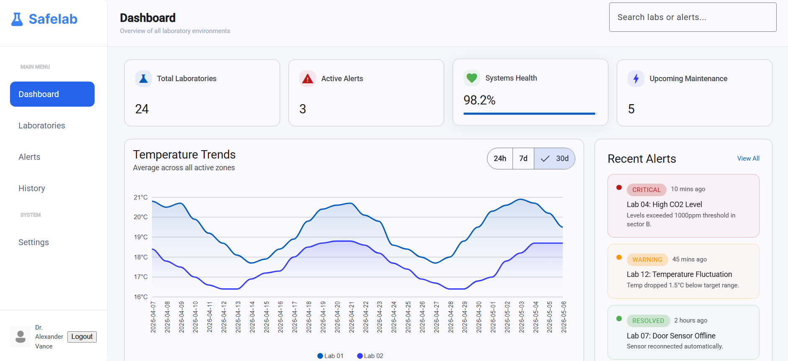</li>
  <li><strong>Laboratories View</strong> 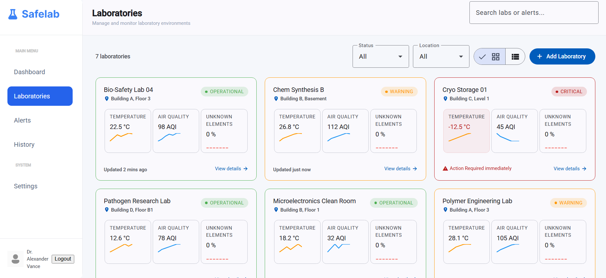</li>
  <li><strong>History View</strong> 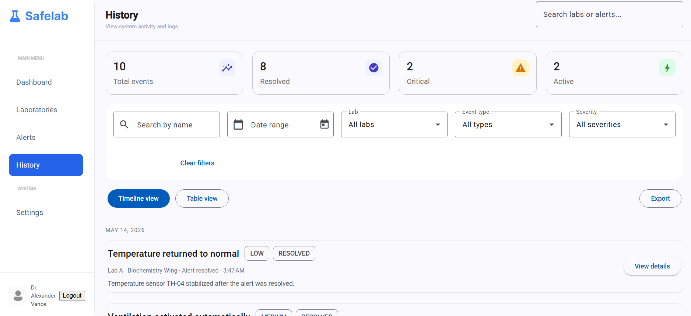</li>
  <li><strong>Alerts View</strong> 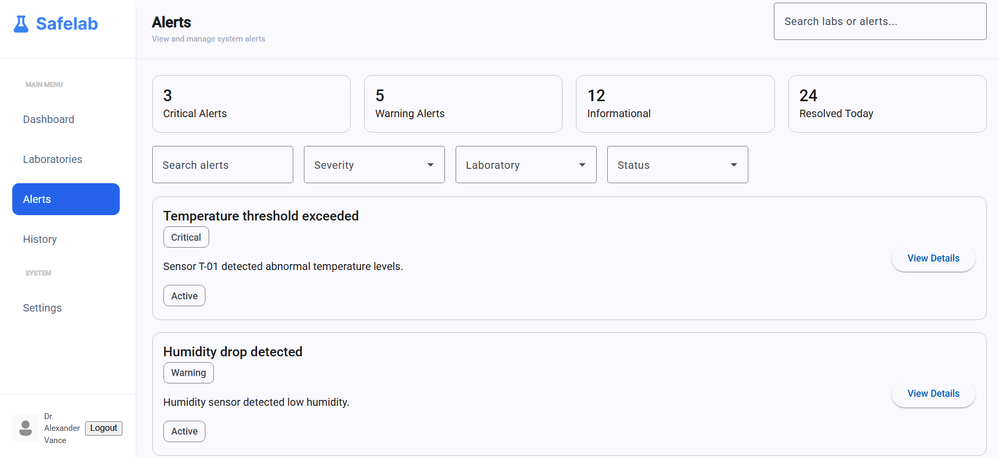</li>
  <li><strong>Settings View</strong> 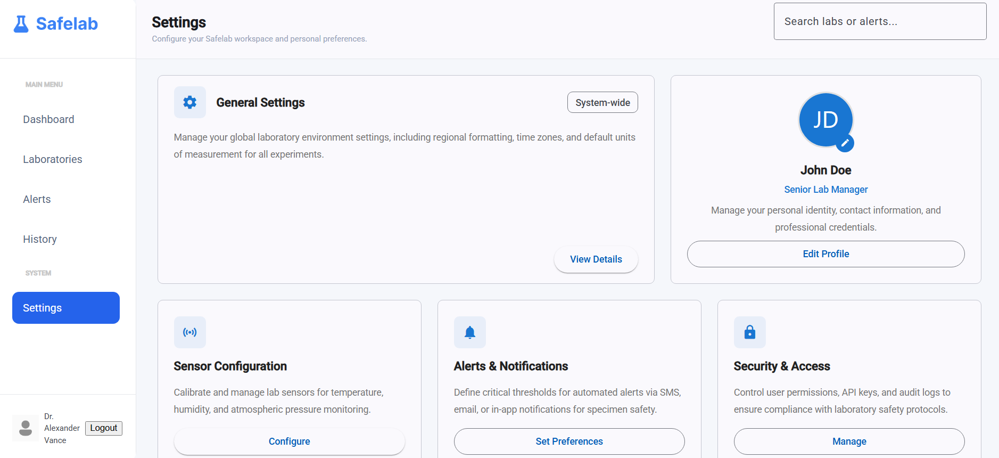</li>
</ul>

<strong>Despliegue de la aplicación:</strong> 
<a href="https://frontend-jade-seven-fwvgy3syck.vercel.app/">Safelab Web Application</a>

### **5.2.2.6. Services Documentation Evidence for Sprint Review**

Durante este Sprint, el equipo se centró en el desarrollo de las vistas principales de la aplicación web, por lo que no se implementaron ni documentaron endpoints relacionados a Web Services.
Sin embargo, se establecieron las bases para la integración futura con el backend y con ello el desarrollo de una fake API para simular las interacciones con el sistema, lo que permitirá una documentación detallada de los servicios en los próximos Sprints.

**Fake API Endpoints:**
<ul>
  <li><strong>Laboratories Endpoint</strong> 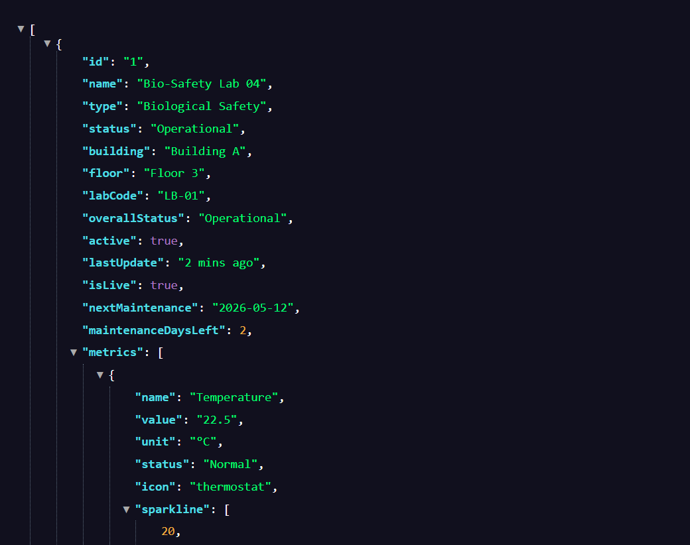</li>
  <li><strong>Telemetry Endpoint</strong> 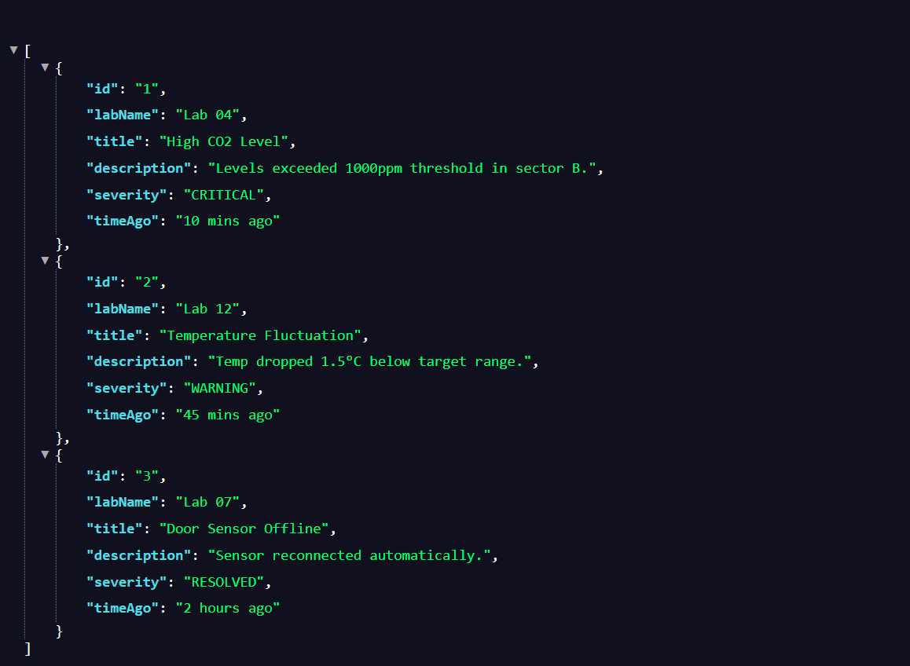</li>
  <li><strong>History Endpoint</strong> 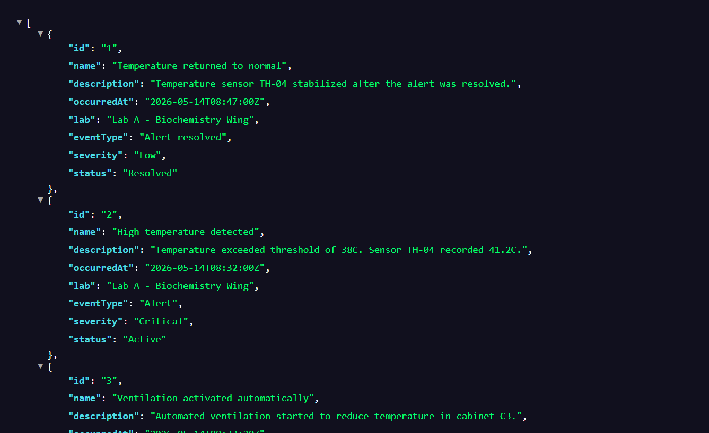</li>
  <li><strong>Alerts Endpoint</strong> 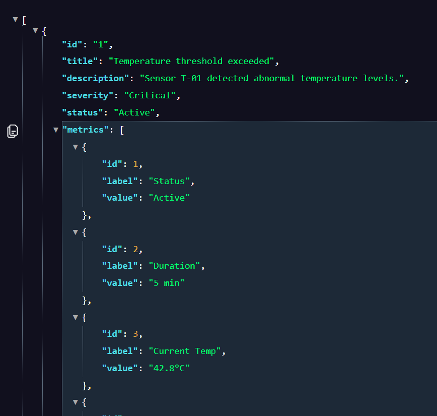</li>
  <li><strong>Settings Endpoint</strong> 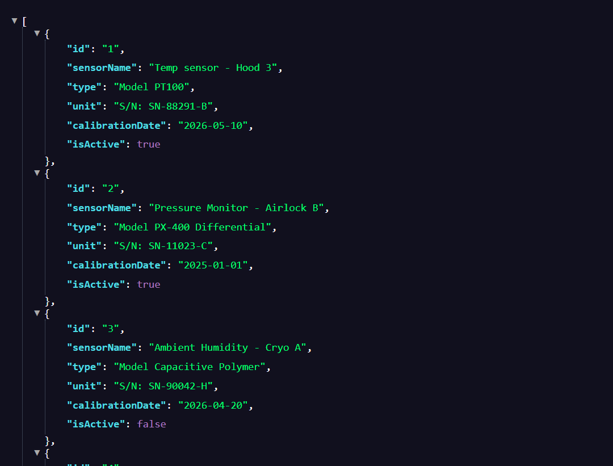</li>
</ul>

<strong>Despliegue del fake API:</strong> 
<a href="https://fake-api-production-0033.up.railway.app/">Safelab Fake API</a>

### **5.2.2.7. Software Deployment Evidence for Sprint Review**

El primer despliegue de la web application se realizó exitosamente en Vercel, mientras que la fake API se desplegó en Railway, lo que permitió validar la funcionalidad de la aplicación y su integración con el backend simulado. A continuación se presentan las evidencias de ambos despliegues:

**Web Application Deployment:**
<ul>
  <li>
    <strong>URL de la Web Application:</strong>
    <a href="https://frontend-j71vgadc7-manuel-sanchezs-projects-f772331f.vercel.app/" target="_blank">https://frontend-j71vgadc7-manuel-sanchezs-projects-f772331f.vercel.app/</a>
  </li>
  <li>
    <strong>Repositorio:</strong>
    <a href="https://github.com/upc-pre-1ASI0729-11834-Especialistas/frontend" target="_blank">https://github.com/upc-pre-1ASI0729-11834-Especialistas/frontend</a>
  </li>
  <li>
    <strong>Despliegue en Vercel:</strong> 
    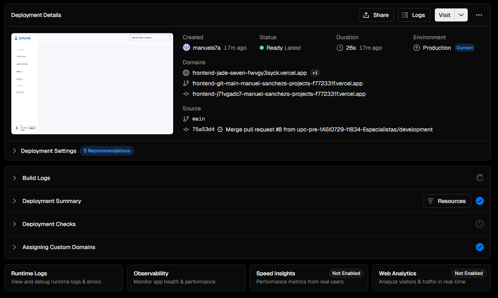
  </li>
</ul>

**Fake API Deployment:**
<ul>
  <li>
    <strong>URL de la Fake API:</strong>
    <a href="https://fake-api-production-0033.up.railway.app/" target="_blank">https://fake-api-production-0033.up.railway.app/</a>
  </li>
  <li>
    <strong>Repositorio:</strong>
    <a href="https://github.com/upc-pre-1ASI0729-11834-Especialistas/fake-api" target="_blank">https://github.com/upc-pre-1ASI0729-11834-Especialistas/fake-api</a>
  </li>
  <li>
    <strong>Despliegue en Railway:</strong> 
    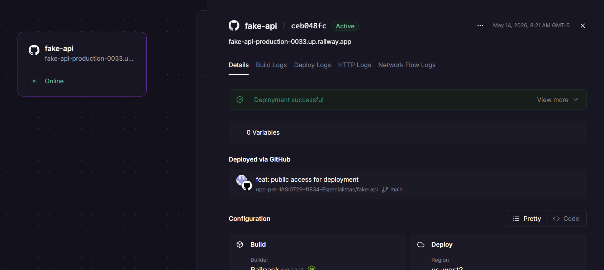
</ul>

### **5.2.2.8. Team Collaboration Insights during Sprint**

Nuestro grupo, Especialistas, gestionó los entregables mediante GitHub, WhatsApp y Google Meet durante el Sprint. Las actividades principales se centraron en el desarrollo y despliegue de la Web Application y documentación.

**Evidencia de Colaboración:**

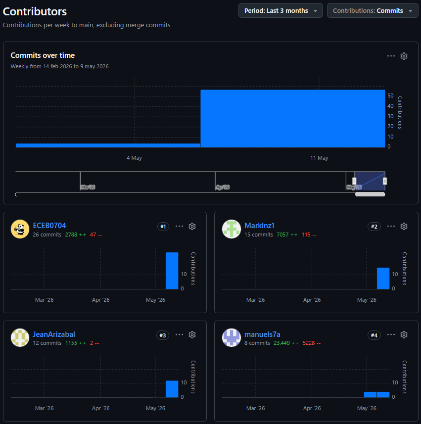

**Principales Herramientas de Comunicación:**
- Github: Para el control de versiones, gestión de issues y revisión de código.
- WhatsApp: Para comunicación rápida, coordinación de tareas y apoyo mutuo.
- Google Meet: Para reuniones de planificación, revisión de avances y aclaración de dudas específicas.

## **5.2.3. Sprint 3**

### **5.2.3.1. Sprint Planning 3**

<table border="1" cellspacing="0" cellpadding="6">
    <tr>
        <th><strong>Sprint #</strong></th>
        <td>Sprint 3</td>
    </tr>
    <tr>
        <th><strong>Resumen del Sprint Planning</strong></th>
        <td>Se priorizarón 2 objetivos: El desarrollo del backend (web-servies), y su respectiva integración al frontend. Con el cumplimiento de estos objetivos, se busca formalizar el negocio mediante la actualización de los CTA de la Landing Page.</td>
    </tr>
    <tr>
        <th><strong>Fecha</strong></th>
        <td>2026-06-05</td>
    </tr>
    <tr>
        <th><strong>Hora</strong></th>
        <td>5:00 PM</td>
    </tr>
    <tr>
        <th><strong>Ubicación</strong></th>
        <td>Google Meet</td>
    </tr>
    <tr>
        <th><strong>Preparado por</strong></th>
        <td>Manuel Angel Sanchez Arenas</td>
    </tr>
    <tr>
        <th><strong>Asistentes a la reunión de planificación</strong></th>
        <td>
            - Manuel Angel Sanchez Arenas, 
            - Jean Niels Arizabal Condori, 
            - Esteban Eduardo Chavez Bardales, 
            - Jhon Jordy Jaramillo Mayta
        </td>
    </tr>
    <tr>
        <th><strong>Resumen del Sprint 2 (Revisión)</strong></th>
        <td>Se realizó con éxito el sprint 2, cumpliendo con el desarrollo del frontend y la documentación respectiva.</td>
    </tr>
</table>

### **5.2.3.2. Aspect Leaders and Collaborators**

<table border="1" cellspacing="0" cellpadding="6">
  <thead>
    <tr>
      <th>Miembro del equipo</th>
      <th>Usuario de GitHub</th>
      <th>Web Application (L/C)</th>
      <th>Web Services (L/C)</th>
      <th>Documentación (L/C)</th>
      <th>Landing Page (L/C)</th>
    </tr>
  </thead>
  <tbody>
    <tr>
      <td>Manuel Sanchez</td>
      <td>@manuels7a</td>
      <td>C</td>
      <td>C</td>
      <td>C</td>
      <td>L</td>
    </tr>
    <tr>
      <td>Jean Arizabal</td>
      <td>@JeanArizabal</td>
      <td>C</td>
      <td>C</td>
      <td>L</td>
      <td>C</td>
    </tr>
    <tr>
      <td>Esteban Chavez</td>
      <td>@ECEB0704</td>
      <td>C</td>
      <td>C</td>
      <td>C</td>
      <td>C</td>
    </tr>
    <tr>
      <td>Jhon Jaramillo</td>
      <td>@Marklnz1</td>
      <td>L</td>
      <td>L</td>
      <td>C</td>
      <td>C</td>
    </tr>
  </tbody>
</table>

### **5.2.3.3. Sprint Backlog 3**

**Sprint Objective:**
Desarrollar los web services principales y modificar la web application para integrar estos servicios y mejorar la funcionalidad y la experiencia del usuario en el monitoreo de las condiciones y la gestión de alertas de los laboratorios.

<h4>Tabla de Sprint Backlog</h4>

<table border="1" cellspacing="0" cellpadding="6">
  <thead>
    <tr>
      <th>Historia de Usuario</th>
      <th>Tarea</th>
      <th>Descripción</th>
      <th>Estimación (Horas)</th>
      <th>Asignado a</th>
      <th>Estado</th>
    </tr>
  </thead>
  <tbody>
    <tr>
      <td>US11</td>
      <td>Gestión Priorizada de Sedes y Laboratorios</td>
      <td>Como: Coordinador de Laboratorio. Quiero: Visualizar la lista de laboratorios con filtros avanzados por estado de criticidad y ubicación. Para: Identificar de inmediato qué sedes presentan anomalías térmicas y priorizar la supervisión en los puntos de mayor riesgo.</td>
      <td>4</td>
      <td>Jhon Jaramillo</td>
      <td>Finalizado</td>
    </tr>
    <tr>
      <td>US15</td>
      <td>Activación de Sistemas de Mitigación y Respuesta Automatizada</td>
      <td>Como: Coordinador de Laboratorio. Quiero: Activar o desactivar los sistemas de mitigación (ventilación/refrigeración auxiliar) bajo reglas de validación técnica. Para: Reaccionar de forma segura ante una excursión térmica y estabilizar el ambiente sin comprometer la integridad de otros equipos.</td>
      <td>8</td>
      <td>Jhon Jaramillo</td>
      <td>Finalizado</td>
    </tr>
    <tr>
      <td>US26</td>
      <td>Escalamiento Automático de Incidentes no Atendidos</td>
      <td>Como: Gerente de Operaciones. Quiero: Que el sistema aplique la política de escalamiento (Escalation Policy) si una alerta crítica no es reconocida en el tiempo establecido. Para: Garantizar que el personal de mayor jerarquía intervenga en situaciones de alto riesgo que no han sido gestionadas a tiempo.</td>
      <td>6</td>
      <td>Jhon Jaramillo</td>
      <td>Finalizado</td>
    </tr>
    <tr>
      <td>US27</td>
      <td>Registro Obligatorio de Acciones Correctivas</td>
      <td>Como: Técnico de Laboratorio. Quiero: Documentar formalmente las medidas tomadas para resolver una anomalía térmica. Para: Cumplir con los protocolos de trazabilidad y permitir el análisis de causa raíz en el futuro.</td>
      <td>5</td>
      <td>Jean Arizabal</td>
      <td>Finalizado</td>
    </tr>
    <tr>
      <td>US28</td>
      <td>Generación de Reporte de Auditoría Regulatoria</td>
      <td>Como: Director de Calidad / Auditor Externo. Quiero: Generar reportes consolidados e inmutables de todas las lecturas e incidentes de un periodo determinado. Para: Presentar evidencia ante entidades regulatorias (DIGEMID/ISO) que certifique la integridad de la cadena de frío.</td>
      <td>7</td>
      <td>Jhon Jaramillo</td>
      <td>Finalizado</td>
    </tr>
    <tr>
      <td>US30</td>
      <td>Personalización de Canales de Alerta y Resúmenes de Actividad</td>
      <td>Como: Coordinador de Laboratorio. Quiero: Configurar los canales de recepción de alertas y la frecuencia de los reportes de actividad. Para: Optimizar la comunicación de incidentes según la gravedad y evitar la "fatiga de alertas" en el personal de turno.</td>
      <td>8</td>
      <td>Jhon Jaramillo</td>
      <td>Finalizado</td>
    </tr>
    <tr>
      <td>US34</td>
      <td>Filtrado de alertas</td>
      <td>Como usuario, quiero filtrar alertas por diferentes criterios para priorizar mis necesidades.</td>
      <td>3</td>
      <td>Manuel Sanchez</td>
      <td>Finalizado</td>
    </tr>
    <tr>
      <td>US35</td>
      <td>Detalle completo de alerta</td>
      <td>Como usuario, quiero ver el detalle completo de una alerta para comprender el incidente.</td>
      <td>5</td>
      <td>Esteban Chavez</td>
      <td>Finalizado</td>
    </tr>
    <tr>
      <td>US40</td>
      <td>Cierre de sesión</td>
      <td>Como usuario, quiero cerrar sesión para proteger el acceso a la plataforma.</td>
      <td>5</td>
      <td>Jhon Jaramillo</td>
      <td>Finalizado</td>
    </tr>
    <tr>
      <td>US41</td>
      <td>Persistencia de sesión</td>
      <td>Como usuario, quiero mantener mi sesión activa para no iniciar sesión constantemente.</td>
      <td>4</td>
      <td>Jhon Jaramillo</td>
      <td>Finalizado</td>
    </tr>
  </tbody>
</table>

### **5.2.3.4. Development Evidence for Sprint Review**

Esta tabla lista los commits realizados durante el sprint, incluyendo el desarrollo de los web services, actualización de la web application, landing page y documentación.

<table border="1">
  <thead>
    <tr>
      <th>Repositorio</th>
      <th>Rama</th>
      <th>ID de Commit</th>
      <th>Mensaje de Commit</th>
      <th>Descripción de Commit</th>
      <th>Fecha de Commit</th>
    </tr>
  </thead>
  <tbody>
    <tr>
      <td>upc-pre-1ASI0729-11834-Especialistas/backend</td>
      <td>main, origin/main</td>
      <td>047ebbe</td>
      <td>Merge pull request #2 from upc-pre-1ASI0729-11834-Especialistas/development Development</td>
      <td>-</td>
      <td>20/06/2026</td>
    </tr>
    <tr>
      <td>upc-pre-1ASI0729-11834-Especialistas/backend</td>
      <td>origin/development</td>
      <td>9f3a326</td>
      <td>Merge pull request #1 from upc-pre-1ASI0729-11834-Especialistas/feature/api-implementation Feature/api implementation</td>
      <td>-</td>
      <td>20/06/2026</td>
    </tr>
    <tr>
      <td>upc-pre-1ASI0729-11834-Especialistas/backend</td>
      <td>origin/feature/api-implementation</td>
      <td>2f9899f</td>
      <td>feat(seeder): seed additional laboratories, alerts, and telemetry readings</td>
      <td>-</td>
      <td>19/06/2026</td>
    </tr>
    <tr>
      <td>upc-pre-1ASI0729-11834-Especialistas/backend</td>
      <td>-</td>
      <td>a53c56d</td>
      <td>config(db): read DDL-auto property from environment variable in production</td>
      <td>-</td>
      <td>19/06/2026</td>
    </tr>
    <tr>
      <td>upc-pre-1ASI0729-11834-Especialistas/backend</td>
      <td>-</td>
      <td>387ae66</td>
      <td>config(cors): allow localhost and vercel origins globally and allow all headers</td>
      <td>-</td>
      <td>19/06/2026</td>
    </tr>
    <tr>
      <td>upc-pre-1ASI0729-11834-Especialistas/backend</td>
      <td>-</td>
      <td>0297b51</td>
      <td>config(db): set Hibernate DDL auto to update in production environment</td>
      <td>-</td>
      <td>19/06/2026</td>
    </tr>
    <tr>
      <td>upc-pre-1ASI0729-11834-Especialistas/backend</td>
      <td>-</td>
      <td>786e829</td>
      <td>fix(telemetry): improve MQTT subscription processing and telemetry payload assembly</td>
      <td>-</td>
      <td>19/06/2026</td>
    </tr>
    <tr>
      <td>upc-pre-1ASI0729-11834-Especialistas/backend</td>
      <td>-</td>
      <td>c89cc82</td>
      <td>refactor(db): extract temporary data seeding to a dedicated TemporarySeeder</td>
      <td>-</td>
      <td>19/06/2026</td>
    </tr>
    <tr>
      <td>upc-pre-1ASI0729-11834-Especialistas/backend</td>
      <td>-</td>
      <td>3c7fc3b</td>
      <td>feat(telemetry): implement TelemetrySimulationController mock publisher endpoint</td>
      <td>-</td>
      <td>19/06/2026</td>
    </tr>
    <tr>
      <td>upc-pre-1ASI0729-11834-Especialistas/backend</td>
      <td>-</td>
      <td>89db521</td>
      <td>feat(automation): add equipment mapping and threshold properties to SensorConfiguration</td>
      <td>-</td>
      <td>19/06/2026</td>
    </tr>
    <tr>
      <td>upc-pre-1ASI0729-11834-Especialistas/backend</td>
      <td>-</td>
      <td>408917f</td>
      <td>feat(api): enhance REST endpoints for pending invitations, user profiles, and threshold controllers</td>
      <td>-</td>
      <td>19/06/2026</td>
    </tr>
    <tr>
      <td>upc-pre-1ASI0729-11834-Especialistas/backend</td>
      <td>-</td>
      <td>01eec32</td>
      <td>feat(telemetry): update MQTT ingestion and query endpoints</td>
      <td>-</td>
      <td>19/06/2026</td>
    </tr>
    <tr>
      <td>upc-pre-1ASI0729-11834-Especialistas/backend</td>
      <td>-</td>
      <td>cd45e93</td>
      <td>feat(labs): extend laboratory command and query services</td>
      <td>-</td>
      <td>19/06/2026</td>
    </tr>
    <tr>
      <td>upc-pre-1ASI0729-11834-Especialistas/backend</td>
      <td>-</td>
      <td>f9837ef</td>
      <td>feat(iam): handle UserWorkspaceAccess setup in ApplicationReadyEventHandler</td>
      <td>-</td>
      <td>19/06/2026</td>
    </tr>
    <tr>
      <td>upc-pre-1ASI0729-11834-Especialistas/backend</td>
      <td>-</td>
      <td>e5b2d78</td>
      <td>feat(automation): add UserWorkspaceAccess entity, repository, and rules</td>
      <td>-</td>
      <td>19/06/2026</td>
    </tr>
    <tr>
      <td>upc-pre-1ASI0729-11834-Especialistas/backend</td>
      <td>-</td>
      <td>b39fcdd</td>
      <td>feat(workspace): introduce Workspace model, repository, and controller</td>
      <td>-</td>
      <td>19/06/2026</td>
    </tr>
    <tr>
      <td>upc-pre-1ASI0729-11834-Especialistas/backend</td>
      <td>-</td>
      <td>57b3a33</td>
      <td>chore(config): simplify allowed CORS origins using vercel wildcard</td>
      <td>-</td>
      <td>18/06/2026</td>
    </tr>
    <tr>
      <td>upc-pre-1ASI0729-11834-Especialistas/backend</td>
      <td>-</td>
      <td>ce35f8a</td>
      <td>fix(security): update cors configuration to support dynamic vercel preview domains</td>
      <td>-</td>
      <td>18/06/2026</td>
    </tr>
    <tr>
      <td>upc-pre-1ASI0729-11834-Especialistas/backend</td>
      <td>-</td>
      <td>156f195</td>
      <td>fix(config): disable hibernate ddl-auto in production to prevent connection deadlock</td>
      <td>-</td>
      <td>18/06/2026</td>
    </tr>
    <tr>
      <td>upc-pre-1ASI0729-11834-Especialistas/backend</td>
      <td>-</td>
      <td>3abc65a</td>
      <td>fix(config): limit Hikari pool size to prevent exceeding max connections in production</td>
      <td>-</td>
      <td>18/06/2026</td>
    </tr>
    <tr>
      <td>upc-pre-1ASI0729-11834-Especialistas/backend</td>
      <td>-</td>
      <td>838f80b</td>
      <td>feat(security): configure CORS allowed origins from properties and enable credentials</td>
      <td>-</td>
      <td>18/06/2026</td>
    </tr>
    <tr>
      <td>upc-pre-1ASI0729-11834-Especialistas/backend</td>
      <td>-</td>
      <td>309421b</td>
      <td>config: parameterize active Spring profile using environment variable</td>
      <td>-</td>
      <td>18/06/2026</td>
    </tr>
    <tr>
      <td>upc-pre-1ASI0729-11834-Especialistas/backend</td>
      <td>-</td>
      <td>57c0c0d</td>
      <td>config: parameterize MQTT host in production properties</td>
      <td>-</td>
      <td>18/06/2026</td>
    </tr>
    <tr>
      <td>upc-pre-1ASI0729-11834-Especialistas/backend</td>
      <td>-</td>
      <td>4f7eed0</td>
      <td>config: move development JWT secret to local dev properties</td>
      <td>-</td>
      <td>18/06/2026</td>
    </tr>
    <tr>
      <td>upc-pre-1ASI0729-11834-Especialistas/backend</td>
      <td>-</td>
      <td>1de65d8</td>
      <td>config: add application-prod.properties with environment variables placeholders</td>
      <td>-</td>
      <td>18/06/2026</td>
    </tr>
    <tr>
      <td>upc-pre-1ASI0729-11834-Especialistas/backend</td>
      <td>-</td>
      <td>1a7a13c</td>
      <td>ci: add multi-stage Dockerfile for Java 25 and configure dynamic port</td>
      <td>-</td>
      <td>18/06/2026</td>
    </tr>
    <tr>
      <td>upc-pre-1ASI0729-11834-Especialistas/backend</td>
      <td>-</td>
      <td>8b99d4d</td>
      <td>feat(iam): resolve role repository bean and entity name collisions and seed default profiles</td>
      <td>-</td>
      <td>18/06/2026</td>
    </tr>
    <tr>
      <td>upc-pre-1ASI0729-11834-Especialistas/backend</td>
      <td>-</td>
      <td>87094fd</td>
      <td>feat(iam): implement user authentication, role clash resolution, and profile seeding</td>
      <td>-</td>
      <td>18/06/2026</td>
    </tr>
    <tr>
      <td>upc-pre-1ASI0729-11834-Especialistas/backend</td>
      <td>-</td>
      <td>83806dc</td>
      <td>feat(alerts): expand alert metadata, integrate automation rules, and resolve status transitions - Update MqttTelemetrySubscriber to automatically generate global Alert and corresponding AlertMetric records (currentValue, threshold, exceededBy, sensorType, calibration, signal, status) when sensor configuration limits are breached.</td>
      <td>-</td>
      <td>18/06/2026</td>
    </tr>
    <tr>
      <td>upc-pre-1ASI0729-11834-Especialistas/backend</td>
      <td>-</td>
      <td>7358b2c</td>
      <td>fix(labs): optimize metric subscriptions update and add maintenance days calculation - Refactor LaboratoryCommandServiceImpl to perform a delta update (remove, update, add) on laboratory metric subscriptions instead of clearing the collection.</td>
      <td>-</td>
      <td>18/06/2026</td>
    </tr>
    <tr>
      <td>upc-pre-1ASI0729-11834-Especialistas/backend</td>
      <td>-</td>
      <td>91eeaa7</td>
      <td>chore(config): change hibernate ddl-auto to update Update the Hibernate DDL auto strategy to update instead of recreate in application.properties.</td>
      <td>-</td>
      <td>18/06/2026</td>
    </tr>
    <tr>
      <td>upc-pre-1ASI0729-11834-Especialistas/backend</td>
      <td>-</td>
      <td>175386f</td>
      <td>refactor(telemetry): update MQTT ingestion and query endpoints to use MetricType Refactor MqttTelemetrySubscriber to reject unregistered metric keys, fetch unit/icon details from the MetricType catalog, and evaluate thresholds against active LabMetricSubscriptions. Update telemetry controller to serve generic historical readings by metric key, keeping the legacy temperature path for backward compatibility.</td>
      <td>-</td>
      <td>18/06/2026</td>
    </tr>
    <tr>
      <td>upc-pre-1ASI0729-11834-Especialistas/backend</td>
      <td>-</td>
      <td>44ba834</td>
      <td>feat(labs): transition Laboratory sensors to dynamic metric subscriptions Remove hardcoded SensorConfig and SafetyThresholds from Laboratory aggregate and replace them with a dynamic LabMetricSubscription relationship, allowing custom min/max safety thresholds to be defined for individual metric types.</td>
      <td>-</td>
      <td>18/06/2026</td>
    </tr>
    <tr>
      <td>upc-pre-1ASI0729-11834-Especialistas/backend</td>
      <td>-</td>
      <td>ebb23a5</td>
      <td>feat(telemetry): introduce MetricType catalog aggregate and REST API Add MetricType entity, repositories, command/query services, DTO resources, and REST controllers to manage the catalog of telemetry metric types (e.g. temperature, humidity, CO2). Includes a database seeder for initial metric types.</td>
      <td>-</td>
      <td>18/06/2026</td>
    </tr>
    <tr>
      <td>upc-pre-1ASI0729-11834-Especialistas/backend</td>
      <td>-</td>
      <td>13ba8b1</td>
      <td>feat(telemetry): implement dynamic MQTT integration with EAV persistence and modernize temporal annotations</td>
      <td>-</td>
      <td>18/06/2026</td>
    </tr>
    <tr>
      <td>upc-pre-1ASI0729-11834-Especialistas/backend</td>
      <td>-</td>
      <td>2b385dc</td>
      <td>feat: implement sensor endpoints, telemetry updates, and MQTT integration properties - Add commands and REST endpoints for creating, updating, and calibrating sensor configurations.</td>
      <td>-</td>
      <td>18/06/2026</td>
    </tr>
    <tr>
      <td>upc-pre-1ASI0729-11834-Especialistas/backend</td>
      <td>-</td>
      <td>09d86fa</td>
      <td>feat(api): implement REST endpoints for all bounded contexts - Created CRUD endpoints for laboratories, alerts, history records, and automation rules.</td>
      <td>-</td>
      <td>17/06/2026</td>
    </tr>
    <tr>
      <td>upc-pre-1ASI0729-11834-Especialistas/backend</td>
      <td>-</td>
      <td>b341ba4</td>
      <td>feat(domain): implement aggregates, entities, and repositories for bounded contexts</td>
      <td>-</td>
      <td>17/06/2026</td>
    </tr>
    <tr>
      <td>upc-pre-1ASI0729-11834-Especialistas/backend</td>
      <td>-</td>
      <td>c14f1f5</td>
      <td>chore: setup database configuration</td>
      <td>-</td>
      <td>17/06/2026</td>
    </tr>
    <tr>
      <td>upc-pre-1ASI0729-11834-Especialistas/backend</td>
      <td>-</td>
      <td>08cca8f</td>
      <td>feat: initial project structure for api</td>
      <td>-</td>
      <td>03/06/2026</td>
    </tr>
    <tr>
      <td>upc-pre-1ASI0729-11834-Especialistas/landing-page</td>
      <td>main, origin/main, origin/HEAD</td>
      <td>db59d24</td>
      <td>update: cta links to web-app</td>
      <td>-</td>
      <td>20/06/2026</td>
    </tr>
    <tr>
      <td>upc-pre-1ASI0729-11834-Especialistas/landing-page</td>
      <td>-</td>
      <td>6626cb5</td>
      <td>feat: about the product section added</td>
      <td>-</td>
      <td>19/06/2026</td>
    </tr>
    <tr>
      <td>upc-pre-1ASI0729-11834-Especialistas/frontend</td>
      <td>main, origin/main</td>
      <td>1c233c4</td>
      <td>Merge pull request #26 from upc-pre-1ASI0729-11834-Especialistas/development Development</td>
      <td>-</td>
      <td>19/06/2026</td>
    </tr>
    <tr>
      <td>upc-pre-1ASI0729-11834-Especialistas/frontend</td>
      <td>origin/development, development</td>
      <td>d13e6f3</td>
      <td>Merge pull request #25 from upc-pre-1ASI0729-11834-Especialistas/feature/frontend-implementation fix(dashboard): redirect equipment link to threshold configuration</td>
      <td>-</td>
      <td>19/06/2026</td>
    </tr>
    <tr>
      <td>upc-pre-1ASI0729-11834-Especialistas/frontend</td>
      <td>-</td>
      <td>cbbc82f</td>
      <td>Merge pull request #24 from upc-pre-1ASI0729-11834-Especialistas/development Development</td>
      <td>-</td>
      <td>19/06/2026</td>
    </tr>
    <tr>
      <td>upc-pre-1ASI0729-11834-Especialistas/frontend</td>
      <td>-</td>
      <td>868ef40</td>
      <td>Merge pull request #23 from upc-pre-1ASI0729-11834-Especialistas/feature/frontend-implementation Feature/frontend implementation</td>
      <td>-</td>
      <td>19/06/2026</td>
    </tr>
    <tr>
      <td>upc-pre-1ASI0729-11834-Especialistas/frontend</td>
      <td>origin/feature/frontend-implementation</td>
      <td>175328e</td>
      <td>fix(dashboard): redirect equipment link to threshold configuration</td>
      <td>-</td>
      <td>19/06/2026</td>
    </tr>
    <tr>
      <td>upc-pre-1ASI0729-11834-Especialistas/frontend</td>
      <td>-</td>
      <td>4cb3d69</td>
      <td>Merge pull request #22 from upc-pre-1ASI0729-11834-Especialistas/development Development</td>
      <td>-</td>
      <td>19/06/2026</td>
    </tr>
    <tr>
      <td>upc-pre-1ASI0729-11834-Especialistas/frontend</td>
      <td>-</td>
      <td>494a093</td>
      <td>Merge pull request #21 from upc-pre-1ASI0729-11834-Especialistas/feature/frontend-implementation Feature/frontend implementation</td>
      <td>-</td>
      <td>19/06/2026</td>
    </tr>
    <tr>
      <td>upc-pre-1ASI0729-11834-Especialistas/frontend</td>
      <td>-</td>
      <td>24759a8</td>
      <td>config(env): point development environment API base URL to render backend URL</td>
      <td>-</td>
      <td>19/06/2026</td>
    </tr>
    <tr>
      <td>upc-pre-1ASI0729-11834-Especialistas/frontend</td>
      <td>-</td>
      <td>d0189ab</td>
      <td>fix(labs): translate hardcoded text in laboratory detail subcomponents</td>
      <td>-</td>
      <td>19/06/2026</td>
    </tr>
    <tr>
      <td>upc-pre-1ASI0729-11834-Especialistas/frontend</td>
      <td>-</td>
      <td>98f2e21</td>
      <td>style(layout): add media query rules for topbar responsiveness on small screens</td>
      <td>-</td>
      <td>19/06/2026</td>
    </tr>
    <tr>
      <td>upc-pre-1ASI0729-11834-Especialistas/frontend</td>
      <td>-</td>
      <td>68441b6</td>
      <td>style(labs): integrate laboratory details name, badge, and metadata directly in Topbar</td>
      <td>-</td>
      <td>19/06/2026</td>
    </tr>
    <tr>
      <td>upc-pre-1ASI0729-11834-Especialistas/frontend</td>
      <td>-</td>
      <td>12a9832</td>
      <td>style(labs): clean up laboratory detail header and integrate simplified breadcrumbs in topbar</td>
      <td>-</td>
      <td>19/06/2026</td>
    </tr>
    <tr>
      <td>upc-pre-1ASI0729-11834-Especialistas/frontend</td>
      <td>-</td>
      <td>b9fb4c9</td>
      <td>feat(alerts): implement alerts page and incident resolution view</td>
      <td>-</td>
      <td>19/06/2026</td>
    </tr>
    <tr>
      <td>upc-pre-1ASI0729-11834-Especialistas/frontend</td>
      <td>-</td>
      <td>1f81663</td>
      <td>feat(shared): improve language switcher display layout</td>
      <td>-</td>
      <td>19/06/2026</td>
    </tr>
    <tr>
      <td>upc-pre-1ASI0729-11834-Especialistas/frontend</td>
      <td>-</td>
      <td>f3a4aba</td>
      <td>feat(automation): develop settings dashboard, rules, threshold tables, and sensor management</td>
      <td>-</td>
      <td>19/06/2026</td>
    </tr>
    <tr>
      <td>upc-pre-1ASI0729-11834-Especialistas/frontend</td>
      <td>-</td>
      <td>646171e</td>
      <td>feat(history): implement history log audit trail and shift report generation</td>
      <td>-</td>
      <td>19/06/2026</td>
    </tr>
    <tr>
      <td>upc-pre-1ASI0729-11834-Especialistas/frontend</td>
      <td>-</td>
      <td>a649668</td>
      <td>feat(labs): build laboratory registration and details views</td>
      <td>-</td>
      <td>19/06/2026</td>
    </tr>
    <tr>
      <td>upc-pre-1ASI0729-11834-Especialistas/frontend</td>
      <td>-</td>
      <td>19062ad</td>
      <td>feat(iam): implement authentication flow views for login and register</td>
      <td>-</td>
      <td>19/06/2026</td>
    </tr>
    <tr>
      <td>upc-pre-1ASI0729-11834-Especialistas/frontend</td>
      <td>-</td>
      <td>aec68e7</td>
      <td>style(layout): update sidebar layout styling and workspace selection</td>
      <td>-</td>
      <td>19/06/2026</td>
    </tr>
    <tr>
      <td>upc-pre-1ASI0729-11834-Especialistas/frontend</td>
      <td>-</td>
      <td>78e12b7</td>
      <td>feat(automation): integrate edit permissions dialog and store enhancements</td>
      <td>-</td>
      <td>19/06/2026</td>
    </tr>
    <tr>
      <td>upc-pre-1ASI0729-11834-Especialistas/frontend</td>
      <td>-</td>
      <td>3cc4c37</td>
      <td>feat(iam): add registration page UI</td>
      <td>-</td>
      <td>19/06/2026</td>
    </tr>
    <tr>
      <td>upc-pre-1ASI0729-11834-Especialistas/frontend</td>
      <td>-</td>
      <td>9e87ae3</td>
      <td>feat(workspace): introduce Workspace store and API service</td>
      <td>-</td>
      <td>19/06/2026</td>
    </tr>
    <tr>
      <td>upc-pre-1ASI0729-11834-Especialistas/frontend</td>
      <td>-</td>
      <td>8abc6d1</td>
      <td>Merge pull request #20 from upc-pre-1ASI0729-11834-Especialistas/development Development</td>
      <td>-</td>
      <td>18/06/2026</td>
    </tr>
    <tr>
      <td>upc-pre-1ASI0729-11834-Especialistas/frontend</td>
      <td>-</td>
      <td>fea66d3</td>
      <td>merge: sync main history into development using ours strategy</td>
      <td>-</td>
      <td>18/06/2026</td>
    </tr>
    <tr>
      <td>upc-pre-1ASI0729-11834-Especialistas/frontend</td>
      <td>-</td>
      <td>cb378ad</td>
      <td>Merge pull request #19 from upc-pre-1ASI0729-11834-Especialistas/feat/backend-connection-setup Feat/backend connection setup</td>
      <td>-</td>
      <td>18/06/2026</td>
    </tr>
    <tr>
      <td>upc-pre-1ASI0729-11834-Especialistas/frontend</td>
      <td>origin/feat/backend-connection-setup</td>
      <td>ad9601b</td>
      <td>fix: improve alerts tracking and update production backend api url</td>
      <td>-</td>
      <td>18/06/2026</td>
    </tr>
    <tr>
      <td>upc-pre-1ASI0729-11834-Especialistas/frontend</td>
      <td>-</td>
      <td>6d1d7d6</td>
      <td>style: format history page template and fix character in handover notice</td>
      <td>-</td>
      <td>18/06/2026</td>
    </tr>
    <tr>
      <td>upc-pre-1ASI0729-11834-Especialistas/frontend</td>
      <td>-</td>
      <td>2383cee</td>
      <td>Merge pull request #17 from upc-pre-1ASI0729-11834-Especialistas/feat/backend-connection-setup Feat/backend connection setup</td>
      <td>-</td>
      <td>18/06/2026</td>
    </tr>
    <tr>
      <td>upc-pre-1ASI0729-11834-Especialistas/frontend</td>
      <td>-</td>
      <td>e1bf36e</td>
      <td>merge: integrate development branch history</td>
      <td>-</td>
      <td>18/06/2026</td>
    </tr>
    <tr>
      <td>upc-pre-1ASI0729-11834-Especialistas/frontend</td>
      <td>-</td>
      <td>fd49314</td>
      <td>Merge pull request #16 from upc-pre-1ASI0729-11834-Especialistas/revert-15-feat/backend-connection-setup Revert "Feat/backend connection setup"</td>
      <td>-</td>
      <td>18/06/2026</td>
    </tr>
    <tr>
      <td>upc-pre-1ASI0729-11834-Especialistas/frontend</td>
      <td>origin/revert-15-feat/backend-connection-setup</td>
      <td>b3d90a9</td>
      <td>Revert "Feat/backend connection setup"</td>
      <td>-</td>
      <td>18/06/2026</td>
    </tr>
    <tr>
      <td>upc-pre-1ASI0729-11834-Especialistas/frontend</td>
      <td>-</td>
      <td>2ba3565</td>
      <td>Merge pull request #15 from upc-pre-1ASI0729-11834-Especialistas/feat/backend-connection-setup Feat/backend connection setup</td>
      <td>-</td>
      <td>18/06/2026</td>
    </tr>
    <tr>
      <td>upc-pre-1ASI0729-11834-Especialistas/frontend</td>
      <td>-</td>
      <td>bc9f8f7</td>
      <td>feat: manual merge of development branch (i18n, app.config, json-server routing)</td>
      <td>-</td>
      <td>18/06/2026</td>
    </tr>
    <tr>
      <td>upc-pre-1ASI0729-11834-Especialistas/frontend</td>
      <td>-</td>
      <td>228d556</td>
      <td>fix(env): remove trailing slash from platform provider api base url</td>
      <td>-</td>
      <td>18/06/2026</td>
    </tr>
    <tr>
      <td>upc-pre-1ASI0729-11834-Especialistas/frontend</td>
      <td>-</td>
      <td>3b2d66f</td>
      <td>feat(iam): integrate profile settings, password update, and session metadata</td>
      <td>-</td>
      <td>18/06/2026</td>
    </tr>
    <tr>
      <td>upc-pre-1ASI0729-11834-Especialistas/frontend</td>
      <td>-</td>
      <td>e38a5af</td>
      <td>feat: add login page</td>
      <td>-</td>
      <td>18/06/2026</td>
    </tr>
    <tr>
      <td>upc-pre-1ASI0729-11834-Especialistas/frontend</td>
      <td>-</td>
      <td>38166b4</td>
      <td>feat(alerts/labs): bind incident views to backend telemetry and remove redundant status card - Extend Alert entity models, resource interfaces, and assembler mapping to include detailed telemetry metrics, timestamps, and sensor metadata from the backend.</td>
      <td>-</td>
      <td>18/06/2026</td>
    </tr>
    <tr>
      <td>upc-pre-1ASI0729-11834-Especialistas/frontend</td>
      <td>-</td>
      <td>d00873f</td>
      <td>feat(labs): implement laboratory editing, refactor detail page widgets, and improve dashboard resilience - Configure edit mode for AddLaboratoryPageComponent under the ':id/edit' route.</td>
      <td>-</td>
      <td>18/06/2026</td>
    </tr>
    <tr>
      <td>upc-pre-1ASI0729-11834-Especialistas/frontend</td>
      <td>-</td>
      <td>7adb779</td>
      <td>refactor(telemetry): support generic metric types in charts and dashboard Update the historical readings API client and store to query backend records dynamically by metric key. Enhance the dashboard and ApexCharts component to format units and titles dynamically based on the selected MetricType.</td>
      <td>-</td>
      <td>18/06/2026</td>
    </tr>
    <tr>
      <td>upc-pre-1ASI0729-11834-Especialistas/frontend</td>
      <td>-</td>
      <td>11286b8</td>
      <td>feat(labs): transition UI and routing to dynamic metric subscriptions Update laboratory models, assemblers, store, and config screens to replace binary sensor toggles with dynamic metric subscriptions featuring min/max safety threshold fields. Add a dedicated UI page and dialog for managing the system's Metric Types catalog.</td>
      <td>-</td>
      <td>18/06/2026</td>
    </tr>
    <tr>
      <td>upc-pre-1ASI0729-11834-Especialistas/frontend</td>
      <td>-</td>
      <td>d6acdfe</td>
      <td>feat(telemetry): introduce MetricType catalog domain model and state Implement the domain entity, API service, assembler, and Signal-based store for MetricType to fetch and manage the available metric definitions from the backend catalog.</td>
      <td>-</td>
      <td>18/06/2026</td>
    </tr>
    <tr>
      <td>upc-pre-1ASI0729-11834-Especialistas/frontend</td>
      <td>-</td>
      <td>247bbd9</td>
      <td>feat(telemetry): support dynamic multi-laboratory charts, sensor provisioning and system health banner</td>
      <td>-</td>
      <td>18/06/2026</td>
    </tr>
    <tr>
      <td>upc-pre-1ASI0729-11834-Especialistas/frontend</td>
      <td>-</td>
      <td>fc314fb</td>
      <td>feat(backend-connection): integrate frontend UI components with state stores and API endpoints - Connected alerts, incident details, and resolution pages to AlertsStore.</td>
      <td>-</td>
      <td>18/06/2026</td>
    </tr>
    <tr>
      <td>upc-pre-1ASI0729-11834-Especialistas/frontend</td>
      <td>-</td>
      <td>35a5b6b</td>
      <td>feat(config): configure development environment endpoints for backend connection</td>
      <td>-</td>
      <td>17/06/2026</td>
    </tr>
  </tbody>
</table>

### **5.2.3.5. Execution Evidence for Sprint Review**

**Web Application:**

Se modificó el poryecto web para integrar los web services desarrollados durante este Sprint. A continuación se presentan las evidencias correspondientes de la implementación.

<ul>
  <li><strong>Dashboard View</strong> 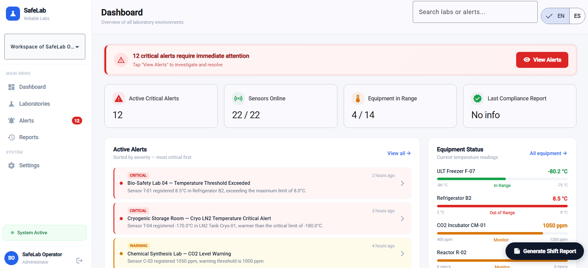</li>
  <li><strong>Laboratories View</strong> 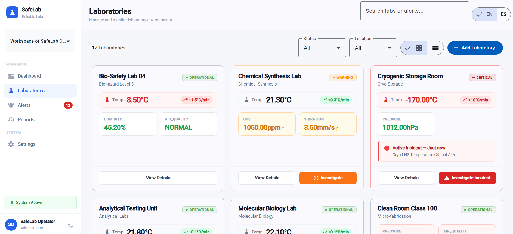</li>
  <li><strong>History View</strong> 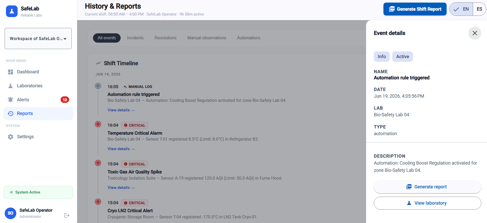</li>
  <li><strong>Alerts View</strong> 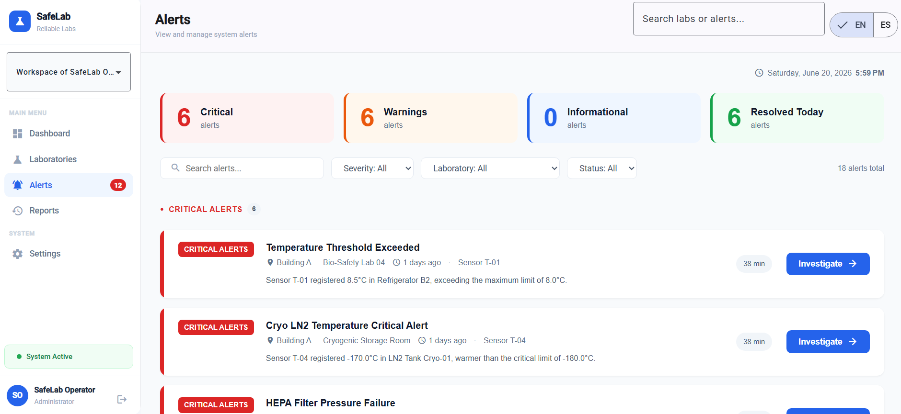</li>
  <li><strong>Settings View</strong> 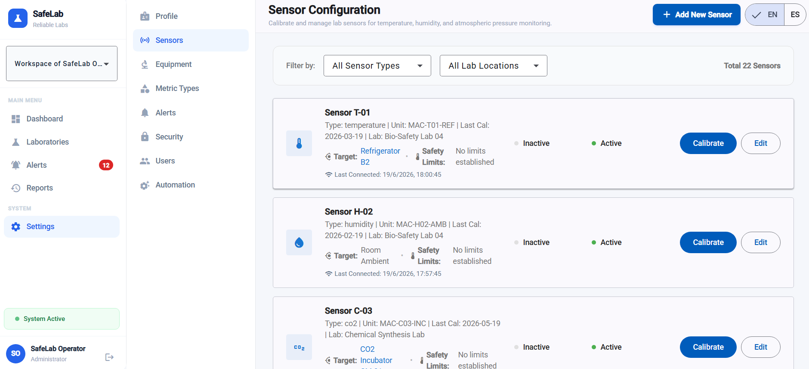</li>
</ul>

<strong>Despliegue de la aplicación web:</strong> 
<a href="https://frontend-iuj2kbsqn-manuel-sanchezs-projects-f772331f.vercel.app/">Safelab Web Application</a>

### **5.2.3.6. Web Services Documentation Evidence for Sprint Review**

**Web Services:**

Se desarrollaron los principales web services para las funcionalidades core de la aplicación web. A continuación, se presenta los endpoints documentados en swagger para cada uno de los servicios implementados:

<ul>
  <li><strong>Laboratories Endpoints</strong>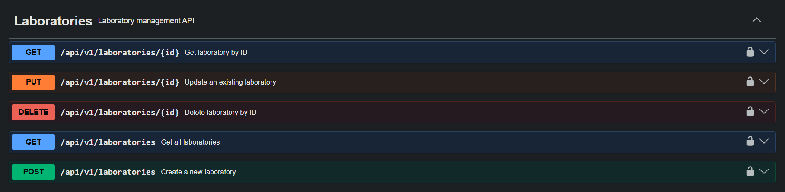</li>
  <li>
    <strong>Telemetry Endpoints</strong>
    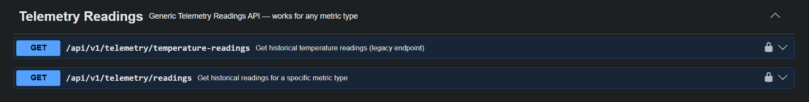
    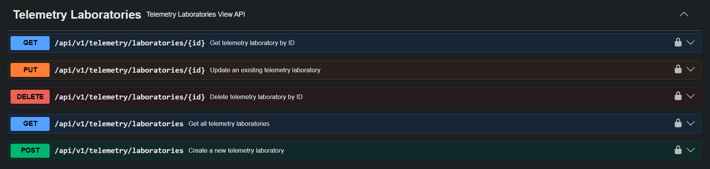
    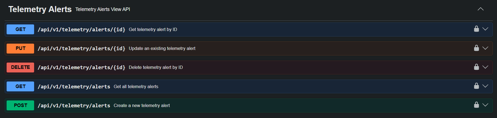
  </li>
  <li><strong>History Endpoints</strong>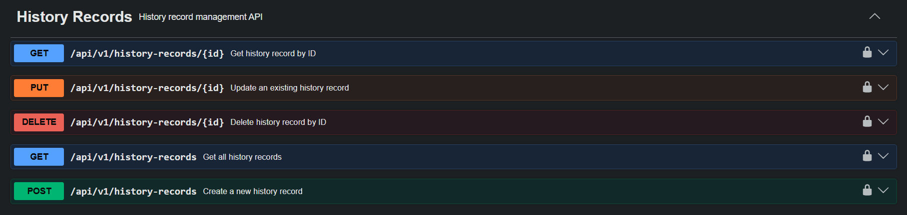</li>
  <li><strong>Alerts Endpoints</strong>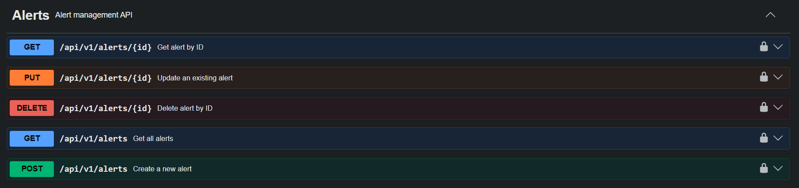</li>
  <li>
    <strong>Settings Endpoints</strong>
    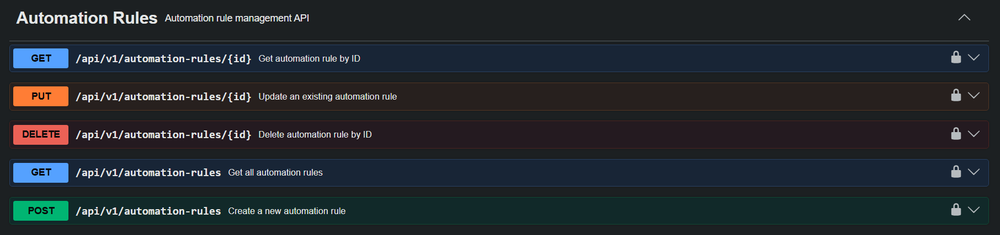
    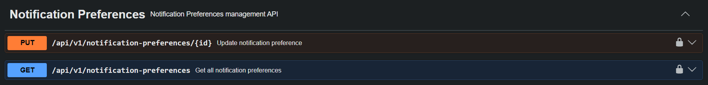
  </li>
  <li><strong>Authentication Endpoints</strong>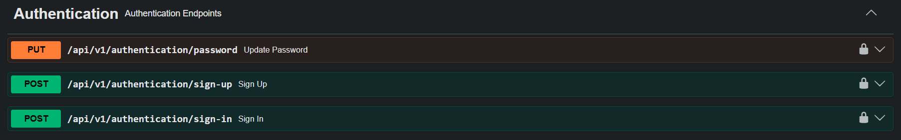</li>
</ul>

<strong>Despliegue de la API: </strong><a href="https://backend-5mih.onrender.com/swagger/swagger-ui/index.html#/">Safelab Web Services</a>

### **5.2.3.7. Software Deployment Evidence for Sprint Review**

Se realizaron múltiples despliegue durante el Sprint 3: Aplicación web en Vercel, API de Safelab en Railway y Landing Page en GitHub Pages. A continuación se presentan las evidencias de cada uno de los despliegues realizados: 

**Landing Page Deployment:**
<ul>
  <li>
    <strong>URL de la Landing Page:</strong>
    <a href="https://upc-pre-1asi0729-11834-especialistas.github.io/landing-page/" target="_blank">https://upc-pre-1asi0729-11834-especialistas.github.io/landing-page/</a>
  </li>
  <li>
    <strong>Repositorio:</strong>
    <a href="https://github.com/upc-pre-1ASI0729-11834-Especialistas/landing-page" target="_blank">https://github.com/upc-pre-1ASI0729-11834-Especialistas/landing-page</a>
  </li>
  <li>
    <strong>Despliegue en Github Pages:</strong> 
    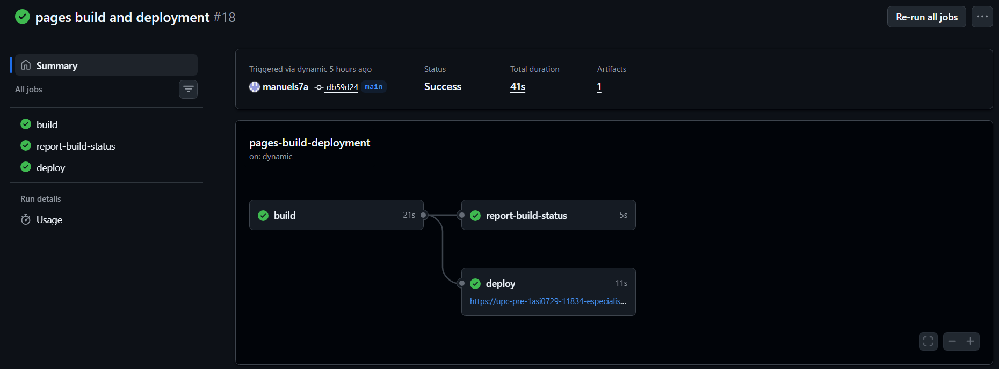
  </li>
</ul>

**Web Application Deployment:**
<ul>
  <li>
    <strong>URL de la Web Application:</strong>
    <a href="https://frontend-j71vgadc7-manuel-sanchezs-projects-f772331f.vercel.app/" target="_blank">https://frontend-j71vgadc7-manuel-sanchezs-projects-f772331f.vercel.app/</a>
  </li>
  <li>
    <strong>Repositorio:</strong>
    <a href="https://github.com/upc-pre-1ASI0729-11834-Especialistas/frontend" target="_blank">https://github.com/upc-pre-1ASI0729-11834-Especialistas/frontend</a>
  </li>
  <li>
    <strong>Despliegue en Vercel:</strong> 
    
  </li>
</ul>

**Web Services Deployment:**
<ul>
  <li>
    <strong>URL de la API:</strong>
    <a href="https://backend-5mih.onrender.com/swagger/swagger-ui/index.html#/" target="_blank">https://backend-5mih.onrender.com/swagger/swagger-ui/index.html#/</a>
  </li>
  <li>
    <strong>Repositorio:</strong>
    <a href="https://github.com/upc-pre-1ASI0729-11834-Especialistas/backend" target="_blank">https://github.com/upc-pre-1ASI0729-11834-Especialistas/backend</a>
  </li>
  <li>
    <strong>Despliegue en Render:</strong> 
    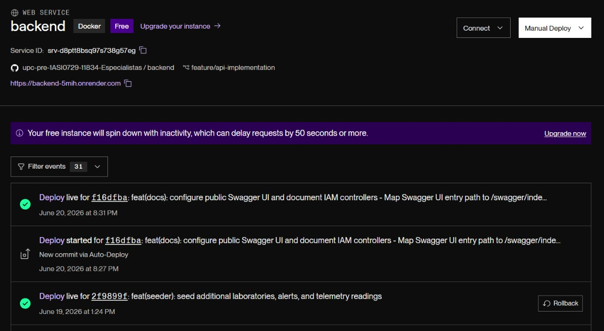
  </li>
</ul>

### **5.2.3.8. Team Collaboration Insights during Sprint** 

Nuestro grupo, Especialistas, gestionó los entregables mediante GitHub, WhatsApp y Google Meet durante el Sprint. Las actividades principales se centraron en el desarrollo y despliegue de la Web Application y documentación.

**Evidencia de Colaboración:**

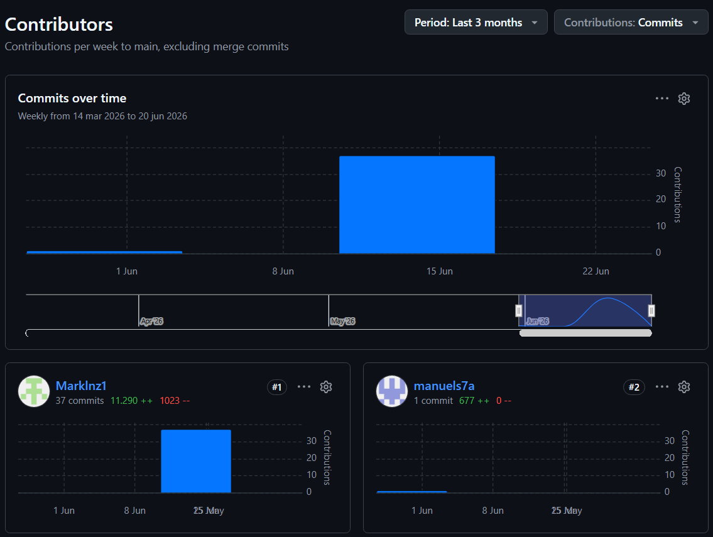

**Principales Herramientas de Comunicación:**
- Github: Para el control de versiones, gestión de issues y revisión de código.
- WhatsApp: Para comunicación rápida, coordinación de tareas y apoyo mutuo.
- Google Meet: Para reuniones de planificación, revisión de avances y aclaración de dudas específicas.

## **5.3. Validation Interviews**

Durante el Sprint 3, se realizaron entrevistas de validación con usuarios potenciales para obtener feedback sobre la aplicación web y los servicios desarrollados. Las entrevistas se llevaron a cabo de manera remota, y se enfocaron en evaluar la usabilidad, funcionalidad y experiencia general del producto.

### **5.3.1. Diseño de entrevistas**

### **5.3.2. Registro de entrevistas**

### **5.3.3. Evaluaciones según heuristicas**

## **5.4 Video About-the-Product**

# **Conclusiones**

En este Sprint 3, el equipo tuvo el mayor progreso en el desarrollo de la aplicación web, logrando implementar las vistas principales y establecer la conexión con los servicios web desarrollados en Java.

Por último, conectamos los CTA de la Landing Page a la aplicación web, lo que permitió una experiencia de usuario fluida desde la presentación del producto hasta la interacción con la aplicación.

A partir de este nuevo avance, llegamos a las siguientes conclusiones:

- Con la integración de los servicios web en la aplicación, y la presentación de la misma en la Landing Page, se logró un avance más tangible del producto, lo que permitió al equipo visualizar mejor el resultado final y realizar ajustes necesarios para mejorar la experiencia de usuario.
- Durante este Sprint, el equipo se enfrentó a muchos cambios de ultimo momento debido a los avances simultáneos en el desarrollo del backend y frontend, generando desafíos en la coordinación y planificación. Sin embargo, se logró mantener una comunicación efectiva y adaptarse a los cambios para cumplir con los objetivos del Sprint.

# **Anexos**

**About the Product**
- Link al video de presentación del producto: [About the Product](https://upcedupe-my.sharepoint.com/:v:/g/personal/u201817507_upc_edu_pe/IQC5o-GEjsfHS5SuthFVzlhWAalwcW_vlJT5VfBVj0VUozk?e=nUWtXh&nav=eyJyZWZlcnJhbEluZm8iOnsicmVmZXJyYWxBcHAiOiJTdHJlYW1XZWJBcHAiLCJyZWZlcnJhbFZpZXciOiJTaGFyZURpYWxvZy1MaW5rIiwicmVmZXJyYWxBcHBQbGF0Zm9ybSI6IldlYiIsInJlZmVycmFsTW9kZSI6InZpZXcifX0%3D)

**Repositorios**
- Repositorio de la Landing Page: https://github.com/upc-pre-1ASI0729-11834-Especialistas/landing-page
- Repositorio del fake API: https://github.com/upc-pre-1ASI0729-11834-Especialistas/fake-api
- Repositorio del frontend: https://github.com/upc-pre-1ASI0729-11834-Especialistas/frontend
- Repositorio del informe: https://github.com/upc-pre-1ASI0729-11834-Especialistas/report
- Repositorio del backend: https://github.com/upc-pre-1ASI0729-11834-Especialistas/backend

**Despliegues**
- Despliegue de la Landing Page: https://upc-pre-1asi0729-11834-especialistas.github.io/landing-page/
- Despliegue del fake API: https://fake-api-production-0033.up.railway.app/
- Despliegue de la Web Application: https://frontend-j71vgadc7-manuel-sanchezs-projects-f772331f.vercel.app/
- Despliegue de los Web Services: https://backend-5mih.onrender.com/swagger/swagger-ui/index.html#/

# **Bibliografía**

